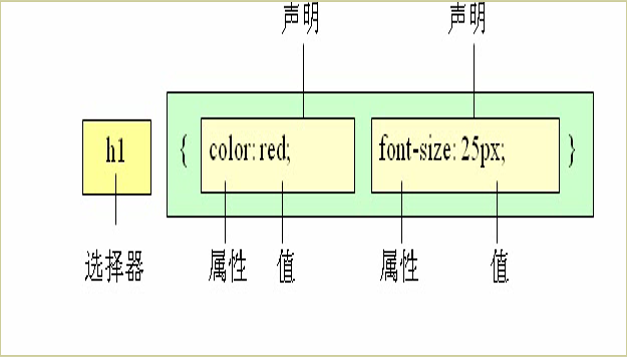

[TOC]
# CSS基础
## CSS概述
### CSS的概念
- CSS英文全称：Cascading Style Sheet 中文名称：层叠样式表
- CSS的作用：用来美化网页的。
### CSS美化相对HTML美化的好处
### W3C三层分离标准
1. HTML：负责搭建网页结构和内容 **结构**
2. CSS： 负责美化网页 **样式**
3. JavaScript: 负责页面交互 **行为**
遵循的原则：先确定语义的HTML ，再选合适的CSS。  
语义是否良好： 当我们去掉CSS之后，网页结构依然组织有序，并且有良好的可读性。

### CSS样式的三种类型
1. 行内样式（内联样式）
2. 嵌套样式（内部样式）
3. 外联样式（外部样式）
**注意事项：**如果有多个 **相同的优先级的样式**作用在同一个元素上，那么离该元素最近的优先被使用。
### CSS注释：
只有一个多行注释 `/**/`
## CSS选择器
- 概念：在给网页中的元素添加样式之前，需要先选择对应的元素，选择元素的方式则称为选择器。
- 作用：用于选择要添加样式的元素。 
### CSS样式规则：
选择器 {属性1：属性值1；属性2：属性值2；属性3：属性值3；}

### 选择器的分类
####  基本选择器
- 标签选择器
- 类选择器
  + 给元素加一个class属性
  + **class的属性名不能以数字开头**
- ID选择器
  + **ID属性值不能重复，一个页面上的ID唯一**
  + 格式： 
```
#ID属性值 {
    样式名：样式值；
    ···
}
```
        * **ID属性值不能以数字开头**
    + **优先级：**ID选择器 > 类选择器 > 标签选择器
#### 复合选择器
    + 层级选择器
        * 选择父标签下的所有子孙标签，只要是在选择器元素里面的都会被选择到
        * 格式
        ```css  
        父选择器 子选择器 {
             样式名：样式值；
                ···
            }
        ```
        * 父选择器可以是任意类型的基本选择器
    + 并级选择器
        * 格式
```
    选择器1，选择器2，选择器3 {
        样式名：样式值；
                ···
    }
```
    + 交集选择器
        * 通时满足两个条件，标签名开头，后面跟ID选择器或类选择器
        **两个选择器之间不能有空格**
        * 格式
        ```
        格式1
        标签选择器#ID选择器 {
             样式名：样式值；
             ······
        } 格式2
        标签选择器.类选择器 {
             样式名：样式值；
             ······
        }
        ```
    + 通用选择器
        * 格式
        ```
        * {
            样式名：样式值；
                ···
        }
        ```
        统一设置整个页面的内容
    + 伪类选择器
        * 在网页不同状态下
    + 属性选择器


|选择器|例子|例子描述|css|选择器名称|
|------|----|--------|---|----------|
|.class|.intro|选择 class="intro" 的所有元素。|1|
|#id|#firstname|选择 id="firstname" 的所有元素。|1|
|\*|\*|选择所有元素。|2|通配符|
|element|p|选择所有 < p\> 元素。|1|
|element,element|div,p|选择所有 < div\> 元素和所有 < p\> 元素。|1|并集选择器|
|element element|div p|选择 < div\> 元素内部的所有 < p\> 元素。|1|    
|element>element|div>p|