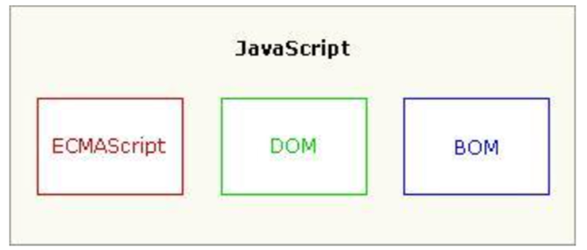
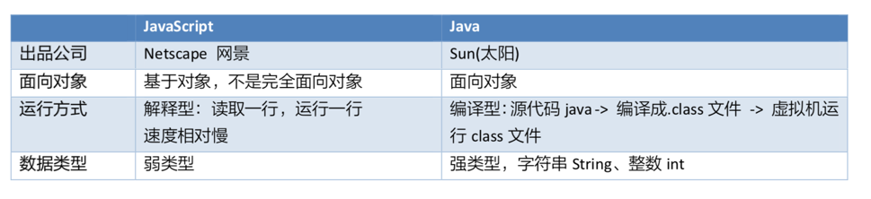

# JavaScript基础
## JavaScript 能干什么？
1. 作用：  
- HTML 的作用是用于描述页面数据的结构的
- CSS 的作用是用来对页面数据进行美化
- JavaScript 的作用是用于与用户进行交互，提高用户体验

2. 特点
- 安全性：运行在浏览器上，不能操作本地用户的文件，不会有病毒的风险。
- 跨平台：可以运行在不同操作系统的浏览器上。（Windows、Linux、OSX、Android、iOS）。因为JS是运行在浏览器上的，只要有浏览器，就可以运行JS。
- 严格区分大小写  
- JavaScript脚本语言具有以下特点:(*来自百度百科*)
  - (1)脚本语言。  
    JavaScript是一种解释型的脚本语言,C、C++等语言先编译后执行,而JavaScript是在程序的运行过程中逐行进行解释。  
  - (2)基于对象。  
    JavaScript是一种基于对象的脚本语言,它不仅可以创建对象,也能使用现有的对象。  
  - (3)简单。  
    JavaScript语言中采用的是弱类型的变量类型,对使用的数据类型未做出严格的要求,是基于Java基本语句和控制的脚本语言,其设计简单紧凑。  
  - (4)动态性。  
    JavaScript是一种采用事件驱动的脚本语言,它不需要经过Web服务器就可以对用户的输入做出响应。在访问一个网页时,鼠标在网页中进行鼠标点击或上下移、窗口移动等操作JavaScript都可直接对这些事件给出相应的响应。  
  - (5)跨平台性。  
    JavaScript脚本语言不依赖于操作系统,仅需要浏览器的支持。因此一个JavaScript脚本在编写后可以带到任意机器上使用,前提上机器上的浏览器支   持JavaScript脚本语言,目前JavaScript已被大多数的浏览器所支持。   
不同于服务器端脚本语言，例如PHP与ASP，JavaScript主要被作为客户端脚本语言在用户的浏览器上运行，不需要服务器的支持。所以在早期程序员比较青睐于JavaScript以减少对服务器的负担，而与此同时也带来另一个问题：安全性。  
而随着服务器的强壮，虽然程序员更喜欢运行于服务端的脚本以保证安全，但JavaScript仍然以其跨平台、容易上手等优势大行其道。同时，有些特殊功能（如AJAX）必须依赖Javascript在客户端进行支持。随着引擎如V8和框架如Node.js的发展，及其事件驱动及异步IO等特性，JavaScript逐渐被用来编写服务器端程序。  

3. 组成

ECMAScript : 核心基础，标准。
DOM：文档对象模型（Document object model)：用来操作网页元素的对象
BOM: 浏览器对象模型(Browser Object Model):用来操作浏览器的对象
4. 与Java的区别 
- 如何理解基于对象和面向对象：
  - 面向对象语言： 封装，继承，多态，三大特征
  - 基于对象语言： 具有封装，没有继承和多态特征。内置了大量的对象，但只能使用其内部定义好的方法和属性，不能通过继承对已经存在的对象进行扩展。

### JavaScript编写方式
1.行内方式
  - 编写位置
    - JavaScript代码写在HTML元素标签的属性上。
   `<input type="button" value="点我呀" onclick="alert('被 点击了');"/>`    
  缺点： 如果代码量比较多，导致代码可读性不好，而且复用性差。
2. 内部方式
  - 编写位置  
  理论上在哪里都可以，实际上最好写在 head中，css标签下面。提高代码可读性    
  - 优点： 复用性更好，可以将代码封装到一个函数中。
  - 缺点：只能当前页面中使用
3. 外部方式
  - 编写位置  
  在外部单独建立一个文件，用`<script type="text/javascript" src="文件路径" > </script>`  引入。
  - 优点：复用性高。
 **注意事项：** 如果使用了script 引入外部文件，那么不能在script里面再写js代码  
 虽然不能在里面写代码，但是结束标签也不能省略。否则引入无效。  
 一个网页中可以使用多个script标签，可以引入多个文件，如同Java导包，执行顺序从上往下。

### javascript注释
和Java中的一样  
- 单行 //
- 多行 /**/
- 文档 /** */
### 变量的定义
1. 只需要用一个var 来定义，不需要定义具体的如string int 等 如：`var a = 10`   

#### 常见的问题 
1. var 关键字是否必须？
  - 可以省略，但不建议
2. 变量名是否可以重复或重复定义？
  - 可以重复定义，但是后面的会覆盖前面的。  
3. 一条语句是否可以定义多个变量？
  - 可以定义多个变量，多个变量用，分割
4. 大括号能否对作用域起到分隔作用？
  - 不能起到隔离作用

### 数据类型  
###### typeof 关键字  
- 作用 ：用来判断某个变量的数据类型
- 两种格式：  
  typeof   变量名  
  typeof(变量名)  
- 返回值： 变量名的数据类型的字符串表现形式

###### 五种数据类型
string  
number  
boolean  
object  
undefined  

###### 类型转换
全局函数  
- parseInt(字符串) 将字符串转化为整数  
- parseFloat(字符串) 将字符串转化为小数
  **从左往右一个一个进行转换，转到不是数字为止。如果一开始就不是数字，那么转换结果为NaN**  
- isNaN(表达式) is not a number  如果不是数字返回true，如果是数字返回false  
  **只有全部是数字才判断是数字，否则就判断不是数字。**  

### 运算符
- 算术运算符 
- 赋值运算符   
- 比较运算符  
- 逻辑运算符  
- 三元运算符    
1. 算数运算符  
  **注意事项**  
- n 进行算术运算必须前提是数字，需要借助parseInt与parseFloat进行 转换。  
- n 字符串与数字相加，结果还是字符串。   
- n 数字与布尔值值true(true=1)相加，相当于加1。  
- n 数字与布尔值false(false=1)相加，相当于加0。  
2. 赋值运算符  
  
3. 比较运算符
-  **JS比较运算符与Java比较运算符的区别**?  
  + 字符串和字符串比：
    - 如果前缀一样，那么哪个字符长度长就大  
    - 如果前缀不一样，字符串与字符串比较会从左到右一个一个字符比较，只要遇到一个比另外一个大的字符，那么这个字符串就是大的。 **根据ASCII码表比**  
  + 字符串与数字比较
    - 会先将字符串转换为数字，之后再进行与数字的比较，前提是字符串必须是全部是数字，否则这个转换就会返回NaN,  **NaN与数字比较返回false**  
- == 和 === 的区别  
  ==：是比较两个变量的内容或值  
  ===：同时比较两个变量的内容与数据类型  
4. 逻辑运算符
- 和Java一样具有短路的功能
5. 三元运算符
- 格式： `条件表达式?结果1:结果2;`
- 示例代码
```javascript
    // 三元运算符
    //prompt：js内置函数，用来让用户输入信息
    var age = prompt("请输入年龄:");
    document.write(age >= 18 ?"你已经成年了，可以尽情浏览该网址内容":"你还未成年，请在家长的陪同下浏览"); 
```

### 流程控制
- if - else语句
在 JS 中不是布尔类型也可以作为判断的条件。  
  - number：0 表示 false，非 0 表示 true。   
  - string：空字符串""表示 false，非空字符串表示 true。   
  - undefined：表示 false   
  - NaN：表示 false  
  - 对象类型：非 null 表示 true，null 表示 false。  

- switch 语句
```javascript
switch(变量名) {  
    case 常量值1:    
        语句1;    
        break;  
    case 常量值2:    
        语句2;    
        break; 
    default:   
        break;
}
```
  case 不仅可以是常量，也可以是变量，也可以是表达式。不过表达式 的结果要为 boolean类型  
- 示例代码：
```javascript
  <script type="text/javascript">
    var score = prompt("请输入成绩",100);
    var s = parseInt(score);
    switch(true){ // 70
        case s > 90:  // 
            document.write("优秀");
        break;

        case s > 80 && s <= 90:
            document.write("良好");
        break;

        case 70:
            document.write("70");
        break;

        default:
            document.write("你的成绩不给力，要补考");
        break;
            }
   </script>  
```

- **while语句** :和Java中一样
- **do-while语句** ：和Java中一样
- **for 语句**  : 和Java中一样
- **for-in** 和Java中的增强for有区别了
```javascript
<script style="text/javascript">
    for (var item in 对象/数组) {
        循环体
    }
</script>
```
**和Java中增强for的区别：** 
  - 如果遍历数组，item是数组的索引。  
  - 如果遍历对象，item是对象的属性。  
  - 