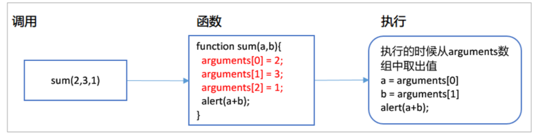
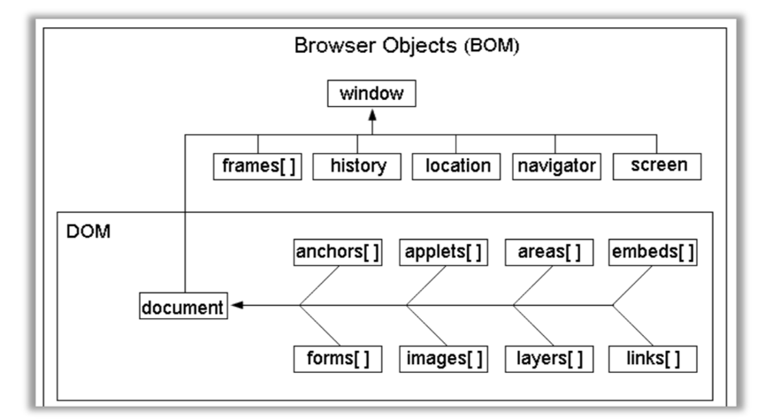
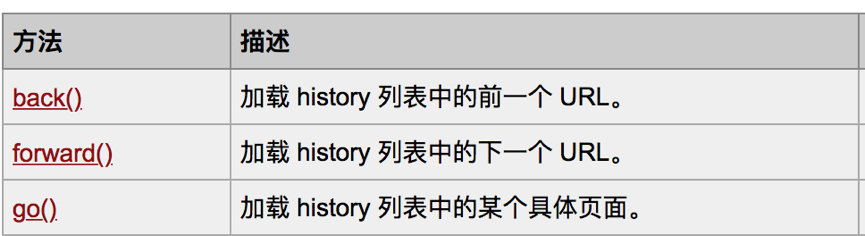

# JavaScript基础
## JavaScript 能干什么？
1. 作用：  
- HTML 的作用是用于描述页面数据的结构的
- CSS 的作用是用来对页面数据进行美化
- JavaScript 的作用是用于与用户进行交互，提高用户体验

2. 特点
- 安全性：运行在浏览器上，不能操作本地用户的文件，不会有病毒的风险。
- 跨平台：可以运行在不同操作系统的浏览器上。（Windows、Linux、OSX、Android、iOS）。因为JS是运行在浏览器上的，只要有浏览器，就可以运行JS。
- 严格区分大小写  
- JavaScript脚本语言具有以下特点:(*来自百度百科*)
  - (1)脚本语言。  
    JavaScript是一种解释型的脚本语言,C、C++等语言先编译后执行,而JavaScript是在程序的运行过程中逐行进行解释。  
  - (2)基于对象。  
    JavaScript是一种基于对象的脚本语言,它不仅可以创建对象,也能使用现有的对象。  
  - (3)简单。  
    JavaScript语言中采用的是弱类型的变量类型,对使用的数据类型未做出严格的要求,是基于Java基本语句和控制的脚本语言,其设计简单紧凑。  
  - (4)动态性。  
    JavaScript是一种采用事件驱动的脚本语言,它不需要经过Web服务器就可以对用户的输入做出响应。在访问一个网页时,鼠标在网页中进行鼠标点击或上下移、窗口移动等操作JavaScript都可直接对这些事件给出相应的响应。  
  - (5)跨平台性。  
    JavaScript脚本语言不依赖于操作系统,仅需要浏览器的支持。因此一个JavaScript脚本在编写后可以带到任意机器上使用,前提上机器上的浏览器支   持JavaScript脚本语言,目前JavaScript已被大多数的浏览器所支持。   
不同于服务器端脚本语言，例如PHP与ASP，JavaScript主要被作为客户端脚本语言在用户的浏览器上运行，不需要服务器的支持。所以在早期程序员比较青睐于JavaScript以减少对服务器的负担，而与此同时也带来另一个问题：安全性。  
而随着服务器的强壮，虽然程序员更喜欢运行于服务端的脚本以保证安全，但JavaScript仍然以其跨平台、容易上手等优势大行其道。同时，有些特殊功能（如AJAX）必须依赖Javascript在客户端进行支持。随着引擎如V8和框架如Node.js的发展，及其事件驱动及异步IO等特性，JavaScript逐渐被用来编写服务器端程序。  

3. 组成


- ECMAScript : 核心基础，标准。
- DOM：文档对象模型（Document object model)：用来操作网页元素的对象
- BOM: 浏览器对象模型(Browser Object Model):用来操作浏览器的对象
4. 与Java的区别 
- 如何理解基于对象和面向对象：
  - 面向对象语言： 封装，继承，多态，三大特征
  - 基于对象语言： 具有封装，没有继承和多态特征。内置了大量的对象，但只能使用其内部定义好的方法和属性，不能通过继承对已经存在的对象进行扩展。

### JavaScript编写方式
1.行内方式
  - 编写位置
    - JavaScript代码写在HTML元素标签的属性上。
   `<input type="button" value="点我呀" onclick="alert('被 点击了');"/>`    
  缺点： 如果代码量比较多，导致代码可读性不好，而且复用性差。
2. 内部方式
  - 编写位置  
  理论上在哪里都可以，实际上最好写在 head中，css标签下面。提高代码可读性    
  - 优点： 复用性更好，可以将代码封装到一个函数中。
  - 缺点：只能当前页面中使用
3. 外部方式
  - 编写位置  
  在外部单独建立一个文件，用`<script type="text/javascript" src="文件路径" > </script>`  引入。
  - 优点：复用性高。
 **注意事项：** 如果使用了script 引入外部文件，那么不能在script里面再写js代码  
 虽然不能在里面写代码，但是结束标签也不能省略。否则引入无效。  
 一个网页中可以使用多个script标签，可以引入多个文件，如同Java导包，执行顺序从上往下。

### javascript注释
和Java中的一样  
- 单行 //
- 多行 /**/
- 文档 /** */
### 变量的定义
1. 只需要用一个var 来定义，不需要定义具体的如string int 等 如：`var a = 10`   

#### 常见的问题 
1. var 关键字是否必须？
  - 可以省略，但不建议
2. 变量名是否可以重复或重复定义？
  - 可以重复定义，但是后面的会覆盖前面的。  
3. 一条语句是否可以定义多个变量？
  - 可以定义多个变量，多个变量用，分割
4. 大括号能否对作用域起到分隔作用？
  - 不能起到隔离作用

### 数据类型  
###### typeof 关键字  
- 作用 ：用来判断某个变量的数据类型
- 两种格式：  
  typeof   变量名  
  typeof(变量名)  
- 返回值： 变量名的数据类型的字符串表现形式

###### 五种数据类型
string  
number  
boolean  
object  
undefined  

###### 类型转换
全局函数  
- parseInt(字符串) 将字符串转化为整数  
- parseFloat(字符串) 将字符串转化为小数
  **从左往右一个一个进行转换，转到不是数字为止。如果一开始就不是数字，那么转换结果为NaN**  
- isNaN(表达式) is not a number  如果不是数字返回true，如果是数字返回false  
  **只有全部是数字才判断是数字，否则就判断不是数字。**  

### 运算符
- 算术运算符 
- 赋值运算符   
- 比较运算符  
- 逻辑运算符  
- 三元运算符    
1. 算数运算符  
  **注意事项**  
- n 进行算术运算必须前提是数字，需要借助parseInt与parseFloat进行 转换。  
- n 字符串与数字相加，结果还是字符串。   
- n 数字与布尔值值true(true=1)相加，相当于加1。  
- n 数字与布尔值false(false=1)相加，相当于加0。  
2. 赋值运算符  
  
3. 比较运算符
-  **JS比较运算符与Java比较运算符的区别**?  
  + 字符串和字符串比：
    - 如果前缀一样，那么哪个字符长度长就大  
    - 如果前缀不一样，字符串与字符串比较会从左到右一个一个字符比较，只要遇到一个比另外一个大的字符，那么这个字符串就是大的。 **根据ASCII码表比**  
  + 字符串与数字比较
    - 会先将字符串转换为数字，之后再进行与数字的比较，前提是字符串必须是全部是数字，否则这个转换就会返回NaN,  **NaN与数字比较返回false**  
- == 和 === 的区别  
  ==：是比较两个变量的内容或值  
  ===：同时比较两个变量的内容与数据类型  
4. 逻辑运算符
- 和Java一样具有短路的功能
5. 三元运算符
- 格式： `条件表达式?结果1:结果2;`
- 示例代码
```javascript
    // 三元运算符
    //prompt：js内置函数，用来让用户输入信息
    var age = prompt("请输入年龄:");
    document.write(age >= 18 ?"你已经成年了，可以尽情浏览该网址内容":"你还未成年，请在家长的陪同下浏览"); 
```

### 流程控制
- if - else语句
在 JS 中不是布尔类型也可以作为判断的条件。  
  - number：0 表示 false，非 0 表示 true。   
  - string：空字符串""表示 false，非空字符串表示 true。   
  - undefined：表示 false   
  - NaN：表示 false  
  - 对象类型：非 null 表示 true，null 表示 false。  

- switch 语句
```javascript
switch(变量名) {  
    case 常量值1:    
        语句1;    
        break;  
    case 常量值2:    
        语句2;    
        break; 
    default:   
        break;
}
```
  case 不仅可以是常量，也可以是变量，也可以是表达式。不过表达式 的结果要为 boolean类型  
- 示例代码：
```javascript
  <script type="text/javascript">
    var score = prompt("请输入成绩",100);
    var s = parseInt(score);
    switch(true){ // 70
        case s > 90:  // 
            document.write("优秀");
        break;

        case s > 80 && s <= 90:
            document.write("良好");
        break;

        case 70:
            document.write("70");
        break;

        default:
            document.write("你的成绩不给力，要补考");
        break;
            }
   </script>  
```

- **while语句** :和Java中一样
- **do-while语句** ：和Java中一样
- **for 语句**  : 和Java中一样
- **for-in** 和Java中的增强for有区别了
```javascript
<script style="text/javascript">
    for (var item in 对象/数组) {
        循环体
    }
</script>
```
**和Java中增强for的区别：** 
  - 如果遍历数组，item是数组的索引。  
  - 如果遍历对象，item是对象的属性。  
- 示例代码：
```javascript
<script type="text/javascript">
    // 数组
    var arr = [1,2,3,4,5];
    // 普通for
    for(var i= 0 ;i < arr.length; i++) {
        document.write(arr[i] + "<br/>");
    }

    // for-in语句
    // 如果遍历的是数组，则item是的索引值。
    for(var item in arr) {
        document.write(arr[item] + "<br/>");
    }

    // 相当定义了一个Person类，该类有两个属性：name和age
    function Person(name,age){
        this.name = name;
        this.age = age;
    }
    // 创建对象
    var p = new Person("小泽",23);
    // 如果遍历的是对象，则item是对象的属性名
    for(var item in p) {
        document.write(item + "=" + p[item] +"<br/>");
    }

</script>
```
- **with语句**  
  - 格式：
```javascript
    with (Object) {

}
```
  - 作用：可以将重复使用的对象使用with结构，再with结构中可以直接调用该对象的方法。  
  - 示例代码  
```javascript
<script type="text/javascript">
    // 定义变量
    var a = 10;
    var b = 10;
    var c = true;
    var d = 1.5;
    var e = 'a';
    var f = [1,2,3,4];

    with (document) {
        write("a = " + a + "<br />");
        write("b = " + b + "<br />");
        write("c = " + c + "<br />");
        write("d = " + d + "<br />");
        write("f = " + f + "<br />");
    }
</script> 
```
- **break和continue语句** ：和Java中的用法一样   
##### 函数
- 函数的类型
- 系统函数
- 自定义函数

###### 系统函数  
- JavaScript库里面定义好的，直接给开发者使用的函数。
- 常用的系统函数
```javascript
parseInt("字符串数字"); 字符串转为整数  
parseFloat("字符串数字"); 字符串转为小数  
isNaN(“数据”); 判断给定的数据不是一个数字  
alert(“提示信息”)；弹出框，弹出框内容：提示信息  
prompt(“提示标题”,输入框默认值)；输入框，返回用户输入的内容。  
confirm(“提示信息“)；确认框，有返回值，确认：true，取消：false
eval(“内容”)；将字符串的内容转换成可执行语句，然后执行。
```
- confirm 和 eval 示例代码  
```javascript
<script type="text/javascript">
    // confirm(“提示信息“)；确认框，有返回值，确认：true，取消：false
    var result = confirm("请问你是否要删除该视频？");
    if (result) {
        document.write("删除成功");
    } else {
        document.write("取消删除");
    }

    // eval(“内容”)；将字符串的内容转换成可执行语句，然后执行。
    var content = "var a = 10; var b = 20;";
    eval(content);
    document.write("a = " + a + "<br/>" + "b = " + b );
</script>
```
#####  自定义函数
- 定义格式
```javascript
    function name(parameters) {
        // function body
}
```
- 示例代码:定义一个函数求两个数之和。
```javascript
function sum(a,b) {
    return a + b;
}
document.write(sum(a,b));
```
- **注意事项：**  JavaScript没有方法重载的说法，只要函数名相同后面的就会覆盖前面的，这是由于其编译型语言特性决定的，边走边编译。
- 函数中的arguments隐式数组对象  
- 再任何一个函数的内部都有一个隐藏的数组，名字叫arguments，当调用函数的时候，实参先传递给arguments，函数的形参再从数组中去取元素的值。
  
- **结论：实参个数与形参个数无关，可以不同。**  
- 示例代码： 在函数内部输出arguments的长度和数组中的每个元素。  
```javascript
<script type="text/javascript">
    // 示例代码：定义一个函数求两个数之和。
    function sum(a,b){
        document.write("两个参数 <br/>"); 
        return a + b;
    }
    // 关于函数重载：在上一个示例中，在定义一个函数，求三个数之和。
    /**
        注意：
            在js中，没有函数重载的概念，如果函数名相同，后面会覆盖前面定义的函数。

        关于函数中的arguements数组
            每一个js函数中有会有一个arguements数组，该数组会先接收调用方法时传递的所有实际参数
            比如
            sum(1,2) 
                arguements[0] = 1
                arguements[1] = 2

            sum(1,2,3)
                arguements[0] = 1
                arguements[1] = 2
                arguements[2] = 3


     */
    function sum(a,b,c){ 
        // document.write("三个参数 "+c+"<br/>"); 
        // 遍历arguements数组
        for(var index in arguments) {
            alert(arguments[index]);
        }
        return a + b + c;
    }
    // 数字和undefined相加，结果是：NaN
    document.write(sum(1,2) + "<br/>"); // NaN 
    document.write(sum(1,2,3)+ "<br/>"); // 6
</script>
```
##### 自定义匿名函数  
- 概念：没有名字的函数则称为匿名函数。
- 格式
```javascript
var sum = function(paremeters) {
    // function body
}
- 示例代码： 定义一个匿名函数求两个数之和。  
```javascript
<script type="text/javascript">
  // 示例代码：定义一个函数求两个数之和。
  var add = function(a,b){
      return a+b;
  }
  // 调用函数
  var result = add(1,2);
alert(result);
</script>
```

##  JavaScript的事件
### 事件概述
时间式js不可或缺的组成部分，要学习js的时间，必须要理解几个概念：
1. 事件源： 被监听的html元素
2. 事件： 某类动作，例如点击事件，移入移出事件，敲击键盘事件等
3. 事件与事件源的绑定： 在事件源上注册某事件
4. 事件出发后的响应行为： 事件触发后需要执行的代码，一般使用函数进行封装。
### 常用的事件  
| **事件名**         | **描述**                     |
| --------------- | -------------------------- |
| **onload**      | 当指定内容被加载完毕的时候会触发           |
| **onsubmit**    | 当表单提交时触发该事件---注意事件源是表单form |
| **onclick**     | 鼠标点击某个对象                   |
| ondblclick      | 鼠标双击某个对象                   |
| **onblur**      | 元素失去焦点                     |
| **onfocus**     | 元素获得焦点                     |
| **onchange**    | 下拉框内容发生变化的时候触发             |
| onkeydown       | 某个键盘的键被按下                  |
| onkeypress      | 某个键盘的键被按下或按住               |
| onkeyup         | 某个键盘的键被松开                  |
| onmousedown     | 某个鼠标按键被按下                  |
| onmouseup       | 某个鼠标按键被松开                  |
| **onmouseover** | 鼠标被移到某元素之上，只会在移到元素上时触发一次   |
| **onmouseout**  | 鼠标从某元素移开                   |
| **onmousemove** | 鼠标被移动，只要移动就触发              |

### 事件案例演示
#### 案例演示效果图
  
####  案例需求说明

1. 当网页加载完成后，用户名默认显示：jack
2. 当鼠标经过文字：” 鼠标经过看美女” 显示效果如右图
3. 当鼠标离开文字：”鼠标经过看美女”显示效果如左图
4. 当文本输入框获得焦点时，清空文本输入框的文字。
5. 当文本输入框失去焦点时，设置文本输入框内容为：jack
6. 当改变城市时，弹框显示用户选择的城市名
7. 当点击提交按钮时，提交表单。

#### [ **案例代码** ](html/事件案例01.html "事件案例01")  
## BOM 模型
### 什么时BOM模型  
**BOM：Browser Object Model 浏览器对象模型。** 由一系列相关的对象构成。通过BOM提供的对象可以与浏览器窗口进行交互，每个对象都提供了很多方法与属性，只要操作这些浏览器对应的对象，操作这些对象的属性，那么就能改变浏览器的行为。
  
### BOM的常用对象
1. screen 对象，screen对象中存放着有关显示浏览器屏幕的信息。
2. window对象，包含的属性描述了正在使用的浏览器或一个框架。
3. navigator对象，包含的属性描述了正在使用的浏览器。
4. history对象，其实就是用来保存浏览器历史记录信息。
5. location对象，location对象是window对象的一个部分，可通过window.location属性来访问。  
### window对象
- 主要掌握三个功能
  + 弹框方法
  + 打开新窗口
  + 定时器方法

#### 弹框方法
1. 提示框：alert(提示信息);
2. 确认框：confirm(提示信息);
3. 输入框：prompt(提示信息);

#### 打开新窗口
1. 相关方法
  - open(); 打开新窗口。
2. 示例代码
  - 打开网页上的按钮，在新窗口中打开一个广告界面。
```javascript
<!DOCTYPE html>
<html lang="en">
<head>
  <meta charset="UTF-8">
  <title>open方法测试</title>
  <script style="text/javascript">
     function openAd() {
           window.open("html/第一个网页.html");
       }  
  </script>
</head>
<body>
  <input type="button" value="点击弹出广告" onclick="openAd();" />
</body>
</html>
````

#### 定时器
1. 相关方法
  - **taskId = setInterval（方法名，毫秒值）** 开启一个定时任务，每隔指定的毫秒数执行指定的方法，返回定时任务的id号。（会重复执行）
  - setTimeout(方法名，毫秒值)；在指定的毫秒术后执行指定的代码（只会执行一次）
  - clearInterval(taskId); 根据任务id号取消定时任务。
2. 代码示例：
  - 开启一个定时任务，每隔3秒后打开广告界面。
  - 开启一个定时任务，3秒后打开广告界面。
```javascript
<!DOCTYPE html>
<html>
    <head>
        <meta charset="UTF-8">
        <title></title>
        
        <script type="text/javascript">
            function openAd(){
                // 打开广告界面
                window.open("15-广告界面.html","_blank","width=400,height=300,left=300px,top=500px");
            }
            
            // 每隔3秒弹一个广告界面，会重复执行
            var taskId = window.setInterval("openAd();",3000);
            // 停止广告
            function closeAd(){
                // 清除定时任务
                window.clearInterval(taskId);
            }
            // 3秒后弹出一个广告,只执行一次。
            // window.setTimeout("openAd();",3000);
            
        </script>
    </head>
    <body>
        <input type="button" value="弹出广告界面" onclick="openAd();"/>
        <input type="button" value="禁止弹出广告" onclick="closeAd();"/>
    </body>
````
#### location对象
1. 概述
  - location对象包含有关当前url的信息。
  - location对象是window对象的一部分，可以通过window.location属性来访问。
  - 重要属性： **href** ： 设置或获取地址栏URL字符串。
2. 代码示例
  - 通过href属性修改地址栏
```html
<!DOCTYPE html>
<html lang="en">
<head>
    <meta charset="UTF-8">
    <title>location对象示例</title>
    <script style="text/javascript">
        function changeWeb() {
            window.location.href = "html/事件案例01.html";
        }
    </script>
</head>
<body>
    <input type="button" value="location测试" onclick="changeWeb();" />
</body>
</html>
```

#### history对象
1. 概述
  - 用来操作浏览器历史访问记录。
2. 相关方法
  
3. 示例代码：
```html
<!-- 1.html -->
<!DOCTYPE html>
<html>
    <head>
        <meta charset="UTF-8">
        <title></title>

        <script type="text/javascript">
            // 回到上一页
            function lastPage(){
                history.back();
            }
            // 去到下一页
            function nextPage(){
                history.forward();
            }
        </script>
    </head>
    <body>
        1.html<br/>
        <a href="#" onclick="lastPage();">上一页</a><br />
        <a href="#" onclick="nextPage();">下一页</a><br />
        <a href="2.html">进入2.html</a>
    </body>
</html>

<!-- 2.html -->
<!DOCTYPE html>
<html>
    <head>
        <meta charset="UTF-8">
        <title></title>

        <script type="text/javascript">
            // 回到上一页
            function lastPage(){
                history.back();
            }
            // 去到下一页
            function nextPage(){
                history.forward();
            }
        </script>
    </head>
    <body>
        2.html<br/>
        <a href="#" onclick="lastPage();">上一页</a><br />
        <a href="#" onclick="nextPage();">下一页</a><br />
        <a href="3.html">进入3.html</a>
    </body>
</html>

<!-- 3.html -->
<!DOCTYPE html>
<html>
    <head>
        <meta charset="UTF-8">
        <title></title>

        <script type="text/javascript">
            // 回到上一页
            function lastPage(){
                history.back();
            }
            // 去到下一页
            function nextPage(){
                history.forward();
            }
        </script>
    </head>
    <body>
        3.html<br/>
        <a href="#" onclick="lastPage();">上一页</a><br />
        <a href="#" onclick="nextPage();">下一页</a><br />
    </body>
</html>
```

