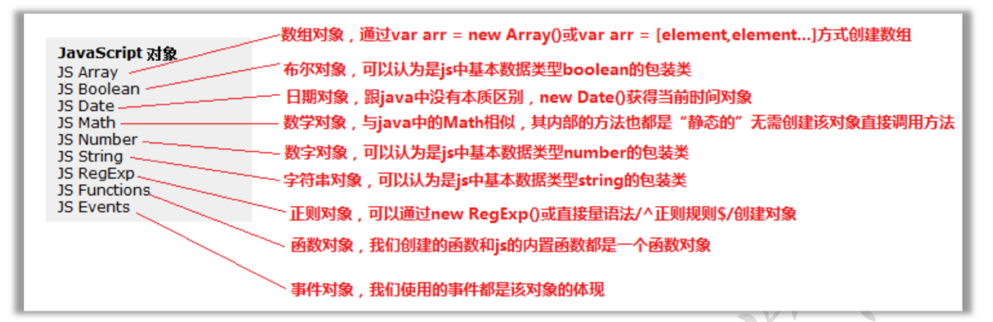
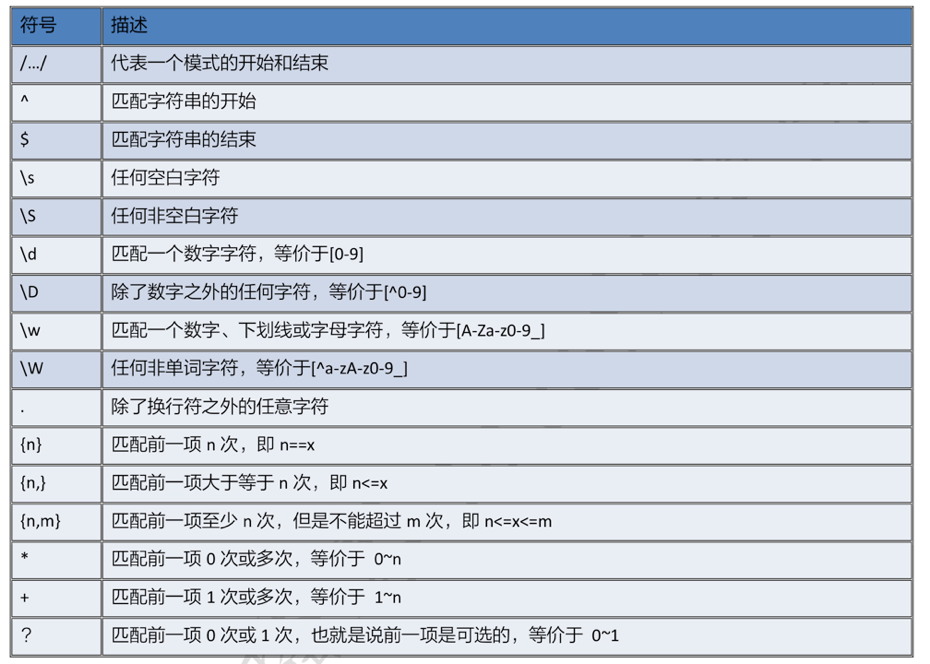
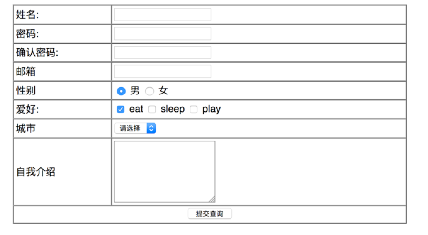
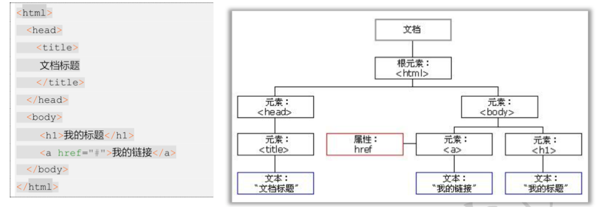
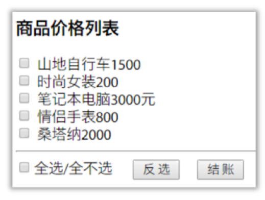
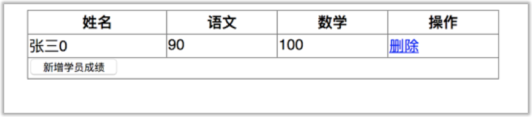
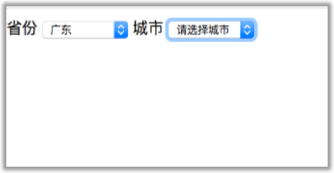
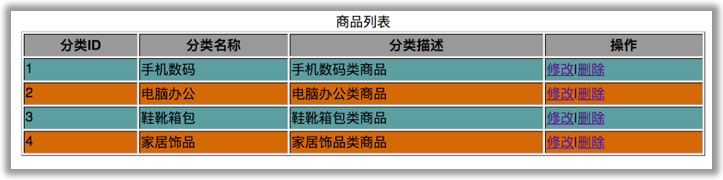

# JS的内置对象和DOM编程
## 内置对象

### 数组对象
- JS 数组：注意事项
  - 数组的定义方式（3种）：
    - var arr = [1,2,3]; var arr = [1,"4",true];
    - 使用内置对象Array对象：  
      var arr1 = new Array(5);
      arr1[0] = "1";
    - 使用内置对象Array   
      var arr2 = new Array(2,3,4,5);//定义一个数组，数组里面的元素是2.3.4.5

- 遍历：
  - for 和for-in遍历数组的区别
    - for方式遍历数组中的所有元素，包括undefined
    - for-in方式遍历数组中的所有已经赋值的元素，不会遍历undefined；  
- 常用方法：
  - sort(); 默认是按照字符的ASCII码从小到大排序  
  如果想要按照数字的大小来排序, 则需要提供比较函数然后返回一个用于说明这两个值的相对顺序的数字。    
    比较函数应该具有两个参数 a 和 b，其返回值如下：
      若 a 小于 b，在排序后的数组中 a 应该出现在 b 之前，则返回一个小于 0 的值。
      若 a 等于 b，则返回 0。  
      若 a 大于 b，则返回一个大于 0 的值。  
    - **arr.sort(sortArray); // 使用自定义函数排序**   
  - reverse();将数组中的元素反转
  - join(separator);  将数组中的元素使用指定的分隔符进行拼接，得到一个字符串。

#### js的全局变量和局部变量

- 全局变量：在script标签里面定义一个变量，这个变量在页面中js部分都可以使用  
- 局部变量：在方法的内部定义一个变量，只能在方法的内部使用。   
#### script 标签应该放的位置
放在什么地方都可以。统一放head标签下面，css下面，方便阅读

### Date对象
- 创建方式： var date = new Date();
- 常用方法：
  - getFullYear()  的到年份
  - getMonth()  得到月， **月份是从0-11**
  - getDate()  得到日
  - getDay()  得到星期几
  - getHours() 得到小时
  - getMinutes() 得到分
  - getSeconds() 得到秒
  - getTime()  的到从1970-1-1 0点到现在相差的毫秒数。
  - toLocalString() 得到符合本地习惯的日期格式  

### Math 对象  
Math相当于Java中的工具类，不需要创建对象，直接使用
- 常用方法
  - ceil()  向上取整
  - floor() 向下取整
  - round()  四舍五入
  - random()  获取随机数 [0,1)
- 生成指定范围的随机数  
  - Math.floor(Math.random()\*n): 生成0~（n-1）之间的随机数，每个数获取到的概率是一样的
  - Math.ceil(Math.random()\*n): 生成0~n的随机数，除0外，每个随机数的获取概率相同   

### RegExp 正则表达式
 

- 创建方式（两种）：
  - var regex = new RegExp("正则表达式"); 和Java中一样需要转义。  
  - var reg = /正则表达式/; **js 独有的方式，不需要转义**
- 常用方法： test(字符串) 返回布尔类型。 true/false 和Java中match相似
- **注意事项**
  - JS中默认不是严格匹配。只要包含相应的正则表达式的字符串，就返回true。如果想要严格匹配，则使用 **^** 开头， **$** 结尾。  

- 表单验证案例
  

- 验证要求
- 姓名：只能英文字母开头，只能包含英文字母，长度4～16个字符。
- 密码：只能大小写字母和数字,6-20个字符。
- 邮箱: 符合邮箱地址的格式 ：/^\w+@\w+(.[a-zA-Z]{2,3}){1,2}$/
- 代码实现：点击图片跳转

## DOM 编程
### 概念
- **DOM 的全称：Document Object Model文档对象模型**
- 浏览器加载页面时会将每个元素都堪称一个对象，根据对象的层次结构生成一颗DOM树，DOM树上的每一对象都称为节点对象。
- DOM编程： 通过操作节点对象的方法或属性来操作对应的标签，从二改变浏览器显示的数据。

### 节点的分类
| 类型     | 名字        |
| ------ | --------- |
| 文档     | Document  |
| 元素(标签) | Element   |
| 属性     | Attribute |
| 文本     | Text      |
| 注释     | Comment   |

- 每一个HTML网页就对应一个Document对象。
- 每一个元素标签都对应一个Element对象。
- 每一个属性都对应一个Attribute对象。
- 每一个标签体中的文本内容都是一个Text对象。

### 获取节点对象的相关方法
> document.getElementById("元素的id")；根据id获取元素对象。
> document.getElementsByName("Element's attribute name");根据元素的name属性值获得标签对象，返回数组。
>document.getElementsByTagName("Element's name") ;根据元素的标签名获得所有的标签对象，返回数组。
>document.getElementsByClassName("Element's attribute with class");根据元素的class属性获取元素对象，返回数组。

### 节点的增删改相关方法
- document.createElement("标签名")创建一个新的节点对象
- element.setAttribute("属性名","属性值")创建一个新的属性
- parent.appendChild(child) 将新的子节点追加到parent父节点的最后
- parent.insertBefore(new,old)将新的字节点插入到old子节点的前面
  - **注意：这个方法的调用者parent必须是old的直接父节点。**
- parent.removeChild(child)通过父节点删除一个子节点。

### 全选和反选案例
- 这是个很头大的案例，老师讲的不是很好自己来敲了一遍。
- 案例效果图和需求如下，点击图片进入代码页面。
- 需求说明如下：
  - 页面上有5件商品，前面都有复选框，名字都叫item，value是商品的价格。
  - 下面有一个“全选/全部选”的复选框，id是“all”，点它实现全选和全不选功能，还有个反选按钮，点它实现反选的功能；
  - 下面有个结账按钮，点他则计算选中商品的总金额，并以货币符号¥和绿色显示在按钮旁边的span内，span的id是“result”
 

### 动态添加删除学生案例
- 案例需求说明
  - 点击删除按钮将对应行的学生信息删除。
  - 点击新增学员成绩按钮添加一行学生信息。
- 案例效果图如下

### 省市联动案例
- 案例需求：
  - 省份改变时，城市下拉框的可选值跟着改变。
- 案例效果图如下

### 隔行换色案例
- 案例需求：
  - 表格的奇数行显示一个种颜色，偶数行显示另一种颜色
- 案例效果图如下

