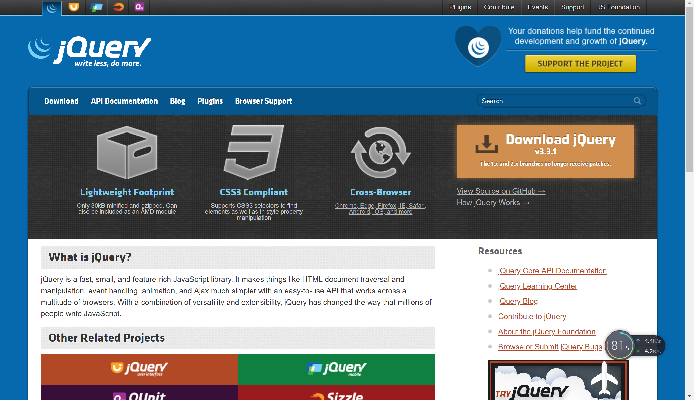
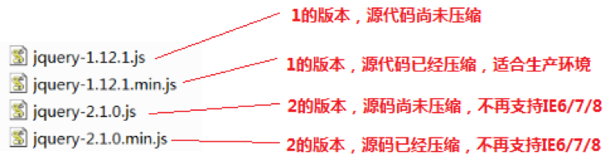

# jQuery基础
## jQuery介绍
### 什么是jQuery
  1. jQuery是一个优秀的JavaScript的轻量级框架
  2. 兼容CSS3和各大浏览器
  3. 提供了dom、events、animate、Ajax、等简易的操作
  4. 插件非常丰富，大多数功能都又相应的插件解决方案
  5. jQuery宗旨：write less do more。

### jQuery有什么好处  
1. 效率:提高程序员开发JS的效率
2. 差异：能够消除浏览器之间的开发差异，减少程序员的开发工作量。
### 轻量级框架的特点
  1. 使用简单，容易上手
  2. 体积小，占用资源少
### jQuery的下载和导入
  - 下载: http://www.jquery.com



### 版本介绍



  1. 对服务器端的开发人员来说,各个版本的使用差别不大
  2. 2.x版本不兼容IE6/7/8的老浏览器
  3. min用于产品级,已经压缩过的版本,文件小很多.

### 导入jQuery框架
在需要使用jQuery的html中使用js的导入方式导入，示例如下  
```JavaScript
<script type="text/javascript" src="jQuery的文件"></script>
```

## JS对象和jQuery对象的区别
### 事件语法的区别
- JS事件写法:js对象.onclick = function(){} onclick是js对象的事件属性.
- jQuery事件写法：jQuery对象.click(function(){}); click()是jQuery对象的方法

### 加载完毕事件的区别
- 语法不同
  js的页面加载完毕：`window.onload = function(){};`  
  Query的页面加载完毕：`$(document).ready(function(){});简便写法：$(function(){});`  
- 效率不同
> js的方式：等网页中所有的元素以及元素引入的内容都加载完毕后触发，比如img标签引入的图片，要等图片下载完毕才会触发。
> jQuery的方式：只需要等网页中的元素加载完成就会触发，不需要等待元素中引入的内容加载完毕。

- 次数不同
>js方式：只能写一次，如果有多次，后面的会覆盖前面的。
jQuery方式：可以有多个监听函数，会按顺序执行，可以更好管理代码。

- 示例代码:
```javascript
<script type="text/javascript" src="js/jquery-1.11.1.min.js"></script>
  <script type="text/javascript">
    $(function () {
      $("#btn1").click(function () {
        alert(1);
      });
      $("#btn1").click(function () {
        alert(2);
        
      });
    })
    // 两条语句都会执行
  </script>

```
###  jQuery对象与JS对象的转换
1.6.1 概述
jQuery本质上也是js，但如果使用jQuery的属性和方法那么必须保证对象是jQuery对象而不是js对象。

使用js的方式获取的对象是js对象。

使用jQuery方式获取的对象是jQuery对象，本质是一个数组，数组中存储的都是js对象。

两者之间的属性和方法不能混用。

jQuery对象只能访问jQuery对象的属性和方法,不能访问js对象的属性和方法.

js对象只能访问js对象的属性和方法,不能访问jQuery对象的属性和方法

- 转换语法
>js对象转换成jQuery对象，语法：$(js对象);
jQuery对象转换成js对象，语法：jQuery对象.get(索引) 或jQuery对象[索引];

- 示例代码
  - 需求：页面上有一个文本框，文本框中有值：传智播客。
    + 1) 分别通过js对象和jQuery对象得到值，并且使用alert()方法显示出来。
    + 2) 混合使用是错误的，没有输出效果。
    + 3) 对象转换以后使用各自的方法得到值。
```javascript
<script type="text/javascript" src="js/jquery-1.11.1.min.js"></script>
<script type="text/javascript">
  $(function () {
    // 通过js方式获得的文本输入框的内容
    var jsobj = document.getElementById('userid');
    // 只能用js的方法和属性,比如.value
    // 将js对象转换为jQuery对象
    var jQueryObj = $(jsObj);
    alert(jQueryObj.val()); // 正确


    // 通过jQuery方式获得文本输入框的内容
    // jQueryObj:是jQuery对象，本质是数组，里面都是js对象
    var jQueryObj = $("#userId");
    // 调用jQuery对象的方法获得文本输入框的值
    alert(jQueryObj.val());

    // alert(jQueryObj.value);  // 错误的，value是js对象的属性，不是jQuery对象的
    // 将jQuery对象转换为js对象
    var jsObj = jQueryObj[0];
    // alert(jsObj.value);
  })
</script>
```

## jQuery选择器
### 选择器的作用
​- jQuery的选择器与CSS的选择器作用是完全一样的，目的是精确快速的定位到某个HTML元素上并获取该元素对象，进而使用jQuery的方法对该元素进行操作。
- 常用的选择器
  + 基本选择器
  + 层级选择器
  + 属性选择器
  + 基本过滤选择器
  + 表单属性选择器
### 基本选择器
- 常用的基本选择器:
  + 标签选择器 `$("html标签名")`
  + id选择器 `$("#id的属性值")`
  + 类选择器 `$(".class类的属性值")`
<!-- 和CSS的用法一样所以示例略过 -->

### 层级选择器
语法:  
- $("A B"); 获取A元素下的所有B子孙元素。
- $("A > B"); 获得A元素下的所有B子元素。不包括孙子元素。
- $("A + B"); 获得A元素同级别的下一个兄弟元素B 
- $("A ~ B"); 获得A元素同级别的下后面所有B元素。
- $("A").siblings("B") 获得A元素同级别的B元素。

不会就查手册:略过代码

### 属性选择器
语法:
- $("A[属性名]"):  选中有指定属性名的A元素
- $("A[属性名=值]"): 选中有指定属性名且指定属性值的A元素
- $("A[属性名!=值]"): 选中有指定属性名的A元素其属性值不等于指定值的A元素
- $("A[属性名^=值]"): 选中属性值以指定值开头的A元素。
- $("A[属性名$=值]"): 选中属性值以指定值结尾的A元素。
- $("A[属性名*=值]"):  选中属性值包含指定值的A元素。
- $("A[属性名=值][属性名=值][属性名=值]"): 复合属性选择器，同时满足多个

具体用时查手册
### 基本过滤器
语法:
- :first  第一个
- :last   最后一个
- :not(selector)   不包含满足注定选择器的
- :even       偶数,包含0
- :odd        奇数
- :eq(index)   获得第index个
- :gt(index)   索引大于index，不包含index
- :lt(index)   索引小于index的，不包含index
- :header     获得所有的标题元素：<h1>...<h6>
- :animated    获得正在执行的动画元素

查手册吧

### 表单属性选择器
语法:

- :enabled   可用的
- :disabled  不可用的
- :checked    选中(单选框和复选框)
- :selected   选中(下拉框)

查手册


## jQuery的DOM操作方法
### html代码/文本/值的操作方法
常用方法:
- html()： 获取标签里的html代码: `<h1><a href>百度一下</a></h1>` 则获取到的`<a href>百度一下</a>`
-  text()： 获得标签体的文本字符串，`<h1><a href>百度一下</a></h1> `则获取到的：百度一下
- val()：设置`value`属性的值或获得`value`属性的值
示例代码 :
```javascript

```