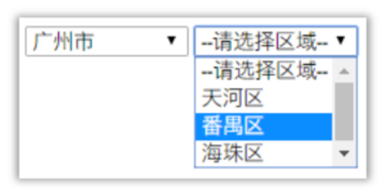
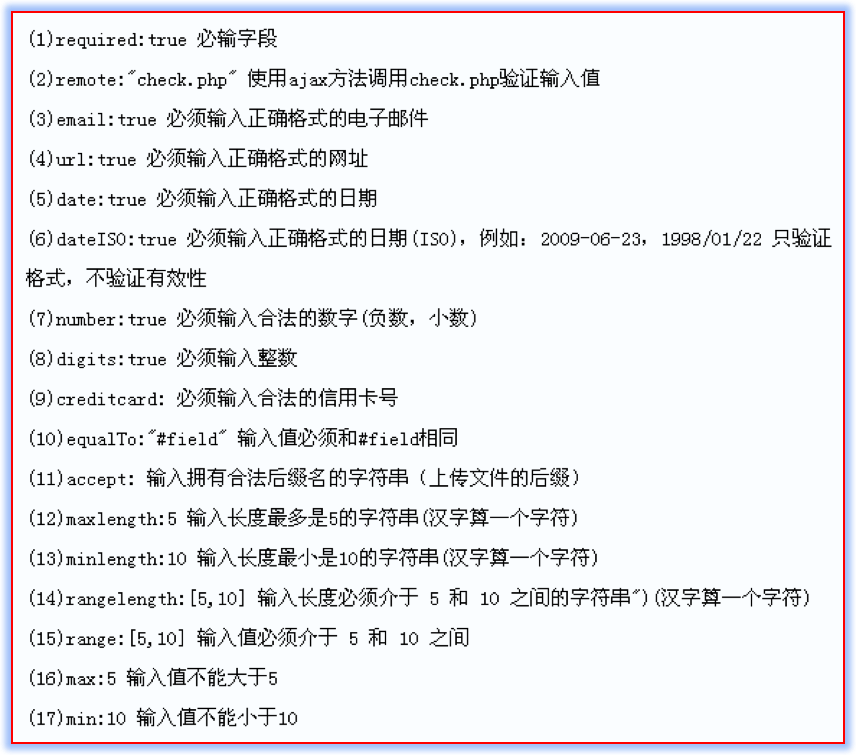

# jQuery基础
## jQuery介绍
### 什么是jQuery
  1. jQuery是一个优秀的JavaScript的轻量级框架
  2. 兼容CSS3和各大浏览器
  3. 提供了dom、events、animate、Ajax、等简易的操作
  4. 插件非常丰富，大多数功能都又相应的插件解决方案
  5. jQuery宗旨：write less do more。

### jQuery有什么好处  
1. 效率:提高程序员开发JS的效率
2. 差异：能够消除浏览器之间的开发差异，减少程序员的开发工作量。
### 轻量级框架的特点
  1. 使用简单，容易上手
  2. 体积小，占用资源少
### jQuery的下载和导入
  - 下载: http://www.jquery.com


### 版本介绍


  1. 对服务器端的开发人员来说,各个版本的使用差别不大
  2. 2.x版本不兼容IE6/7/8的老浏览器
  3. min用于产品级,已经压缩过的版本,文件小很多.

### 导入jQuery框架
在需要使用jQuery的html中使用js的导入方式导入，示例如下  
```JavaScript
<script type="text/javascript" src="jQuery的文件"></script>
```

## JS对象和jQuery对象的区别
### 事件语法的区别
- JS事件写法:js对象.onclick = function(){} onclick是js对象的事件属性.
- jQuery事件写法：jQuery对象.click(function(){}); click()是jQuery对象的方法

### 加载完毕事件的区别
- 语法不同
  js的页面加载完毕：`window.onload = function(){};`  
  Query的页面加载完毕：`$(document).ready(function(){});简便写法：$(function(){});`  
- 效率不同
> js的方式：等网页中所有的元素以及元素引入的内容都加载完毕后触发，比如img标签引入的图片，要等图片下载完毕才会触发。
> jQuery的方式：只需要等网页中的元素加载完成就会触发，不需要等待元素中引入的内容加载完毕。

- 次数不同
>js方式：只能写一次，如果有多次，后面的会覆盖前面的。
jQuery方式：可以有多个监听函数，会按顺序执行，可以更好管理代码。

- 示例代码:
```javascript
<script type="text/javascript" src="js/jquery-1.11.1.min.js"></script>
  <script type="text/javascript">
    $(function () {
      $("#btn1").click(function () {
        alert(1);
      });
      $("#btn1").click(function () {
        alert(2);
        
      });
    })
    // 两条语句都会执行
  </script>

```
###  jQuery对象与JS对象的转换
1.6.1 概述
jQuery本质上也是js，但如果使用jQuery的属性和方法那么必须保证对象是jQuery对象而不是js对象。

使用js的方式获取的对象是js对象。

使用jQuery方式获取的对象是jQuery对象，本质是一个数组，数组中存储的都是js对象。

两者之间的属性和方法不能混用。

jQuery对象只能访问jQuery对象的属性和方法,不能访问js对象的属性和方法.

js对象只能访问js对象的属性和方法,不能访问jQuery对象的属性和方法

- 转换语法
>js对象转换成jQuery对象，语法：$(js对象);
jQuery对象转换成js对象，语法：jQuery对象.get(索引) 或jQuery对象[索引];

- 示例代码
  - 需求：页面上有一个文本框，文本框中有值：传智播客。
    + 1) 分别通过js对象和jQuery对象得到值，并且使用alert()方法显示出来。
    + 2) 混合使用是错误的，没有输出效果。
    + 3) 对象转换以后使用各自的方法得到值。
```javascript
<script type="text/javascript" src="js/jquery-1.11.1.min.js"></script>
<script type="text/javascript">
  $(function () {
    // 通过js方式获得的文本输入框的内容
    var jsobj = document.getElementById('userid');
    // 只能用js的方法和属性,比如.value
    // 将js对象转换为jQuery对象
    var jQueryObj = $(jsObj);
    alert(jQueryObj.val()); // 正确


    // 通过jQuery方式获得文本输入框的内容
    // jQueryObj:是jQuery对象，本质是数组，里面都是js对象
    var jQueryObj = $("#userId");
    // 调用jQuery对象的方法获得文本输入框的值
    alert(jQueryObj.val());

    // alert(jQueryObj.value);  // 错误的，value是js对象的属性，不是jQuery对象的
    // 将jQuery对象转换为js对象
    var jsObj = jQueryObj[0];
    // alert(jsObj.value);
  })
</script>
```

## jQuery选择器
### 选择器的作用
​- jQuery的选择器与CSS的选择器作用是完全一样的，目的是精确快速的定位到某个HTML元素上并获取该元素对象，进而使用jQuery的方法对该元素进行操作。
- 常用的选择器
  + 基本选择器
  + 层级选择器
  + 属性选择器
  + 基本过滤选择器
  + 表单属性选择器
### 基本选择器
- 常用的基本选择器:
  + 标签选择器 `$("html标签名")`
  + id选择器 `$("#id的属性值")`
  + 类选择器 `$(".class类的属性值")`
<!-- 和CSS的用法一样所以示例略过 -->

### 层级选择器
语法:  
- $("A B"); 获取A元素下的所有B子孙元素。
- $("A > B"); 获得A元素下的所有B子元素。不包括孙子元素。
- $("A + B"); 获得A元素同级别的下一个兄弟元素B 
- $("A ~ B"); 获得A元素同级别的下后面所有B元素。
- $("A").siblings("B") 获得A元素同级别的B元素。

不会就查手册:略过代码

### 属性选择器
语法:
- $("A[属性名]"):  选中有指定属性名的A元素
- $("A[属性名=值]"): 选中有指定属性名且指定属性值的A元素
- $("A[属性名!=值]"): 选中有指定属性名的A元素其属性值不等于指定值的A元素
- $("A[属性名^=值]"): 选中属性值以指定值开头的A元素。
- $("A[属性名$=值]"): 选中属性值以指定值结尾的A元素。
- $("A[属性名*=值]"):  选中属性值包含指定值的A元素。
- $("A[属性名=值][属性名=值][属性名=值]"): 复合属性选择器，同时满足多个

具体用时查手册
### 基本过滤器
语法:
- :first  第一个
- :last   最后一个
- :not(selector)   不包含满足注定选择器的
- :even       偶数,包含0
- :odd        奇数
- :eq(index)   获得第index个
- :gt(index)   索引大于index，不包含index
- :lt(index)   索引小于index的，不包含index
- :header     获得所有的标题元素：<h1>...<h6>
- :animated    获得正在执行的动画元素

查手册吧

### 表单属性选择器
语法:

- :enabled   可用的
- :disabled  不可用的
- :checked    选中(单选框和复选框)
- :selected   选中(下拉框)

查手册


## jQuery的DOM操作方法
### html代码/文本/值的操作方法
常用方法:
- html()： 获取标签里的html代码: `<h1><a href>百度一下</a></h1>` 则获取到的`<a href>百度一下</a>`
-  text()： 获得标签体的文本字符串，`<h1><a href>百度一下</a></h1> `则获取到的：百度一下
- val()：设置`value`属性的值或获得`value`属性的值
示例代码 :
```javascript

```

### html属性操作
```javascript
attr() ： 设置或获取属性值
prop()：  设置或获取属性值,数据类型是boolean
removeAttr()：删除属性
removeProp()：删除属性
```
**如何选择attr()和prop()** 
在一般情况下，获得boolean类型的属性true/false时，使用prop()方法。如：selected, checked等。获得其它类型的属性使用attr()。

###  html的class属性操作
本质是操作标签元素的class属性  
```
addClass(类样式名)  添加样式
removeClass(类样式名)  删除样式
toggleClass(类样式名)  切换样式，如果样式存在，则删除，否则添加
```
### html的样式操作
css();添加或获取样式，相当于设置样式：style

### html元素的创建和插入
```javascript
创建标签：$("完整的标签")：不是标签名，而是一个完整的标签，包含所有的属性和文本。
append(): 相当于appendChild()，添加元素为当前元素的最后一个子元素。与当前元素是父子关系。
prepend()：添加元素为当前元素的第一个子元素。与当前元素是父子关系
before()：在当前元素的前面插入一个元素，与当前的元素是兄弟关系。
after(): 在当前元素的后面插入一个元素，与当前的元素是兄弟关系。
```

### html元素的删除操作
相关方法
```javascript
remove（）：删除本身(自杀)，哪个元素对象调用就删除哪个元素。 
empty（）: 删除所有的子节点，本身还是存在
```

## 隔行变色和全选效果
- 需求和效果如下
  - 实现奇数行和偶数行的背景色不同，第一行除外
  - 当鼠标移出移入这一行的时候，背景色发生变化
    - 实现全选和反选的效果，同时要注意，如果点下面的复选框，全选框也要发生相应的变化。
- 实现步骤
  - 实现奇数行和偶数行的背景色不同，第一行除外
  - 当鼠标移出移入这一行的时候，背景色发生变化
  - 实现全选和反选的效果，同时要注意，如果点下面的复选框，全选框也要发生相应的变化。
  - 定义偶数行和奇数行的两个类样式，分别指定不同的背景色。
  - 给所有的tr的偶数行和奇数行添加类样式
  - 都不要第1行，从第2行开始计算奇偶数。
  - 鼠标移入事件时添加类样式，鼠标移出事件时删除类样式。
  - 点全选框，所有名字为checkItem的复选框的checked属性设置为全选框的checked状态
  - 给所有的复选框添加点击事件，如果当前没有选中，则全选框也不选中。如果选中，则设置一个标记  ，判断所有的复选项。如果有一项没有选中，则去掉全选框的选择状态。如果全部选中，则让全选框选中。
  - 反选按钮，调用上面的方法，将所有的checkItem对象都点击一次。

##  jQuery动画效果
### 动画相关方法
**元素的显示与隐藏**  
- show(speed，fn);显示
- hide(speed，fn);隐藏
- toggle(speed，fn); 切换，如果一开始是显示状态，则隐藏，一个开始是隐藏状态，则变成显示状态。
    // speed：显示速度，单位：毫秒。字符串常量：slow，normal，fast。
    // 参数fn：动画完成之后调用的回调函数。
**元素的滑动显示与隐藏**
- slideDown(speed，fn); 显示，高度变大
- slideUp（speed，fn); 隐藏
- slideToggle（speed，fn);切换
**元素的淡入淡出的显示和隐藏**
- fadeIn(speed，fn); 淡入显示
- fadeOut（speed，fn); 淡出隐藏
- fadeToggle（speed，fn);切换


## jQuery对象的遍历

### 遍历的必要性
- jQuery对象本身就是数组对象，通过jQuery选择器获得的对象都是满足该选择条件的对象数组，因此常常需要对jQuery对象进行遍历。

### jQuery遍历方式

#### 第一种
- 使用原生JS凡是遍历：for循环遍历
    for（var = index 0; index < jQuery对象.length;index ++){}

#### 第二种
- 通过jQuery对象的方法遍历，是jQuery特有的方式
```javascript
jQuery对象.each(function(index,element)) {
  // index 是索引
  // element: 遍历到的元素
}
```

#### 第三种
    - 通过jQuery的全局方法遍历,是jQuery特有的方式
    $.each(jQuery对象,function(index,element)) {
      // index : 索引值
      // element: 遍历到的元素
    }
**注意:** 不管用那种方式遍历,得到的都是JS对象,如果要使用jQuery方法则需要转为jQuery对象。
## jQuery的事件


- 用之前的两种办法绑定的事件无法移除，所以如果有需要移除的需求的话，需要用新的绑定事件的方法。

### 事件的动态绑定
#### bind绑定事件
语法：
```JavaScript
jQuery对象.bind("事件类型",回调函数);
jQuery对象.bind({"事件类型1":回调函数,"事件类型2":回调函数.....});
```
- 需求案例：
- 需求：给一个id为btn的按钮绑定一个点击事件和鼠标移入和移出事件。
- 点击按钮：弹出一个对话框。
- 鼠标移入：改变按钮标题的颜色为：红色
- 鼠标移除：恢复按钮标题的颜色为：黑色

#### on绑定事件
语法：

```javascript
jQuery对象.on("事件类型",回调函数);
jQuery对象.on({"事件类型1":回调函数,"事件类型2":回调函数.....});
```
基本用法和bind相同，不过有不同点

#### band和on绑定事件的区别
-  bind绑定只会绑定一开始就存在的元素，新添加的元素是不起作用的。
-  on绑定在于即使是新添加的元素也会被绑定相应的事件。


### 事件的解绑
#### unband
- 语法：
```javascript
jQuery对象.unbind("事件类型");  解绑一个事件
jQuery对象.unbind("事件类型1" "事件类型2" ....) 同时解绑多个事件  多个事件类型之间使用空格分割。
jQuery对象.unbind(); 不传参数，则表示解绑所有事件。
```

#### off
- 和unbind的用法一样，一般配合on的绑定事件来用。


### 事件的切换


## jQuery的案例
### 左右互换案例
[](html/jQuery左右互换案例.html)


- 实现原理
- 添加的实现：使用选择器，把左边选中的option，添加到右边的select的元素中。
- 添加所有的实现：使用选择器，把左边所有的option，添加到右边的selected的元素中
- 使用append()或appendTo()都可以，只是主操作对象不同。
- append()方法本身是剪切，会删除原有的元素。如果要进行复制操作，则使用append(元素.clone());

### 省市联动
[](html/jQuery省市联动案例.html)


## 表单验证插件
### jQuery插件的概述
​网络上有许多成熟的插件供开发者使用，插件就是将一些常用的功能进行封装，这些功能是要基于jQuery运行的，这些封装后的功能就叫做插件。而我们需要做的是学会该插件的使用即可。  
**其中，jQuery的表单验证插件是一个比较常用的功能。**


### 表单验证插件-validation插件
- 使用步骤
1) 下载jquery-validation插件  
2) 将该插件（也就是一个js文件）导入到我们的工程中  
3) 在要使用验证插件的html中引入该js文件    
  - 先导入jQuery(lib目录下)   
  - 导入验证框架：jquery.validate.js或jquery.validate.min.js (在dist目录-  
  - 如果要让默认信息提示中文，可以导入messages_cn.js (在dist\localization\目录下)  

- 语法：

```javascript
$("form表单的选择器").validate({     
    rules:{         
        表单项name值:验证规则，         
        表单项name值:验证规则，         
        ... ...     
    },     
    messages:{         
        表单项name值:错误提示信息，         
        表单项name值:错误提示信息，         
        .. ...     
    } 
})
```

- 常用校验规则




**注：如果有多个验证器，如果前一个验证器没有通过，则不会运行下一个验证器。**


- 修改消息的显示位置
  正常情况下，当此表单项验证不通过时，会将错误信息自动显示出来，jQuery验证插件会自动帮助我们控制它的显示与隐藏。当错误提示信息不按照我们预想的位置显示时，可以按照如下方式设置自定义错误显示标签的位置。  
`<lable for="html元素name值" class="error" style="display:none">出错的信息</lable>  `


### 自定义校验规则

如果预定义的验证规则尚不能满足需求的话可以编写自定义验证规则.  

步骤如下:  
1. 使用$.validator.addMethod("验证规则名称",function(value,element,param));  
    value：元素的value值  
    element：元素对象  
    param：验证规则的参数  
    返回值如果是true，表示验证通过，为false表示验证失败    
2. 在rules中通过验证规则名称使用验证规则    
3. 在messages中定义该规则对应的错误提示信息
[](html/form表单插件案例.html)

- eval()函数的用法

