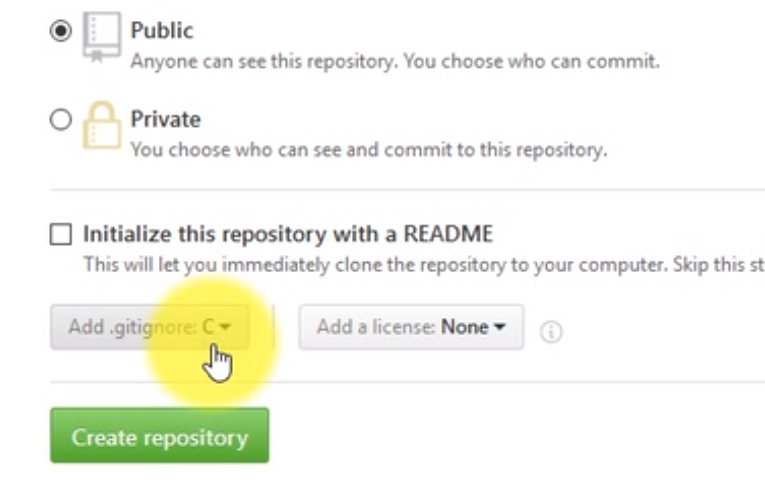

# 记录一下个人学习GitHub的经历
- [x]  为什么要学习GitHub？
- [ ]  GitHub入门
- [ ]  Git工具的基本使用
- [ ]  [markdown语法](../Markdown常用语法.txt)
- [ ]  git GUI工具
- [ ]  git 进阶教程
- [ ]  
## github 入门
### **.gitignore**
.gitignore 是一个纯文本文件，里面存放忽略被版本控制的文件
每行代表忽略一个文件，或一类文件，
注释： `# `所有的文字都可以算注释
直接vim .gitignore
如果想把.gitignore忽略的文件加入暂存区，可以git add -f [文件名]

可以不用自己编写自己的.gitignore
github 为我们编写了一些特定的 

- 查看gitignore 忽略的规则
- git check-ignore -v [文件名]

### Git常用命令
`[]`里面的是需要根据情况输入的值

|          git命令     | git 命令的含义 |
|:-------------------:|:--------------:|
|git status           |查看git状态      |
| git log             |查看本仓库的日志 |
|git config --global user.name [AllenLeic]|修改全局配置的用户名字|

- git config --global user.email leicong2015@outlook.com 修改全局配置的用户email
- git config -l  显示所有git config命令
- git remote -v 查看远程仓库remote状态 
- git 调用出git的帮助
- git help -a 列出git能使用的命令
- git blame 文件名   查看文件的所有提交信息
- git blame -L 开始行号，结束行号

### Git配置SSH协议
- 生成SSH 协议公钥和私钥
- ssh-Keygen -t rsa -C "leicong2015@outlook.com"  
- 将用户主目录下面的 .ssh 文件夹下面id_rsa.pub 打开，把上面的key复制下来放到  
- github登陆状态的setting--> key 粘贴就行了。  
- 然后再本地git clone 或 添加 remote   
- 添加remote 格式为：git remote add origin git@github.com:AllenLeic/Java-learning-journey.git  

- 调用git remote -v 查看是否链接成功；
- 首次推送会弹出：Are you sure you want to continue connecting (yes/no)? 
- 手动输入yes，然后回车回车，确认就行了。
- 如果推送成功的话在GitHub上的登陆状态能看到之前的SSH key已经变成了绿色图标了。

### Git的HTTP协议下如何记住用户名
- 一种方法：在git push origin master 中间加个-u变为`git push -u -origin master`  下次就自动记住了用户名和密码。
- 存储凭证：输入`git config --global credential.helper wincred` 代表存储凭证

### Git别名的使用
- 以图形的方式打印个Git提交日志
> git log --graph --pretty=format:'%h%  %ad | %s%d[%an]'  --date=short

这个命令太长了，可以用别名替代。  
- 配置方式
`git config --global alias.ci commit`    
  - 代表为commit 设置别名
- 可以到主目录去用文件配置的方式配置
  - cd ~ 
  - vim .gitconfig
  - 快速的编辑.gitconfig : vim ~/.gitconfig
  - 在里面的alias下面写自己的别名配置文件

### Git解决换行符提示的问题
因为Linux和Windows和mac的换行符不一样所以会出现换行符警告提示。 
输入命令`git config --global core.safecrlf false`  就解决了这个问题