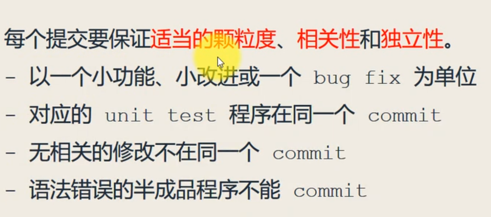
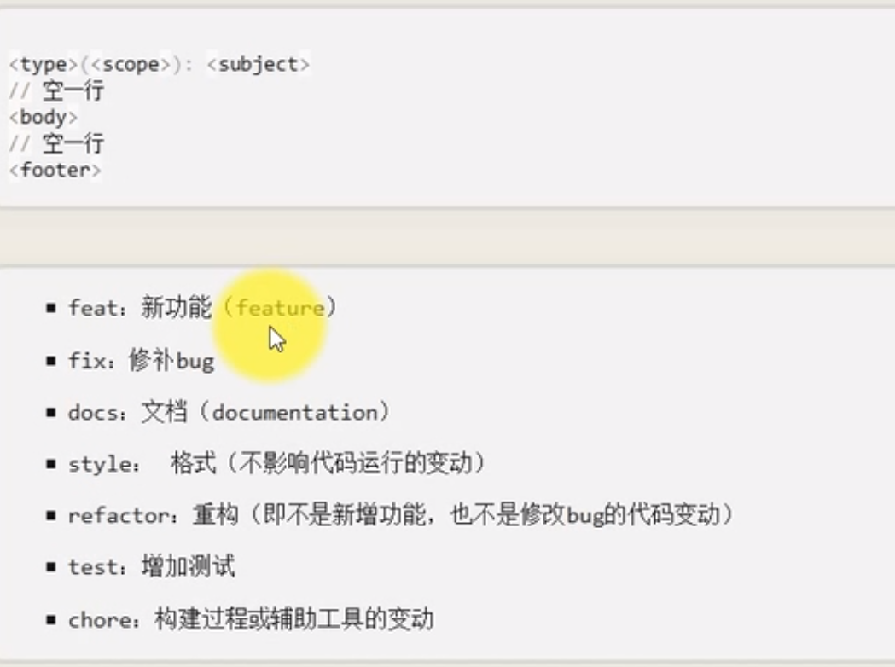
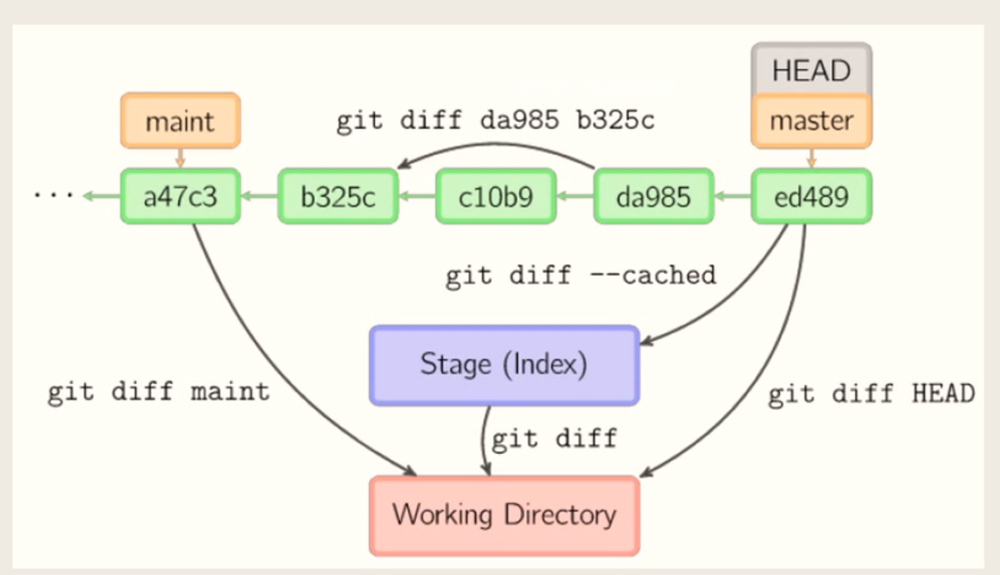
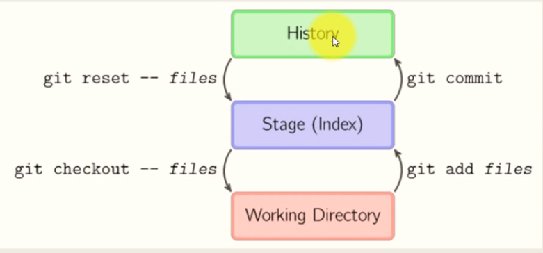
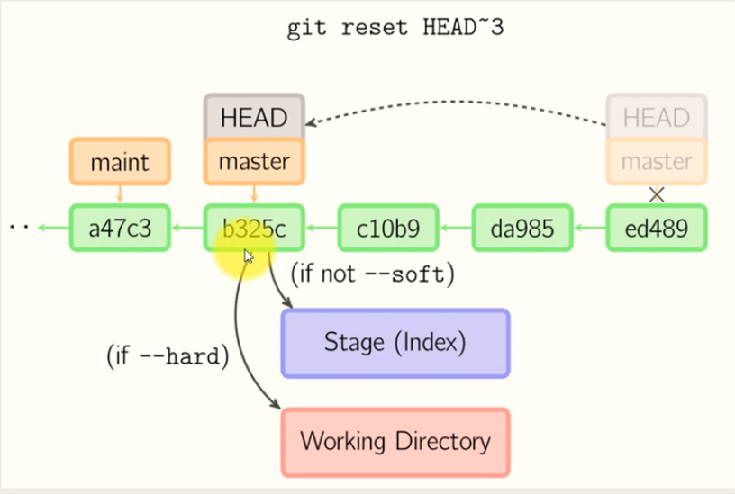

# 记录一下个人学习GitHub的经历
- [x]  [github介绍](#github介绍)
- [x]  [Git常用命令](#Git常用命令)
- [x]  [Git配置SSH协议](#Git配置SSH协议)
- [x]  [markdown语法](Markdown高级语法.md)
- [ ]  git GUI工具
- [ ]  git 进阶教程
- [ ]  

## github 入门
### GitHub介绍
GitHub是基于git的一个大型托管网站，是全球最大的 **开源社区** "男性交友平台"。 :smile:  

- 以下资料来自维基百科：  

> GitHub是通过Git进行版本控制的软件源代码托管服务，由GitHub公司（曾称Logical Awesome）的开发者Chris Wanstrath、PJ Hyett和Tom Preston-Werner使用Ruby on Rails编写而成。  
> 
>GitHub同时提供付费账户和免费账户。这两种账户都可以创建公开的代码仓库，但是付费账户还可以创建私有的代码仓库。根据在2009年的Git用户调查，GitHub是最流行的Git访问站点。 除了允许个人和组织创建和访问保管中的代码以外，它也提供了一些方便社会化共同软件开发的功能，即一般人口中的社区功能，包括允许用户追踪其他用户、组织、软件库的动态，对软件代码的改动和bug提出评论等。GitHub也提供了图表功能，用于概观显示开发者们怎样在代码库上工作以及软件的开发活跃程度。
>截止到2015年，GitHub已经有超过九百万注册用户和2110万代码库。  事实上已经成为了世界上最大的代码存放网站和开源社区。  
GitHub  
GitHub平台于2007年10月1日开始开发。 网站于2008年2月以beta版本开始上线，4月份正式上线。
>GitHub里面的项目可以通过标准的Git命令进行访问和操作。同时，所有的Git命令都可以用到GitHub项目上面。GitHub开发了针对Windows和OS X操作系统的桌面客户端。此外，也可以使用第三方插件来实现Git功能。

>网站提供了一系列社交网络具有的功能，例如赞、关注、评论。用户可以通过复刻他人项目的形式参与开发，并可通过协作示意图来查看有多少开发者参与了开发并追踪最新的复刻版本。此外网站还有Wiki（通过一个名为 gollum 的软件实现）等功能。

>GitHub同时允许注册用户和非注册用户在网页中浏览项目，也可以以ZIP格式打包下载。但是用户必须注册一个账号然后才能进行讨论、创建并编辑项目、参与他人的项目和代码审查。

>开发语言  
GitHub系统由GitHub公司的开发者Chris Wanstrath开发。系统采用了Ruby on Rails和Erlang作为后端。  

- 因为是全球最大的开源社区，上面有全球最新的开源技术，我们可以在上面学习到更多更新的技术，对自身的成长和视野的开拓是很有利的，所以很有必要掌握一些技术来在GitHub上闯荡江湖。
- GitHub是基于git的代码托管网站，所以我们有必要需学习一下git的一些操作。

### **.gitignore**
.gitignore 是一个纯文本文件，里面存放忽略被版本控制的文件
每行代表忽略一个文件，或一类文件，
注释： `# `所有的文字都可以算注释
直接vim .gitignore
如果想把.gitignore忽略的文件加入暂存区，可以git add -f [文件名]

可以不用自己编写自己的.gitignore
github 为我们编写了一些特定的 

- 查看gitignore 忽略的规则
- git check-ignore -v [文件名]

### Git常用命令
`[]`里面的是需要根据情况输入的值

|          git命令     | git 命令的含义 |
|:-------------------:|:--------------:|
|`cd [路径]`             | 转到路径下|
|`git help -a`          |列出git能使用的命令|
|`git`                    |调用出git的帮助|
|`git status `          |查看git暂存区状态      |
|`git statud -sb`       |用简短的方式查看git暂存区状态|
|`git log`             |查看本仓库的日志 |
|`git log [-5]`         |查看最近的5条日志|
|`git log [文件名]`      |只看这个文件提交的历史|
|`git log --grep [messages]` | 根据messages来过滤查看的信息|
|`git config --global user.name [用户名]`|修改全局配置的用户名字|
|`git config --global user.email [邮箱名字]`|修改全局配置的用户email|
|`git config -l`       |显示所有`git config`的子命令|
|`git remote -v`        |查看远程仓库remote状态 |
|`git blame [文件名]`|查看文件的所有提交信息|
|`git blame -L [开始行号，结束行号]`|从开始行行号查询到结束行号|
|`git clean -f`            |删除未被版本追踪的文件|
|`git clean -n`         |列出所有未被版本追踪的文件|
|`git clean -x -f`      |删除所有未被版本追踪的文件，包括被.gitignore忽略的文件|
|`touch [文件名]`        |创建一个新文件|
|`git add [文件名]`    |把文件加入暂存区，文件名`.`代表所有文件|
|`git add -p [文件名]`           |一个文件多次提交|
|`git rm [文件名]`         |删除文件，文件在暂存区|
|`rm [文件名]`            | 直接删除文件，不在暂存区|
|`cat [a]`              |查看a文件内容|
|`echo [文字信息] >> [文件名A]` |在A里面增加了文字信息|
|`git mv [a] [b]`       |重命名 ， 把a改为b|
|`git mv [a] ./demos/`  | 把a文件移动到demos文件夹|
|`mkdir [文件名]`        |创建文件夹|
|`git commit -m "message"`| 提交暂存区的版本|
|`git commit -a -m "message"` | git中已经有之前的版本了|
|`git commit -am "message"` | 同上，只是简化了代码|
|`git show HEAD`         |HEAD相当于指针，目前指向的是当前提交，如果要看上一条提交就在HEAD后面加^或~1|
|`git show [哈希值]`       |根据哈希值显示提交内容|

### git commit 提交的时候的一些注意事项
- git commit 提交的时候的一些建议和原则。

- git commit 时候message的书写建议和规范。
- 使用格式化的message有什么好处？
  1. 帮助我们快速浏览，提供更多的信息
  2. 可以很方便的查找某一类信息
  3. 可以很方便的提取出change log
- 如何去写规范化的message

`docs(文件名): fix grammar `

`<body>`

`<foot> 可以用closeed # 关闭issues`    
- angular规范， angular是Google公司推出的一个框架，目前开源社区最广泛的规范。

### gitdiff命令讲解

### Git配置SSH协议
- 生成SSH 协议公钥和私钥
- `ssh-Keygen -t rsa -C "leicong2015@outlook.com" ` 
- 将用户主目录下面的 .ssh 文件夹下面id_rsa.pub 打开，把上面的key复制下来放到  
- github登陆状态的setting--> key 粘贴就行了。  
- 然后再本地git clone 或 添加 remote   
- 添加remote 格式为：`git remote add origin git@github.com:AllenLeic/Java-learning-journey.git  `

- 调用`git remote -v` 查看是否链接成功；
- 首次推送会弹出：Are you sure you want to continue connecting (yes/no)? 
- 手动输入yes，然后回车回车，确认就行了。
- 如果推送成功的话在GitHub上的登陆状态能看到之前的SSH key已经变成了绿色图标了。

### Git的HTTP协议下如何记住用户名
- 一种方法：在`git push origin master` 中间加个-u变为`git push -u -origin master`  下次就自动记住了用户名和密码。
- 存储凭证：输入`git config --global credential.helper wincred` 代表存储凭证

### Git别名的使用
- 以图形的方式打印个Git提交日志
> `git log --graph --pretty=format:'%h%  %ad | %s%d[%an]'  --date=short`

这个命令太长了，可以用别名替代。  
- 配置方式
`git config --global alias.ci commit`    
  - 代表为commit 设置别名
- 可以到主目录去用文件配置的方式配置
  - `cd ~ `
  - `vim .gitconfig`
  - 快速的编辑.gitconfig : `vim ~/.gitconfig`
  - 在里面的alias下面写自己的别名配置文件

### Git解决换行符提示的问题
因为Linux和Windows和mac的换行符不一样所以会出现换行符警告提示。 
输入命令  
`git config --global core.safecrlf false`  就解决了这个问题

### Git 的回撤操作

- 回撤暂存区内容到工作目录
  - git reset HEAD  暂存区stage到working directory（处理暂存区和工作目录）

- 回撤提交到暂存区
  - git reset HEAD --soft
  - git reset HEAD^ --soft 这个是把最后一次commit 从history撤回
  - git reset `[hash值]` --hard 把版本退回到这个hash值这个版本
- 回撤提交，放弃更改
  - git reset HEAD --hard

- 回撤远程仓库，-f 即 --force
  - git push -f （强行把本地的仓库和远程仓库同步，让远程仓库变成和本地仓库一样）

- 回撤上一次提交
  - git add .
  - git commit --amend -m "message"

- 变基操作，改写历史提交
  - git rebase -i HEAD~3 【-i 是交互性的变基】
  会弹出一个vim编辑窗口 然后根据里面的提示，编辑操作是非常强大的。
