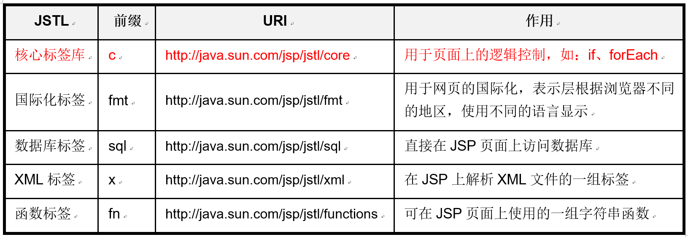

# EL和JSTL及MVC设计模式

## EL表达式

### EL表达式的作用
需求：实现登录的功能，如果登录失败，Servlet就向请求域中添加信息，转发到login.jsp显示出来  

- servlet: 得到表单的用户名和密码，判断是否登录成功，如果登录失败向请求域中添加错误信息，转发。
- jsp：在页面上从请求域中取出servlet放在里面的信息，并且显示出来。  
代码:  
```html
<%--  <%
    String msg = (String) request.getAttribute("msg");
    if (msg !=null) {
        out.print(msg);
    }
  %> --%>
  
  ${msg}
  <form action="login" method="post">
   用户名：
   <input type="text" name="name"/><br/>
   密码：
   <input type="password" name="password"/><br/>
   <input type="submit" value="登录"/>
  </form>

```

```java
package com.itheima.servlet;

import java.io.IOException;
import java.io.PrintWriter;

import javax.servlet.ServletException;
import javax.servlet.annotation.WebServlet;
import javax.servlet.http.HttpServlet;
import javax.servlet.http.HttpServletRequest;
import javax.servlet.http.HttpServletResponse;

/**
 * 登录
 * @author NewBoy
 *
 */
@WebServlet("/login")
public class Demo1LoginServlet extends HttpServlet {

    public void doGet(HttpServletRequest request, HttpServletResponse response)
            throws ServletException, IOException {
        //得到表单的用户名和密码
        String name = request.getParameter("name");
        String password = request.getParameter("password");
        //判断是否登录成功
        if ("admin".equals(name) && "123".equals(password)) {
            //存到会话域
            request.getSession().setAttribute("name", name);
            //重定向
            response.sendRedirect(request.getContextPath() + "/welcome.jsp");
        }
        //如果登录失败向请求域中添加错误信息
        else {
            request.setAttribute("msg", "用户名或密码不正确");
            //转发。
            request.getRequestDispatcher("/index.jsp").forward(request, response);
        }
    }

    public void doPost(HttpServletRequest request, HttpServletResponse response)
            throws ServletException, IOException {
        doGet(request, response);
    }

}
```

`欢迎您！<%-- <%=session.getAttribute("name")%> --%>  ${name}`

2. JSP页面中使用Java代码的建议： 
- 原则： 不建议在JSP上写大量的Java代码，因为页面最好是以标签为主。
- JSP表达式：使用EL表达式来代替
- Java代码： 使用JSTL来代替  
**目的：减少JSP页面上的Java代码**  

3. 什么是EL： Expression Language 表达式语言  
- 语法：${表达式}  
- 与JSP表达式区别：  


|区别|JSP表达式|EL|
|---|---------|---|
|语法|<%= 变量名或表达式%>| ${变量名或表达式}|
|输出值|输出脚本上的变化值|输出作用域中的值|


```
   <%
    int m= 100;
    //m必须放在作用域
    pageContext.setAttribute("n", m);
   %>
   
   使用JSP表达式：<%=m%><br/>
   EL表达式：${n} <br/>
```

4. EL表达式的作用：
  - 用来输出作用域中的变量
  - 用来进行运算

### 获取数据
1. 在四个域中查找
`${msg}` 相当于这个方法：  `pageContext.findAttribute("msg")`
2. 指定域获取数据  
  

3. 演示：保存4个同名的变量，分别输出每个域中的变量值。  
  

```jsp
   <%
    pageContext.setAttribute("color", "red");
    request.setAttribute("color", "green");
    session.setAttribute("color", "blue");
    application.setAttribute("color", "yellow");
   %>
   
   <div style="color: ${pageScope.color}">
    给你一点颜色看看
   </div>
   <div style="color: ${requestScope.color}">
    给你一点颜色看看
   </div>
   <div style="color: ${sessionScope.color}">
    给你一点颜色看看
   </div>
   <div style="color: ${applicationScope.color}">
    给你一点颜色看看
   </div>
   <div style="color: ${color}">
    给你一点颜色看看
   </div>
```


### EL中的11个内置对象
  

- 各个内置对象的作用  
  


### pageContext调用get方法
``` jsp 
    <body>
    当前工程路径<br/>
    <%=request.getContextPath() %><br/>
    ${pageContext.request.contextPath} <br/>
    <hr/>
    请求资源路径<br/>
    <%=request.getRequestURL() %><br/>
    ${pageContext.request.requestURL } <br/>
    <hr/>
    当前会话的ID<br/>
    <%=session.getId() %><br/>
    ${pageContext.session.id}<br/>
    <hr/>
```

### 得到Cookie中的值
- 先通过EL得到指定cookie的对象，再通过getName()和getValue()得到具体的名字和值  
```jsp
    <%
    //超人
    Cookie man = new Cookie("user", "Superman");
    man.setMaxAge(1000);
    response.addCookie(man);
    %>
    Cookie的名字：
    ${cookie.user.name},   ${cookie.user.value}
```

### param和paramValues使用
```jsp
访问地址：http://localhost:8080/day41-el/demo2.jsp?user=jack&hobby=swimming&hobby=chicken<br/>
得到值：${param.user} <br/>
爱好：${paramValues.hobby[0]}、${paramValues.hobby[1]}、${paramValues.hobby[2]} <br/>
```

### 得到浏览器的类型
```
  <hr/>
  <%=request.getHeader("user-agent") %><br/>
  ${header["user-agent"] }<br/>
  ${header['user-agent'] }<br/>
```

### EL表达式中[""]和.的区别
1. 得到EL表达式的两种写法
```jsp
<%
    request.setAttribute("mn", 100);
    request.setAttribute("m-n", 200);
%>
    ${requestScope.mn} <br/>
    ${requestScope["m-n"]} <br/>
```
2. 什么时候使用[""]方式
如果名字(键)中包含有特殊的符号，则使用[""]方式，双引号和单引号都可以。  

## EL表达式获取不同类型的数据
  

```jsp
<%@page import="com.itheima.entity.Student"%>
<%@ page language="java" import="java.util.*" pageEncoding="UTF-8"%>
<!DOCTYPE HTML PUBLIC "-//W3C//DTD HTML 4.01 Transitional//EN">
<html>
  <head>
    <title>demo3.jsp</title>
  </head>
  <body>
    <h3>获取JavaBean</h3>
    <%
        Student stu = new Student(100, "潘金莲", false, 95.6);
        pageContext.setAttribute("stu", stu);
    %>
    名字： ${stu.name}  ， 性别：${stu.male?"男":"女"}， 分数：${stu.score}
    <hr/>
    <h3>获取数组</h3>
    <%
        int[] arr = {40,30,10,35};
        request.setAttribute("arr", arr);
    %>
    ${arr[0]}、${arr[1]}、${arr[2]}、${arr[3]}
    <hr/>
    <h3>获取Map</h3>
    <%
        HashMap<String, String> map = new HashMap<String,String>();
        map.put("no1", "小红");
        map.put("no2", "小花");
        map.put("no-3", "小菊");
        session.setAttribute("map", map);
    %>
    ${map}<br/>
    ${map.no1}、${map.no2}、${map['no-3']}
    <hr/>
    <h3>获取List</h3>
    <%
        ArrayList<String> names = new ArrayList<String>();
        names.add("孙悟空");
        names.add("孙悟天");
        names.add("孙悟饭");
        pageContext.setAttribute("names", names);
    %>
    ${names}<br/>
    ${names[0]}、${names[1]}、${names[2]}<br/>
    <hr/>
  </body>
</html>

```
- 面试题: 
如果一个会话域中保存了一个user对象，请问以下哪种取值可以取出user对象的username属性值。  
```jsp
A： ${user.username}  
B： ${sessionScope.user.username}     
C： ${username}   
D： <%=((User)pageContext.findAttribute("user")).getUsername() %>     
E： <%=((User)session.getAttribute("user")).getUsername() %> 
```

## EL中使用表达式

### 算术
  

### 比较表达式
  

### 逻辑表达式
  

### 三元运算
**${逻辑表达式?真的值: 假的值}**  

### 判空表达式
1. 语法：
`${empty 表达式}` 如果表达式不为空，返回`false`，为空返回`true`
2. 作用：  
  - 用于判断表达式是否为null
  - 用于判断字符串是否是空字符串
  - 用于判断集合是否有元素

```jsp
<%@page import="com.itheima.entity.Student"%>
<%@ page language="java" import="java.util.*" pageEncoding="UTF-8"%>
<!DOCTYPE HTML PUBLIC "-//W3C//DTD HTML 4.01 Transitional//EN">
<html>
<head>
<title>demo4.jsp</title>
</head>
<body>
    <h2>算术运算符</h2>
    ${1+1}
    <br /> ${2-1}
    <br /> ${1*1}
    <br /> ${5 div 2}
    <br /> ${5 div 0}
    <br /> ${5 mod 2}
    <br />
    <h2>比较运算符</h2>
    ${1 eq 1}
    <br /> ${1 != 1}
    <br /> ${1 lt 2}
    <br /> ${1 <= 1}
    <br /> ${1 > 2}
    <br /> ${1 >=1}
    <br />

    <h2>逻辑运算符</h2>
    ${true and false}
    <br /> ${true || false }
    <br /> ${not true}
    <br />

    <h2>三元运算</h2>
    ${param.age >18?"成年人，请充值":"未成年，请绕行"}
    <br />

    <h2>判空表达式</h2>
    <%
        Student obj = new Student();
        pageContext.setAttribute("obj", obj);
    %>
    1) 用于判断表达式是否为null： ${empty obj}
    <br /> 2) 用于判断字符串是否是空字符串: ${empty  "abc"}
    <br /> ${empty  ""}
    <br /> 3) 用于判断集合是否有元素
    <br />
    <%
        ArrayList<String> names = new ArrayList<String>();
        names.add("孙悟空");
        names.add("孙悟天");
        names.add("孙悟饭"); 
        pageContext.setAttribute("names", names);
    %>
    ${empty names}
</body>
</html>
```

### EL表达式的启用和禁用
- 页面禁用:`<%@page isELIgnored="true" %>  true表示不可用，false表示可用`  
- EL的转义:`\${5 div 0} 这个EL不起作用`  

## 核心标签库

### JSTL标签库
1. 什么是JSTL： Java Standard Tag Library Java标准标签库，多个标签组成的库。
2. JSTL标签库的分类: 
  

3. JSTL使用步骤
  - 创建项目的时候导入JSTL的jar包
  - 在页面上使用taglib指令导入标签库
  - `<%@taglib prefix="c" uri=" http://java.sun.com/jsp/jstl/core" %>`
   
### 判断标签<c:if>
作用： 用于判断指定的表达式是否为真，如果为真，则执行标签体中的内容。  
  
示例：如果用户提交的age值大于18，则显示你已经成年，否则显示未成年。
```jsp
    <c:if test="${param.age >=18 }">
        你已经成年
    </c:if>
    <c:if test="${param.age <18 }">
        未成年
    </c:if>
```

### 多分枝标签
- 作用：相当于Java中的switch代码块  
   
- 案例：通过输入分数，得到评级  
- 在一个表单grade.jsp输入一个分数，提交给自己。然后在同一个页面中根据分数输出相应的等级，90~100优秀 80~90 良好 60~70中等 60~70 及格 60以下不及格。   

  
```jsp
<%@ page language="java" import="java.util.*" pageEncoding="UTF-8"%>
<%@taglib prefix="c" uri="http://java.sun.com/jsp/jstl/core" %>
<!DOCTYPE HTML PUBLIC "-//W3C//DTD HTML 4.01 Transitional//EN">
<html>
  <head>
    <title>demo2.jsp</title>
  </head>
  <body>
    <form action="demo2.jsp">
        分数：
        <input type="text" name="score" value="${param.score}"/>
        <input type="submit" value="评级"/>
    </form>
    <!-- 判断是否为空 -->
    <c:if test="${not empty param.score }">
        <c:choose>
            <c:when test="${param.score>=90 and param.score<=100}">
                优秀
            </c:when>
            <c:when test="${param.score>=60 and param.score<90}">
                及格
            </c:when>
            <c:when test="${param.score>=0 and param.score<60}">
                不及格
            </c:when>
            <c:otherwise>
                分数有误
            </c:otherwise>
        </c:choose>
    </c:if>
  </body>
</html>
```


### 遍历标签<c:forEach>
1. 作用： 用于遍历数组或集合
  

2. varStatus对象属性  
  

3. 遍历集合：
  - 示例：学生信息：包含编号，姓名，性别，成绩。在Servlet中得到所有的学生信息，转发到JSP页面，在JSP页面上使用forEach标签，从List中输出所有的学生信息。  

   

```java
package com.itheima.servlet;

import java.io.IOException;
import java.io.PrintWriter;
import java.util.ArrayList;
import java.util.List;

import javax.servlet.ServletException;
import javax.servlet.annotation.WebServlet;
import javax.servlet.http.HttpServlet;
import javax.servlet.http.HttpServletRequest;
import javax.servlet.http.HttpServletResponse;

import com.itheima.entity.Student;

/**
 * 读取学生信息
 * 放在请求域中
 * 转发到demo3.jsp使用forEach显示
 * @author NewBoy
 *
 */
@WebServlet("/list")
public class ListStudentServlet extends HttpServlet {

    public void doGet(HttpServletRequest request, HttpServletResponse response)
            throws ServletException, IOException {
        //创建集合对象
        List<Student> students = new ArrayList<Student>();
        students.add(new Student(1000, "猪八戒", true, 65));
        students.add(new Student(2000, "白骨精", false, 79));
        students.add(new Student(3000, "嫦娥", false, 98));
        students.add(new Student(4000, "唐僧", true, 79));
        students.add(new Student(5000, "蜘蛛精", false, 99));
        //放在请求域中
        request.setAttribute("students", students);
        //转发
        request.getRequestDispatcher("/demo3.jsp").forward(request, response);
    }

    public void doPost(HttpServletRequest request, HttpServletResponse response)
            throws ServletException, IOException {
        doGet(request, response);
    }

}
```
  
```jsp
<%@ page language="java" import="java.util.*" pageEncoding="UTF-8"%>
<%@taglib prefix="c" uri="http://java.sun.com/jsp/jstl/core" %>
<!DOCTYPE HTML PUBLIC "-//W3C//DTD HTML 4.01 Transitional//EN">
<html>
  <head>
    <title>demo3.jsp</title>
    <style type="text/css">
        tr {
            height: 30px;
            text-align: center;
        }
        
        th {
            background-color: lightgray;
        }
        
        table {
            border-collapse: collapse;
        }
        
        tr:hover {
            background-color: lightyellow;
        }
    </style>
  </head>
  <body>
    <h3>显示学生列表</h3>
    <table border="1" width="500">
        <tr>
            <th>序号</th>
            <th>学号</th>
            <th>姓名</th>
            <th>性别</th>
            <th>成绩</th>
        </tr>
        <!--  
        items: 数组或集合
        var: 代表集合中的每个元素，变量名就是JavaBean
        begin: 指定从哪个元素开始遍历，默认是0
        end: 到哪个元素结束
        step: 步长，每次跳几个元素
        varStatus: 对象名
         -->
        <c:forEach items="${requestScope.students}" var="stu" varStatus="row">
        <tr>
            <td>${row.last}</td>
            <td>${stu.id}</td>
            <td>${stu.name}</td>
            <td>${stu.male?"男":"女"}</td>
            <td>${stu.score}</td>
        </tr>
        </c:forEach>
    </table>
  </body>
</html>
```

- **遍历各种元素**
```jsp
<%@ page language="java" import="java.util.*" pageEncoding="UTF-8"%>
<%@taglib prefix="c" uri="http://java.sun.com/jsp/jstl/core" %>
<!DOCTYPE HTML PUBLIC "-//W3C//DTD HTML 4.01 Transitional//EN">
<html>
  <head>
    <title>demo4.jsp</title>
  </head>
  <body>
    <h3>遍历数组</h3>
    <%
        int[] arr = {40,30,10,35};
        request.setAttribute("arr", arr);
    %>
    <c:forEach items="${arr}" var="num">
        ${num} &nbsp;
    </c:forEach>
    
    <h3>遍历Map</h3>
      <%
        TreeMap<String, String> map = new TreeMap<String,String>();
        map.put("no1", "小红");
        map.put("no2", "小花");
        map.put("no3", "小菊");
        request.setAttribute("map", map);
    %>
    <c:forEach items="${map}" var="entry">
        键： ${entry.key} -->  值： ${entry.value }  <br/>
    </c:forEach>
    
    <h3>Java中for循环的用法</h3>
    <c:forEach begin="1" end="100" var="num" step="2">
        ${num} &nbsp;
    </c:forEach>
  </body>
</html>

```

## JSP的开发模式

### 模式一(Model Ⅰ)
  
1. 适用的开发类型： 
  - 用于一些小型项目开发，开发效率比较高。目前来说几乎不用了。
2. 使用的技术和功能：
  - JSP：表示层，并且调用了JavaBean访问数据库
  - JavaBean: 封装数据，业务逻辑，数据库访问


### 模式二(Model Ⅱ)
1. 适用的开发类型：
  - 中大型项目的开发，目前几乎都是使用这种开发模式。
2. 使用技术和各部分功能：
  - Servlet：做为控制器来使用
  - JavaBeans：封装数据，业务逻辑，数据库访问
  - JSP：用做表示层(HTML5，CSS，JavaScript，EL，JSTL)

  

### MVC开发模式
- 什么是MVC
  MVC是一种设计模式，与语言无关。在JavaWeb中模式2是MVC的一种实现  
  

  

MVC是一种软件设计模式，将1业务逻辑、2数据存储、3界面显示 分离的方式来组织项目的代码。将业务逻辑放在一个部件里面，在修改用户界面及用户交互的同时，不需要重新编写业务逻辑。使用MVC的目的是将M和V的实现代码分离，从而使同一个程序可以使用不同的表现形式。  

### 三层开发模式

1. 三层结构  
  

2. 各层的作用
  - 表示层(又称为Web层)： JSP+Servlet
  - 业务层：处理各种业务功能，如：登录，注册
  - 数据访问层：用来与数据库进行交互。Dao  
    

3. 在JavaWeb中的三层
- 问: 我们的JavaWeb开发使用哪种架构？
- 既有MVC，又有三层架构
- Javaweb中的三层架构是MVC设计模式的一种实现  

## 案例:使用MVC和三层结构显示商品列表
  
