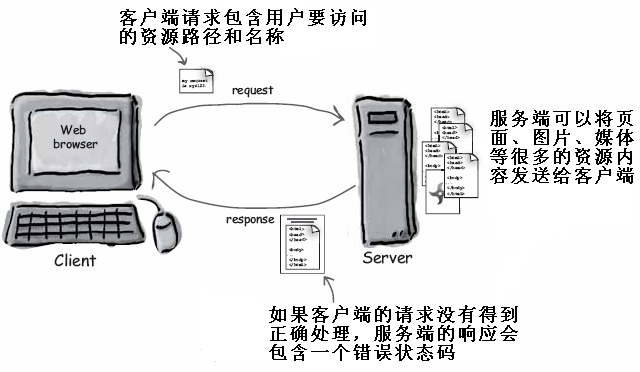
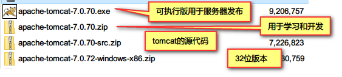

# HTTP协议&Tomcat

## HTTP协议概述
### HTTP协议是什么
概念：Hyper Text Transfer Protocol超文本传输协议，HTML Hyper Text Markup Language 超文本标签语言  
作用：用于在网络上传输HTML的，在浏览器与服务器之间进行数据的传输  
- HTTP协议的特点
- 1）HTTP协议的组成：HTTP的请求request，HTTP响应response  
- 2）无状态协议，浏览器向服务器发送请求的时候，服务器并不记录用户的状态。同一个浏览器多次发送请求，服务器并不知道这是同一个用户。
- 3）因为不记录用户的状态，**所以HTTP协议的传输速度是比较快。HTTP是应用层协议运行在TCP协议之上，TCP协议是传输层协议**  
- 默认端口号：80
- TOMCAT默认端口号：8080
- http://www.itcast.cn/ 输入http://www.itcast.cn:80是一样的。
- https://www.taobao.com/加密的HTTP协议，效率上比http协议要低。端口号：443

### URL组成
 <br>
- **什么是URL：3.2.1  什么是URL：用来访问互联网上的<font style="color:red">Web资源</font>，代表Web资源的访问地址**
- `http://www.itcast.cn:8080/day35/index.jsp?boardid=5&id=24618&page=1`

- URL和URI的区别
Uniform Resource Locator 统一资源定位符，一个可以直接访问的地址。  
Uniform Resource Identifier 统一资源标识符，只是起到标识的作用，不能访问。一般是URL的一部分。  

## HTTP请求

### 什么是HTTP请求
- **用于封装浏览器向服务器发送的所有的数据**

### 查看HTTP请求
1. 在HTML页面上，制作2个表单提交页面，用户名和密码，get和post提交按钮，查看HTTP请求


```html
<form action="server" method="get">
    用户名：
    <input type="text" id="user"  name="user"/><br />
    密码：
    <input type="password" name="pwd" /><hr />
    <input type="submit" value="登录"/>
</form>

```

2. 查看浏览器与服务器的通讯
  
HTTP协议的组成部分  


### HTTP请求的组成
1. get 方法的请求头  


2. post方法的请求头  


3. HTTP请求的三个组成部分
  - 请求行
  - 请求头
  - 请求体，get方法中没有请求体，参数以查询字符串的方式发送，post方法中参数在请求体中发送。
  
### 请求行
1. 一个完整的请求行包括：
  - 求情的方式：get或post
  - 请求的URI
  - 协议和版本
  - 如`GET /day35-html/index.html HTTP/1.1`
2. 请求方式的区别
   


### 请求头


### 请求体
在get方法中没有请求体，post方法中才有

## HTTP响应概述
### 什么是HTTP响应
由服务器发送给浏览器的所有的数据

### 响应的信息组成
1. 响应行  
2. 响应头  
3. 响应体   


### 响应行
`HTTP/1.1 200 OK`
1. 协议和版本 http/1.1
2. 状态码 200
3. 状态信息 OK

- 常用的状态码的含义  


### 响应头


### 响应体
就是服务器向浏览器发送的数据，比如网页或图片的数据

## 软件的架构

### BS和CS概述
1. **CS的特点：**  


Client Server 客户端/服务器模式  

1) 所有的客户端都需要安装软件，客户端美化比较方便。网络游戏：LOL，魔兽  
2) 如果服务器升级，所有的客户端都要升级。  
3) 程序员开发：主要开发客户端  
  

2. **BS的特点：**
Browser Server 浏览器服务器模式  
 

1)  客户端不用安装，只要有浏览器就可以运行。  
2)  服务器升级，客户端不用升级。  
3)  程序员开发服务器端


3. **静态网站和动态网站的区别**
- 特点：<font style="color: red">程序运行在服务器端是动态网页</font>
- 静态网站的特点：
  静态网页是相对于动态网页而言，是指没有后台数据库、不含程序和不可交互的网页。你编的是什么它显示的就是什么、不会有任何改变。  
- 动态网站的特点：
  1)  动态网页<font style="color:red">以数据库技术为基础<font>，可以大大减少降低网站维护的工作量；  
  2)  采用动态网页技术的网站可以实现更多的功能，如用户注册、用户登录、在线调查、用户管理、订单管理等等；  
  3)    动态网页实际上并不是独立存在于服务器上的网页文件，只有当用户请求时服务器才返回一个完整的网页；**一个服务器端运行的Java程序，运行的结果就是一个动态网页。**
  使用的技术：JSP、C#、PHP  

## Web服务器 
### 什么是Web服务器
1) 硬件上就是一台性能强大电脑  
2) 软件上需要安装Web容器，又叫Web服务器。我们写的Java程序是运行在Web容器中。  
  

### JavaEE的规范
什么是JavaEE的规范  
1)  在Java中所有的服务器要实现一组Oracle公司规定的接口，这些接口称为 <font style="red">JavaEE规范</font>。不同厂商的JavaWeb服务器都实现了这些接口。在JavaEE中一共有13种规范。  

2)  常见的JavaEE规范有： <font>JSP、Servlet、JDBC、XML、DataSource</font> EJB   

### 什么是Web服务器
  由服务器厂商实现了Oracle制定的JavaEE规范，使用Java写的，用来调用Servlet等程序，并且将服务器的资源发送给浏览器。  
  

- 模拟一个Web服务器
1) 读取本地资源  
2) 发送给不同的客户端，使用IE浏览器访问  
3) 采用多线程的方式  
```java
package com.itheima.tomcat;

import java.io.FileInputStream;
import java.io.FileNotFoundException;
import java.io.IOException;
import java.io.OutputStream;
import java.net.ServerSocket;
import java.net.Socket;

public class MyTomcat extends Thread {

    private Socket socket; // 每个对象不同

    public MyTomcat(Socket socket) {
        this.socket = socket;
    }

    @Override
    public void run() {
        // 1) 读取本地资源
        try (FileInputStream inputStream = new FileInputStream("e:\\MyWeb\\index.html");
                // 得到输出流
                OutputStream outputStream = socket.getOutputStream();) {
            int len = 0;
            byte[] buf = new byte[4096];
            while((len=inputStream.read(buf))!=-1) {
                outputStream.write(buf, 0, len);
            }
        } catch (IOException e) {
            e.printStackTrace();
        }
    }

    public static void main(String[] args) throws IOException {
        // 每个用户访问创建一个线程
        ServerSocket serverSocket = new ServerSocket(8080);
        System.out.println("服务器启动");
        while (true) {
            Socket socket = serverSocket.accept(); // 得到一个客户端
            //输出客户端的信息
            System.out.println(socket.getInetAddress().getHostAddress() + "用户连接");
            // 启动一个线程
            new MyTomcat(socket).start();
        }
    }

}

```

- 常见的Web服务器
1) WebLogic:  
  WebLogic是Oracle公司的产品，是目前应用最广泛的Web服务器，支持J2EE规范。WebLogic最早由 WebLogic Inc. 开发，后并入BEA 公司，最终BEA公司又并入 Oracle公司。BEA WebLogic是用于开发、集成、集群、部署和管理大型分布式Web应用、网络应用和数据库应用的Java应用服务器。


2) WebSphere
另一个常用的Web服务器是IBM公司的WebSphere，支持JavaEE规范。  


3) 其他：  
  

4) Tomcat服务器： **免费开源**
在小型的应用系统或者有特殊需要的系统中，可以使用一个免费的Web服务器：Tomcat
支持的规范：该服务器支持全部JSP以及Servlet规范  

  

## Tomcat的使用
### Tomcat入门
下载和安装：  
- apache官网：www.apache.org  
- tomcat的产品页面：http://tomcat.apache.org/
  
- 安装包的类别： 
  
安装：zip包直接解压到任何一个目录即可
- 启动与关闭：
1. 启动
`c:\apache-tomcat-7.0.70\bin\startup.bat`
  

2. 测试是否启动成功： 
   

3. 关闭：
正常关闭，如果直接关闭窗口 则是中断服务器  
`c:\apache-tomcat-7.0.70\bin\shutdown.bat`

### Tomcat目录结构(重点)
    

### Tomcat启动时常见的问题
1. 未设置JAVA_HOME 环境变量
- 必须要配置JAVA_HOME 或JRE_HOME
  
- 解决办法：在环境变量中加JAVA_HOME的配置

2. 端口被占用
- 出错信息：
  
- 查看日志文件：
  

- 解决办法：
  1. 使用软件查看哪个端口占用了8080，把它终止。
  2. 修改tomcat的默认端口号，如：8888  
    - 修改conf/server.xml,文件找到71行。重启Web容器
    ```xml
        <Connector port="8888" protocol="HTTP/1.1"
               connectionTimeout="20000"
               redirectPort="8443" />
    ```
  


### Tomcat项目的发布方式(重点)
1. 方式一：
  直接将我们写的项目赋值到`tomcat/webapps`文件夹
    

2. 方式二：
  将项目复制到tomcat/webapps/ROOT, 表示欢迎页面，访问的时候可以省略前面的项目名，默认打开index.html或index.jsp
  ```xml 
   <!-- 欢迎页面列表 -->
    <welcome-file-list>
          <welcome-file>a.html</welcome-file>
          <welcome-file>b.html</welcome-file>
    </welcome-file-list>

  ```


## Servlet的开发
### JavaWeb的开发步骤
1. JavaWeb的开发步骤  
  创建项目：项目命名、项目所在目录、项目的JavaSE和JavaEE版本  
  

2. 选择Java的源代码和字节码的目录  
  

3. 项目的访问地址，网页所在的文件夹  
  

### 什么是Servlet
  Servlet是一个Java写的小应用程序，运行在Web容器中(Tomcat)，用来接收浏览器的请求，并且做出响应。  


### 开发Servlet程序
1. Web项目结构：  
  

- lib: 用于存放我们项目开发过程中用到的第3方的jar库
- classes: 用于存放字节码文件  
- web.xml: 当前项目的配置文件，servlet就需要在这里进行配置

2. 利用MyEclipse开发Servlet的步骤  

- myeclipse自带了tomcat,但是一个简化版，没有欢迎页面，我们使用自己外部的tomcat。  
  

在myeclipse中启动Tomcat   
  

- 开发servlet步骤
1. 创建一个Java类继承于HttpServlet抽象类
2. 重写抽象方法，doGet和doPost,doGet方法用于处理get请求，doPost方法用于处理post请求。
3. 在doGet方法中，得到打印流，将网页的内容输出到浏览器
4. 在web.xml中编写servlet的配置信息
``` java
package com.itheima.servlet;

import java.io.IOException;
import java.io.PrintWriter;

import javax.servlet.ServletException;
import javax.servlet.http.HttpServlet;
import javax.servlet.http.HttpServletRequest;
import javax.servlet.http.HttpServletResponse;

//1)    创建一个Java类继承于HttpServlet抽象类
public class HelloServlet extends HttpServlet {
    
    /**
     * 如果直接在浏览器上输入的地址，使用的是get方法，通过表单的post提交才是post方法
     * request表示请求，response表示响应
     */
    @Override
    //2)    重写doGet或doPost方法，doGet方法用于处理get请求，doPost方法处理post请求
    protected void doGet(HttpServletRequest request, HttpServletResponse response)
            throws ServletException, IOException {
        // 3) 在doGet方法中，得到打印流，将网页的内容输出到浏览器。
        //设置响应的MIME类型为html，字符集为utf-8
        response.setContentType("text/html;charset=utf-8");
        //通过响应对象得到打印流
        PrintWriter out = response.getWriter();
        out.print("<h1>我是一个Servlet</h1>");
        out.close();   //响应结束，流自动关闭
        //4)    在web.xml中编写servlet的配置信息
    }

}

```

5. 编写文件web.xml  
  

6. 部署项目到tomcat，点击按钮  
  

7. 运行Tomcat，在浏览器中输入地址  

  
