# JSP开发技术

学习目标:  
- 能够理解JSP的page指令
- 能够理解JSP的内置对象
- 能够理解JSP的4个域对象

## JSP语法基础

### JSP概述
1. 什么是JSP:
JSP --- Java Server Page 运行在Java服务器中的页面  
2. JSP的特点   
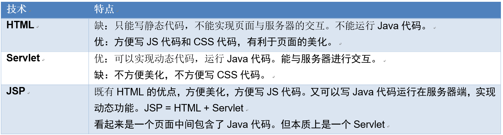  

### 有关JSP的一些疑问
1. JSP的执行过程  
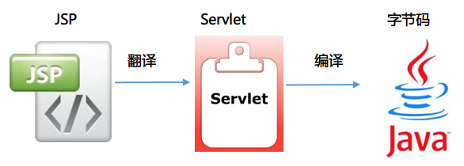  
- 将JSP翻译成Servlet，一个Java代码
- 将Servlet编译成一个字节码文件
- 字节码文件在JVM中执行

2. JSP文件中的HTML代码和Java代码在翻译后的Servlet中是如何分别被执行的?
- 我们在JSP上写的代码出现在_jspService()这个方法中，相当于Servlet中的service()方法，每次请求都会执行的方法。  
- HTML代码： 通过out.write输出的
- Java代码：原样直接放在翻译以后的Servlet中

3. JSP和Servlet是什么关系？
1. 查看源码  
  `public final class demo1_jsp extends org.apache.jasper.runtime.HttpJspBase`
HttpJspBase这个类是tomcat写的一个类  
  `public abstract class HttpJspBase extends HttpServlet`

2. 结论：JSP本质是一个Servlet

## JSP的脚本元素

### JSP页面的七个组成部分 
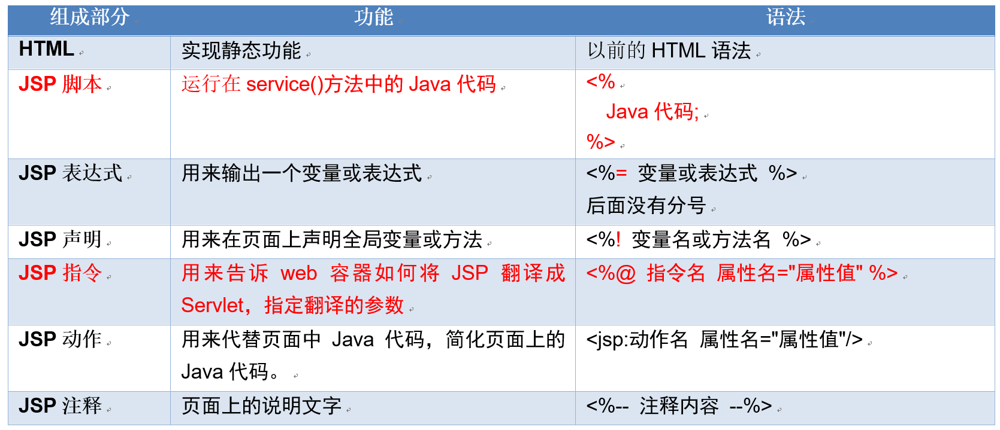  

### 各部分的介绍
1. 注释:  
注释总共有三种注释,html注释,Java注释,还有一种特殊的jsp注释`<%-- 注释内容 -- %>`  
其中,HTML的注释,网页的源代码可以看到。Java的注释，生成的servlet文件中可以看到。JSP的注释，哪里都看不到，只有JSP源代码中可以看到。

  - 面试题：如果使用HTML注释JSP脚本元素会怎么样？
如：`<!-- <%out.print("Hello JSP");%> -->`   
答： 使用HTML注释虽然在网页上看不到结果，但JAVA代码依然执行了。  

2. JSP表达式  
  - 语法：<%=变量名或表达式%>
  - 作用： 用来输出变量值或表达式计算结果
  - 格式：前面有等于号，后面没有分号。在Servlet中翻译成一个out.print()输出的。

3. JSP脚本  
  - 语法： <% Java代码; %>
  - 作用： 运行Java代码，在service()方法中去执行的，每次请求都会执行。
  - 演示：在脚本中创建一个ArrayList，添加三个名字，使用for循环输出。使用有序列表输出，隔行变色。

效果图：  
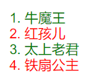  

```jsp
  <%
        ArrayList<String> names = new ArrayList<String>();
        names.add("牛魔王");
        names.add("红孩儿");
        names.add("太上老君");
        names.add("铁扇公主");
    %>
    <ol>
    <%for(int i=0; i<names.size(); i++) { %>
        <li <%=(i%2==0)?"style='color: green'":"style='color: red'" %>><%=names.get(i)%></li>
    <%} %>
</ol>
```

4. JSP的声明  
- 语法： <%! 声明全局变量或方法%>
- 作用：声明全局变量或方法
- 演示：
  - 在脚本中创建一个字符串，使用表达式输出
  - 在声明中也创建一个同名的字符，表达式输出，会不会有问题？
  - 在声明中创建一个方法，输出一句话。
- 结论：在JSP声明中定义的变量和方法属性于成员变量或成员方法。而在JSP脚本中定义的变量是局部变量。但声明目前使用并不是很多，以后我们主要在业务层去定义方法。

## JSP的三大指令
1. 什么是JSP指令：
- 三大指令名分别是：page、taglib、include
- 指令的格式：
`<%@指令名 属性名="属性值"%>`  
`<%@ page language="java" import="java.util.*" pageEncoding="UTF-8"%>`  

2. taglib指令
- 作用：在JSP页面上导入标签库
- 格式：`<%@taglib prefix="前缀" uri="http://java.sun.com/jsp/jstl/core" %>`

3. include指令
- 作用：用于在一个JSP页面中包含另一个JSP页面
- 语法：`<%@include file="被包含的JSP页面"%>`  

## JSP的标准动作  
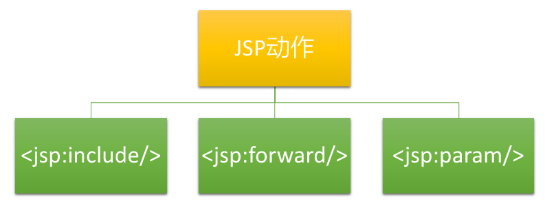  

1. `<jsp:include>`
- 作用：用于一个JSP页面包含另一个JSP页面动作           
- 语法： `<jsp:include page="被包含的页面"/>`

2. include动作与include指令的区别  
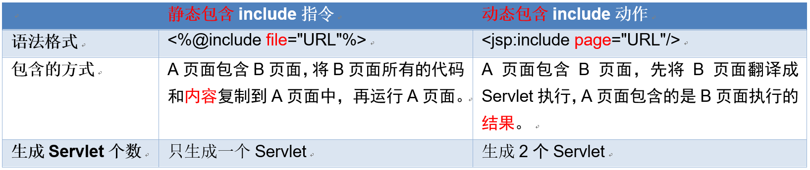  

注：如果B页面中出现了与A页面中同名的变量名，应该使用动态包含。  

### <jsp:forward>
在JSP页面上进行转发，相当于`request.getRequestDispatcher("/url").forward(request, response)`

### <jsp:param>
用于给`<jsp:include`>和`<jsp:forward>`这两个动作指定参数，可以指定多个参数。  

```jsp
 <%request.setCharacterEncoding("utf-8"); %>
    <!-- 页面的转发 -->
    <jsp:forward page="c.jsp">
        <jsp:param value="猪八戒" name="user"/>
        <jsp:param value="30" name="age"/>
    </jsp:forward>
```
  
```jsp
 <body>
    <!-- 通过上面的转发后可以得到 --> 
   名字： <%=request.getParameter("user") %><br/> 
   年龄： <%=request.getParameter("age") %><br/>
  </body>
```


## JSP的page指令

### page指令概述
1. 作用：用于指定一个JSP页面上所有的属性，告诉JSP如何翻译成Servlet。
2. 位置：可以放在页面的任何一个位置，但一般建议放在页面的最前面。

### 导包的属性
- `language="java"` 指定页面使用的脚本语言，默认就是Java
- `import="java.util.*"` 导入在JSP页面上使用的包
  - 方式一：每条import导入一个包
  `<%@page import="java.text.SimpleDateFormat"%>`  
  `<%@page import="java.util.Date"%>`  
  - 方式二：一个import导入所有的包，中间使用逗号分隔  
  `<%@page import="java.text.SimpleDateFormat,java.util.Date"%>`

### 与编码相关的属性
- `contentType="text/html; charset=utf-8"`  
`response.setContentType("text/html; charset=utf-8");`  
相当于Servlet中指定内容的MIME类型：网页的格式，还指定了编码为utf-8  

- `pageEncoding="utf-8"`   
  - 相当于上面这个属性的功能，也会在Servlet中生成`response.setContentType("text/html;charset=utf-8");`
  - JSP本身是一个文本文件，指定JSP本身保存到编码
  - 用来指定JSP翻译成Servlet的编码

- 结论： 
如果在要JSP页面上指定页面的编码，我们只需要使用pageEncoding属性就可以了。  

### 与错误相关的属性
- `errorPage="error.jsp"` 指定如果当前jsp页面出错，转发到哪个页面。
- `isErrorPage="false"` 设置当前的页面是否是错误页面，如果是设置为true。错误页面上可以使用内置对象exception，非错误页面不能使用这个对象。

- 演示：在JSP页面上写出错误代码，运行出现异常，我们写一个页面指定为错误页面。

```jsp
<%@page pageEncoding="utf-8" errorPage="error.jsp"%>
  正常运行
   <%
        //String str = null;
        //出现空指针异常
        //out.print(str.length());
        int m = 100 / 0;
   %>
```

```jsp
<%@ page language="java" import="java.util.*" pageEncoding="UTF-8" isErrorPage="true"%>
  <body>
        出错啦！
        
        <%=exception.getMessage() %>
  </body>
```

- 错误信息的跳转方式：在web.xml中指定
```xml
<!-- 指定整个项目的错误页面 -->
    <error-page>
        <!-- 指定状态码 -->
        <error-code>404</error-code>
        <location>/404.jsp</location>
    </error-page>
    
    <error-page>
        <!-- 指定错误的类型 -->
        <exception-type>java.lang.NullPointerException</exception-type>
        <location>/none.jsp</location>
    </error-page>
```


### page指令属性小结
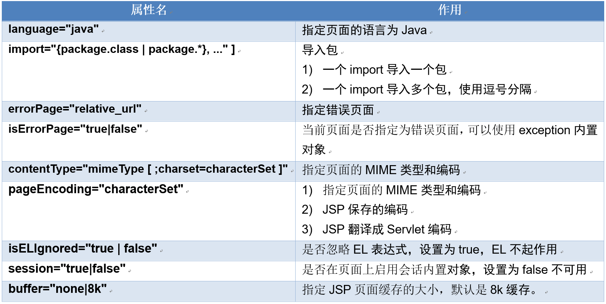  

## 9个JSP内置对象

### 什么是JSP的内置对象
- 概念：在JSP上可以直接使用的Servlet对象，不需要声明就可以直接使用。
- 查看生成的Servlet源码：
  ```jsp
  public void _jspService(HttpServletRequest request, HttpServletResponse response)
        throws java.io.IOException, javax.servlet.ServletException {
    PageContext pageContext;   //页面上下文：代表当前的页面对象
    HttpSession session;  //会话
    Throwable exception; 
    ServletContext application;
    ServletConfig config;
   JspWriter out;   //有缓存的打印流，PrintWriter没有缓存
    Object page = this;   //JPS翻译以后的Servlet对象
  }
  ```

### 九个内置对象
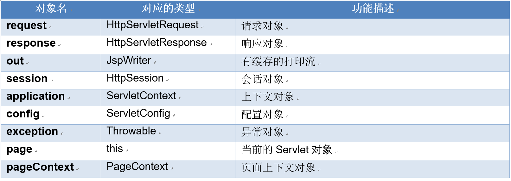  

### pagecontext对象的作用

1. 概述：
  - 代表页面作用域，有操作作用域的方法
  - 可以通过这个对象得到其它的8个内置对象，得它得天下。
  - 可以通过pageContext得到其它8个内置对象
    `<%=request == pageContext.getRequest() %><br/>`  
    `<%=session == pageContext.getSession()%><br/>`  
    `<%=application == pageContext.getServletContext()%><br/>`  

2. 方法  
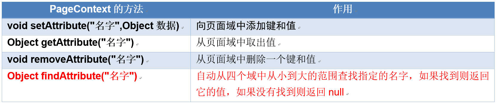  

3. 示例
- 在1个页面中，在四个域保存四个同名的值，分别是100,200,300,400，转发到另一个页面显示。  
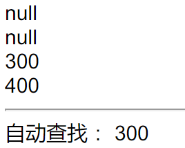  

```jsp
<%@ page language="java" import="java.util.*" pageEncoding="UTF-8"%>
<!DOCTYPE HTML PUBLIC "-//W3C//DTD HTML 4.01 Transitional//EN">
<html>
  <head>
    <title>demo6-pageContext.jsp</title>
  </head>
  <body>
    <%
        //页面域
        pageContext.setAttribute("num", 100);
        //请求域
        request.setAttribute("num", 200);
        //会话域
        session.setAttribute("num", 300);
        //上下文域
        application.setAttribute("num", 400);
    %>
    
    <%=pageContext.getAttribute("num")%>
    
    <jsp:forward page="demo7.jsp"></jsp:forward>
  </body>
</html>
```

```jsp
<%@ page language="java" import="java.util.*" pageEncoding="UTF-8"%>
<!DOCTYPE HTML PUBLIC "-//W3C//DTD HTML 4.01 Transitional//EN">
<html>
  <head>
    <title>demo7.jsp</title>
  </head>
  <body>
    <%=pageContext.getAttribute("num") %> <br/>
    <%=request.getAttribute("num") %><br/>
    <%=session.getAttribute("num") %><br/>
    <%=application.getAttribute("num") %><br/>
    <hr/> 自动查找：
    <%=pageContext.findAttribute("num") %><br/>
  </body>
</html>
```

### JSP页面的四个域范围
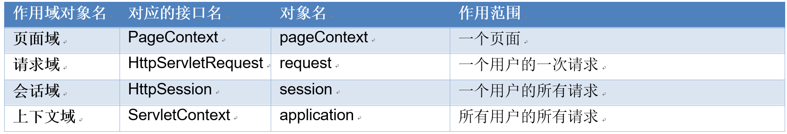   

## 案例:查询所有书籍
### 运行效果  
  

### 系统架构分析  
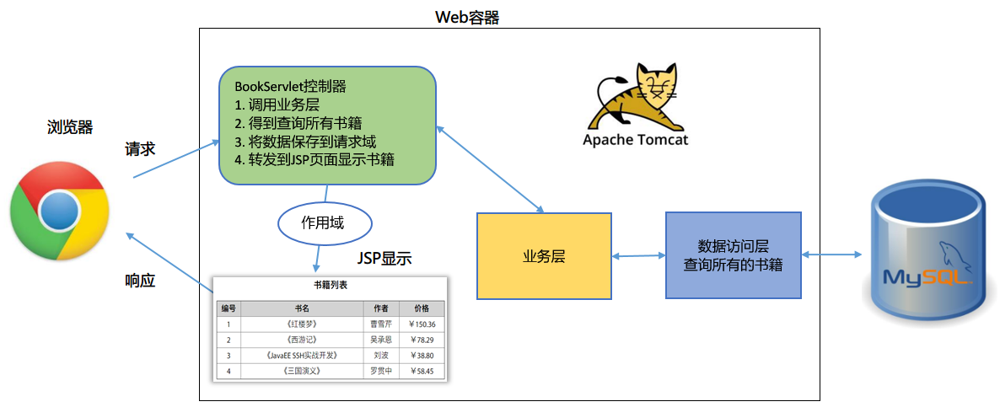  

项目可以看我的另外一个仓库 java-learning-project