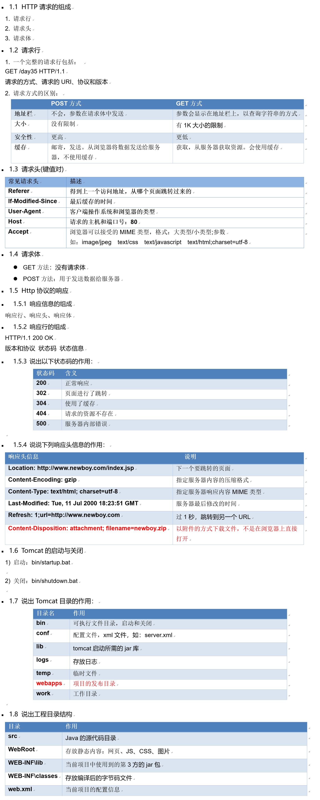
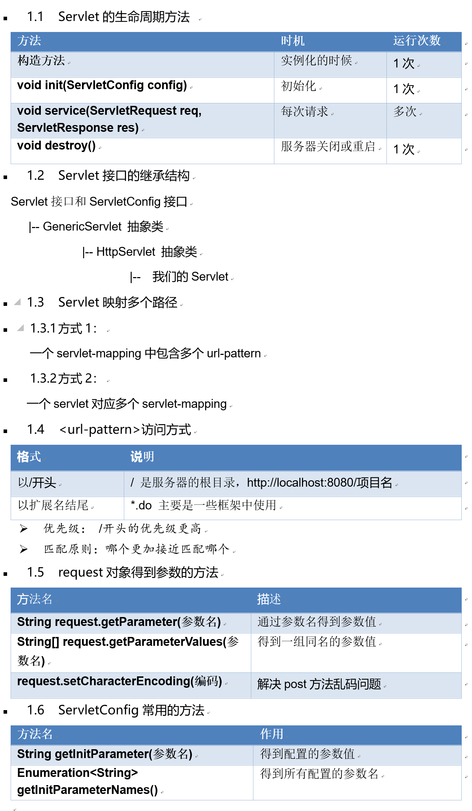
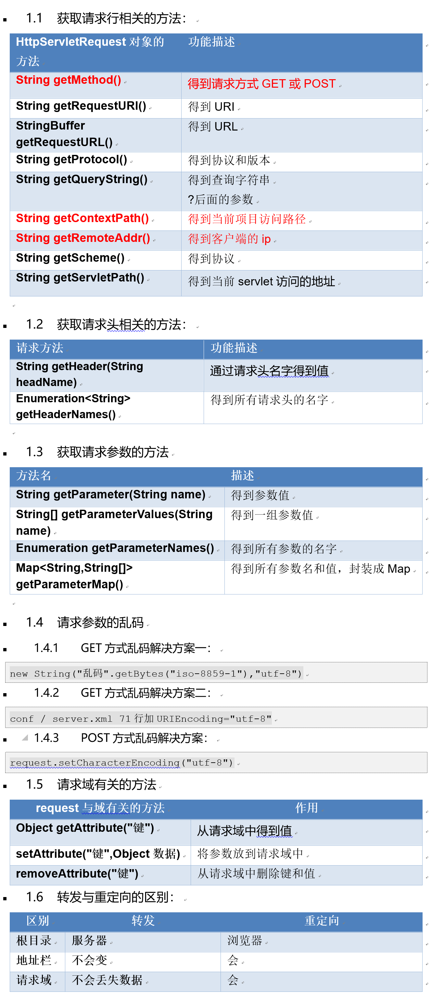

# 这是对JaEE学习的总结
 :book: 目录：    
此目录链接到总结，如需查看详细信息请点各知识点的标题  
- [HTTP协议和Tomcat](#HTTP协议和Tomcat)
## [HTTP协议和Tomcat](HTTP协议&Tomcat.md)
  

## [Servlet和ServletConfig](Servlet和ServletConfig.md)  
  

## [request请求对象](request请求对象.md)  
  

