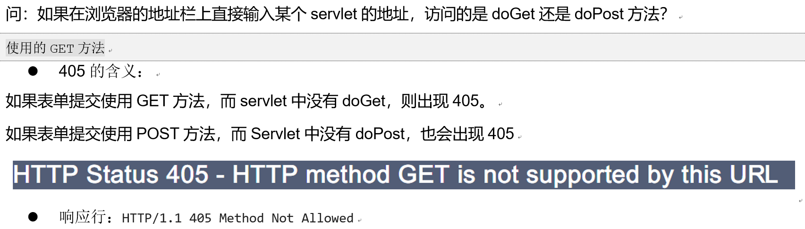

# ServletContext&response

## ServletContext

### 什么是ServletContext
Defines a set of methods that a servlet uses to communicate with its servlet container  
定义了一套用于Servlet和Web服务器(Tomcat)之间进行数据通讯的方法  
for example, to get the MIME type of a file, dispatch requests, or write to a log file.  
比如：得到一个文件的MIME类型(text/css)，请求的转发器，或写一个日志文件  
There is one context per "web application" per Java Virtual Machine.  
每一个servletcontext对象对应一个web应用  

- 概念：
  - <font style="color: red">每个Web应用程序都对应了一个上下文对象</font>
  - 定义了一套用于Servlet和Web服务器(Tomcat)之间进行数据通讯的方法
  - 主要作用：
    - 获得当前工程的资源
    - 获取全局的配置参数(了解)
    - 获得作用域中的数据

- 如何得到ServletContext对象：
  

- servlet 的继承结构：
  

### 获取当前工程的资源文件
- 相关的方法：
-   

- 示例：读取WEB-INF路径下的属性文件，向浏览器输出属性文件的company.properties中的name、address的键和值内容
  
  

- WEB-INF下的资源访问
- 注：在WEB-INF目录下的资源不能直接访问，访问会出现404错误。如果有些要保护的页面不希望用户直接访问，就可以放在WEB-INF目录下。  

- 示例：得到指定资源的真实地址，并且输出
- 如果资源不存在也不会影响
- 案例：得到文件的MIME类型


### 获取全局的配置参数
- ServletConfig的配置:   
只能得到当前Servlet的配置参数，不能得到其它servlet中的配置参数
- ServletContext的配置:  
如果我们希望某个参数可以给所有的Servlet使用，可以配置全局的参数
```java
package com.itheima.servlet;

import java.io.IOException;
import java.io.InputStream;
import java.io.PrintWriter;
import java.util.Enumeration;
import java.util.Properties;
import java.util.Set;

import javax.servlet.ServletContext;
import javax.servlet.ServletException;
import javax.servlet.annotation.WebServlet;
import javax.servlet.http.HttpServlet;
import javax.servlet.http.HttpServletRequest;
import javax.servlet.http.HttpServletResponse;

/**
 * 获取WEB-INF下面的配置文件
 * 获取资源的真实地址
 * 得到文件的MIME类型
 * 获取全局的配置参数  
 * @author AllenLei
 *
 */
public class ServletContextServlet extends HttpServlet {

    public void doGet(HttpServletRequest request, HttpServletResponse response)
            throws ServletException, IOException {
        response.setContentType("text/html;charset=utf-8");
        PrintWriter out = response.getWriter();
        // 获取上下文对象
        ServletContext application = getServletContext();
        InputStream inputStream = application.getResourceAsStream("/WEB-INF/company.properties");
        // 创建一个properties对象
        Properties info = new Properties();
        // 使用properties对象的load方法，把信息装入properties对象中
        info.load(inputStream);
        // 向页面输出properties对象的信息
        out.print(info.getProperty("name") + "<br/>");// 根据键找对应的值
        out.print("真实地址：" + application.getRealPath("/WEB-INF/company.properties") + "<br/>");
        // 得到文件的MIME类型并输出
        out.print("MIME类型：" + application.getMimeType("/file.jpg") + "<br/>");
        out.print("MIME类型：" + application.getMimeType("/day38-response/WebRoot/file.jpg") + "<br/>");
        
        /* 
         * 在web.xml中设置2个全局的参数，name=Rose, age=20 在不同的Servlet中去获取这2个值
         * 使用的方法：servletContext.getInitParameter("参数名") 根据参数名获得参数值
         * Enumeration<String> getInitParameterNames()：获取所有的参数名
         */
        Enumeration<String> names = application.getInitParameterNames();
        while (names.hasMoreElements()) {
            String name = names.nextElement();
            out.print(application.getInitParameter(name) + "<br/>");
        }
        out.close();
    }

    public void doPost(HttpServletRequest request, HttpServletResponse response)
            throws ServletException, IOException {
        doGet(request, response);
    }

}

```


### 获取作用域对象的值
- 请求域：一个用户的一次请求  
- 上下文域：所有用户的所有请求都起使用，只要服务器开启就存在，服务器关闭才销毁。  
- 作用域方法: 
  

- 案例 ： 
- 需求 ：Chrome调用OneServlet向上下文域中添加数据，另一个浏览器FireFox调用TwoServlet读取数据，第三个RemoveServlet删除上下文域中的数据(不同的浏览器相当于不同的用户)  

### 案例：得到当前是第几个登陆
- 原理：
  

- 实现过程
  
1. 在LoginServlet的init()方法中创建count=0，并且将值放入上下文域中.
2. 在登录成功的代码中从上下文域中取出count，并且加1，再更新上下文域中的值。
3. 跳转到另一个CountServlet，在另一个CountServlet中取出上下文域中的值，显示在页面上。
- 登录界面简单代码
```xml
<!DOCTYPE html>
<html>
  <head>
    <title>登录页面</title>
    <meta charset="UTF-8">
  </head>
    <body>
    <h2>用户登录</h2>
    <form action="login" method="post">
    用户名： <input type="text" name="name"/><br/>
    密码： <input type="password" name="password"/><br/>
    <input type="submit" value="登录"/>
    </form>
  </body>
</html>

```

- loginServlet代码：
```java
package com.itheima.servlet;

import java.io.IOException;
import java.io.PrintWriter;

import javax.servlet.ServletContext;
import javax.servlet.ServletException;
import javax.servlet.annotation.WebServlet;
import javax.servlet.http.HttpServlet;
import javax.servlet.http.HttpServletRequest;
import javax.servlet.http.HttpServletResponse;
/**
 * loginServlet get count and +1
 * @author AllenLei
 *
 */
@WebServlet("/login")
public class LoginServlet extends HttpServlet {
    /**
     * 重写init方法，只会执行一次，设置一个count属性默认值是0
     * init 不带参数的方法是genericservlet的方法。
     * the init method in servlet interface has a parameter "ServletConfig config" 
     */
    @Override
    public void init() throws ServletException {
        ServletContext application = getServletContext();
        application.setAttribute("count", 0);
    }
    
    public void doGet(HttpServletRequest request, HttpServletResponse response)
            throws ServletException, IOException {
        response.setContentType("text/html;charset=utf-8");
        PrintWriter out = response.getWriter();
        // 获取上下文对象
        ServletContext application = getServletContext();
        // 先验证用户名和密码是否正确
        String name = request.getParameter("name");
        String passWord = request.getParameter("password");
        // 如果正确则取出count属性+1，再重定向到count页面
        if ("jack".equals(name) && "123".equals(passWord)) {
            int count = (Integer) application.getAttribute("count");
            application.setAttribute("count", count+1);
            response.sendRedirect(request.getContextPath() + "/count");
//          out.print("<h1>您是第" + getServletContext().getAttribute("count") + "个登录的用户</h1>");
        } else {
            // 如果错误，则提示登陆失败
            out.print("<h1>登陆失败</h1>" + "<br/>");
            out.print("<a href='login.html'>重新登录</a>");
        }
        out.close();
    }

    public void doPost(HttpServletRequest request, HttpServletResponse response)
            throws ServletException, IOException {
        doGet(request, response);
    }

}

```

- countservlet代码：
```java
package com.itheima.servlet;

import java.io.IOException;
import java.io.PrintWriter;

import javax.servlet.ServletException;
import javax.servlet.annotation.WebServlet;
import javax.servlet.http.HttpServlet;
import javax.servlet.http.HttpServletRequest;
import javax.servlet.http.HttpServletResponse;
/**
 * countServlet 用于提示用户是第几个登录的。
 * @author AllenLei
 *
 */
@WebServlet("/count")
public class CountServlet extends HttpServlet {

    public void doGet(HttpServletRequest request, HttpServletResponse response)
            throws ServletException, IOException {
        response.setContentType("text/html;charset=utf-8");
        PrintWriter out = response.getWriter();
        // Put your code here
        out.print("<h1>您是第" + getServletContext().getAttribute("count") + "个登录的用户</h1>");
        out.close();
    }

    public void doPost(HttpServletRequest request, HttpServletResponse response)
            throws ServletException, IOException {
        doGet(request, response);
    }

}

```


## response设置响应行的方法

### 什么是response对象
将服务器端的数据封装成response对象发送给浏览器，在Servlet中是一个接口，具体由web容器tomcat去实现。接口名：HttpServletResponse  

### 回顾响应信息的组成
响应行，响应头，响应体

### 设置状态码的方法
响应行：协议和版本 状态码 状态信息
- 设置状态码的方法
  - `setStatus(int status)`:设置响应的状态码，单独设置意义不大
  - `sendError(int sc, String msg)` : 发送一个错误状态码和错误页面给浏览器

### 示例：404状态码
  


### 示例：405状态码
  

## response设置响应头的方法
### 响应头的信息
  

### 响应头的方法
  

### 示例：使用location进行页面跳转
- 302 的含义
- 状态码必须是302 才可以进行页面的重定向 不过现在一般使用js来实现

- 面试题：Location需要与状态码302配合使用，完成页面转发，这句话是否正确？
- 错误的，不是转发，而是重定向。


### 服务器响应数据的两种方式
  

### 字节流输出中文
不建议使用字节流发送文本，因为需要进行编码。 

- 使用字节流输出汉字，为什么没有出现乱码？
因为getBytes()，默认指定了编码，默认是GBK。如果要用utf-8的编码getBytes("utf-8")。  
- 如何通知浏览器当前网页使用什么格式和编码？
浏览器可能不知道服务器编码，我们可以告诉浏览器编码是什么  
`response.setContentType("text/html;charset=GBK");`  

### 字符流输出中文
- 使用打印输出流，输出汉字的结果是什么？ 
  如果直接使用打印流输出汉字，会出现乱码，因为打印流默认使用的是iso-8859-1编码  

- 如何设置打印流默认的字符集？
  `response.setCharacterEncoding("utf-8");`  
- 只设置content-type响应头会怎么样？ 
  - 告诉浏览器，服务器使用什么编码
  - 设置打印流的编码
- 疑问：再同一个servlet中通时使用字节流和字符流会怎么样？
  流不能打开两次，如果已经调用了字节流，再打开字符流就会出现错误  
`严重: Servlet.service() for servlet [com.itheima.servlet.Demo3InputStreamServlet] in context with path [/day38-response] threw exception`  
`java.lang.IllegalStateException: getOutputStream() has already been called for this response`  

## 以附件的方式下载Web资源

### common-io包中的方法
|IOUtils类中的方法|作用|
|:---:|:---:|
|static int copy(InputStream input,OutputStream output)|用于将一个输入流中的数据复制到另一个输出流|


### 实现不同类型的文件下载
1. 使用超链接下载的不足：
  - 文本文件和图片等文件不是下载，而是直接打开
  - 暴露资源的真实地址
  - 不利于业务的逻辑控制，如：下载前扣积分
2. 步骤：
  - 从链接上得到文件名
  - 得到文件的MIME类型
  - 设置content-type头为MIME类型
  - 设置content-disposition头
  - 得到文件的输入流
  - 得到response的输出流
  - 写出到浏览器端
  - 下载文件名使用汉字的情况
|URL编码有关的方法|描述|
|:---------------:|:---:|
|java.net.URLEncoder.encode(字符串,"utf-8")|对字符串进行utf-8编码|
|java.net.URLDecoder.decode(字符串,"utf-8")|对字符串进行utf-8解码|

```html
<!DOCTYPE html>
<html>
  <head>
    <title>资源下载列表</title>
    <meta charset="utf-8">
  </head>
  
  <body>
   <h2>文件下载页面列表</h2>
   <h3>超链接的下载</h3>
   <a href="file.txt">文本文件</a><br/>
   <a href="file.jpg">图片文件</a><br/>
   <a href="file.zip">压缩文件</a><br/>
   <hr/>
   <h3>手动编码的下载方式</h3>
   <!-- download是一个servlet -->
   <a href="download?filename=file.txt">文本文件</a><br/>
   <a href="download?filename=file.jpg">图片文件</a><br/>
   <a href="download?filename=file.zip">压缩文件</a><br/>
   <a href="download?filename=美女.jpg">美女</a><br/>
  </body>
</html>
```
- downloadservlet
```java
package com.itheima.servlet;

import java.io.IOException;
import java.io.InputStream;
import java.io.OutputStream;
import java.net.URLEncoder;

import javax.servlet.ServletContext;
import javax.servlet.ServletException;
import javax.servlet.annotation.WebServlet;
import javax.servlet.http.HttpServlet;
import javax.servlet.http.HttpServletRequest;
import javax.servlet.http.HttpServletResponse;

import org.apache.commons.io.IOUtils;

/**
 * 文件下载案例
 * 
 * @author AllenLei
 * 
 */
@WebServlet("/download")
public class DownloadServlet extends HttpServlet {

    public void doGet(HttpServletRequest request, HttpServletResponse response)
            throws ServletException, IOException {
        // 得到上下文对象
        ServletContext application = getServletContext();
        // - 从链接上得到文件名
        String filename = request.getParameter("filename");
        filename = new String(filename.getBytes("iso-8859-1"),"utf-8");
        // - 得到文件的MIME类型
        String type = application.getMimeType("/" + filename);
        
        // - 设置content-type头为MIME类型
        response.setContentType(type);
        // - 设置content-disposition头
        response.setHeader("Content-Disposition", 
                "attachment; filename="+ URLEncoder.encode(filename, "utf-8"));
        // - 得到文件的输入流
        InputStream inputStream = application.getResourceAsStream("/" + filename);
        // - 得到response的输出流
        OutputStream outputStream = response.getOutputStream();
        IOUtils.copy(inputStream, outputStream);
        // - 写出到浏览器端
        // - 下载文件名使用汉字的情况
        outputStream.close();
    }

    public void doPost(HttpServletRequest request, HttpServletResponse response)
            throws ServletException, IOException {
        doGet(request, response);
    }

}

```

- 下载文件中的乱码问题
- IE、Chrome下载中文采用的是URL编码，FireFox不能采用这种方式。  
- `URLEncoder.encode(filename,"utf-8")`
- **建议不要使用汉字文件名**

## 响应体的案例

### 什么是响应体
服务器发送给浏览器的数据，如：图片。在服务器端通过Java代码绘图的API画一张图片，再发送给浏览器。  
### 验证码案例
基本不会用到，用的时候copy下来就好了  

  

- 实现原理：
  - 验证码就是一张图片，验证码图片不是真实的资源图片而是缓存图片，图片的数据在缓存内存里面，将内存中的缓存图片输出到浏览器上。  
- 实现步骤
1. 写一个方法随机获取颜色
2. 创建缓存图片：指定宽width=90，高height=30
3. 获取画笔对象
4. 设置画笔颜色，并且填充矩形区域
5. 从字符数组中随机得到字符 char[] arr = { 'A', 'B', 'C', 'D', 'N', 'E', 'W', 'b', 'o', 'y', '1', '2', '3', '4' };
6. 设置字体，大小为18，设置字的颜色随机
7. 将每个字符画到图片，位置：5+(i*20), 20
8. 画干扰线10条线，线的位置是随机的，x范围在width之中，y的范围在height之中。
9. 将缓存的图片输出到响应输出流. 

VerficationCodeServlet
```java
package com.itheima.servlet;

import java.awt.Color;
import java.awt.Font;
import java.awt.Graphics;
import java.awt.image.BufferedImage;
import java.io.IOException;
import java.io.PrintWriter;
import java.util.Random;

import javax.imageio.ImageIO;
import javax.servlet.ServletException;
import javax.servlet.annotation.WebServlet;
import javax.servlet.http.HttpServlet;
import javax.servlet.http.HttpServletRequest;
import javax.servlet.http.HttpServletResponse;

/**
 * 生成一张验证码的图片
 * 
 * @author AllenLei
 * 
 */
@WebServlet("/vcode")
public class PicCodeServlet extends HttpServlet {
    
    private Random ran = new Random();
    
    // 1) 写一个方法随机获取颜色
    private Color getColor() {
        //随机生成0~255之间的数据
        int r= ran.nextInt(256);
        int g= ran.nextInt(256);
        int b= ran.nextInt(256);
        return new Color(r, g, b);
    }

    @Override
    protected void service(HttpServletRequest request,
            HttpServletResponse response) throws ServletException, IOException {
        // 2) 创建缓存图片：指定宽width=90，高height=30
        int width=90,height=30;
        BufferedImage img = new BufferedImage(width, height, BufferedImage.TYPE_INT_RGB);
        // 3) 获取画笔对象
        Graphics graphics = img.getGraphics();
        // 4) 设置画笔颜色，并且填充矩形区域
        graphics.setColor(Color.WHITE);
        graphics.fillRect(0, 0, width, height);
        // 5) 从字符数组中随机得到字符 
        char[] arr = { 'A', 'B', 'C', 'D', 'N', 'E', 'W', 'b', 'o', 'y', '1', '2', '3', '4' };
        //设置字体，大小为18
        graphics.setFont(new Font(Font.DIALOG, Font.ITALIC + Font.BOLD, 18));
        for (int i = 0; i <4; i++) {
            //随机得到一个下标
            int index = ran.nextInt(arr.length);
            char c = arr[index];
            // 设置字的颜色随机
            graphics.setColor(getColor());
            // 7) 将每个字符画到图片，位置：5+(i*20), 20
            //画到图片上
            graphics.drawString(String.valueOf(c), 5+(i*20), 20);
        }
        // 8) 画干扰线7条线，线的位置是随机的，x范围在width之中，y的范围在height之中。
        for (int i = 0; i <7; i++) {
            graphics.setColor(getColor());
            int x1 = ran.nextInt(width);
            int x2 = ran.nextInt(width);
            int y1 = ran.nextInt(height);
            int y2 = ran.nextInt(height);
            graphics.drawLine(x1, y1, x2, y2);
        }
        // 9) 将缓存的图片输出到响应输出流中，参数：图片对象，格式，输出流
        ImageIO.write(img, "jpg", response.getOutputStream());
    }

}
```

- 验证界面
```html
<!DOCTYPE html>
<html lang="zh-CN">
  <head>
    <meta charset="utf-8">
    <meta http-equiv="X-UA-Compatible" content="IE=edge">
    <meta name="viewport" content="width=device-width, initial-scale=1">
    <title>登录页面</title>
    <link href="css/bootstrap.min.css" rel="stylesheet">
    <script src="js/jquery-3.2.1.min.js"></script>
    <script src="js/bootstrap.min.js"></script>
  </head>
  <body>
    <div class="container" style="max-width:400px"">
        <h3 style="text-align: center">用户登录</h3>
        <form action="login" method="post" >
            <div class="form-group">
                <label for="name">用户名：</label>
                <input type="text" name="name" class="form-control" id="name" placeholder="请输入用户名">
            </div>
            <div class="form-group">
                <label for="password">密码：</label>
                <input type="password" name="password" class="form-control" id="password" placeholder="请输入密码"/>
            </div>
            <div class="form-inline">
                <label for="vcode">验证码：</label>
                <input type="text" name="vcode" class="form-control" id="vcode" placeholder="验证码" style="width: 70px" maxlength="4"/>&nbsp;
                
            </div>
            <div style="text-align: center; padding-top: 20px;">
                <input type="submit" value=" 登 录 " class="btn btn-primary"/>
            </div>
        </form>
        </div>
  </body>
  <script type="text/javascript">
        $("#pic").click(function(){
            //重新访问服务器，加载src图片
            $(this).attr("src", "vcode?t=" + new Date().getTime());
        });
  </script>
</html>
```

