# Servlet和ServletConfig 

## Servlet的开发

### 什么是Servlet
A servlet is a small Java program that runs within a Web server. Servlets receive and respond to requests from Web clients, usually across HTTP, the HyperText Transfer Protocol.
- 概念：运行在Web服务器中的一个Java小应用程序
- 作用：Servlet用于接收客户端发送过来的请求，并做出响应通过http协议。

### Servlet生命周期
- Servlet创建的时机：
**实例化（构造方法）、初始化（init方法）、服务（service）、销毁（destroy）**


### Servlet的运行过程


### Servlet的生命周期方法
- 定义在javax.servlet.Servlet接口中
|方法|作用|运行次数|
|:---:|:---:|:---:|
|构造方法|实例化对象的运行，**单例**|1次|
|void init(ServletConfig config)|实例化对象后，执行初始化|1次|
|void service(ServletRequest req,ServletResponse res)|每次请求和响应都会执行<br/>**参数：请求和响应**|多次|
|void destroy()|Servlet销毁，服务器关闭或重启的时候执行|1次|

- 演示：直接实现Servlet接口，并重写所有的方法
1. 创建web项目
2. 创建类实现servlet接口，重写所有的方法
```java
package com.itheima.servlet;

import java.io.IOException;
import java.sql.Timestamp;

import javax.servlet.Servlet;
import javax.servlet.ServletConfig;
import javax.servlet.ServletException;
import javax.servlet.ServletRequest;
import javax.servlet.ServletResponse;

/**
 * 生命周期的方法
 * @author NewBoy
 * 上次extends HttpServlet
 */
public class Demo1HelloServlet implements Servlet {
    
    //构造方法
    public Demo1HelloServlet() {
        System.out.println("构造方法，创建了servlet对象：" + this);
    }

    //销毁，执行1次
    @Override
    public void destroy() {
        System.out.println("servlet被销毁");
    }

    //不是生命周期的方法：得到一个ServletConfig对象
    @Override
    public ServletConfig getServletConfig() {
        return null;
    }

    //得到Servlet的一些信息
    @Override
    public String getServletInfo() {
        return "Hello Servlet";
    }

    //初始化：执行1次，由Tomcat将config对象传给当前的Servlet
    @Override
    public void init(ServletConfig config) throws ServletException {
        System.out.println("执行了init方法");
    }

    //服务的方法：执行多次，每次请求都会执行
    @Override
    public void service(ServletRequest request, ServletResponse response)
            throws ServletException, IOException {
        System.out.println(new Timestamp(System.currentTimeMillis())  + "有浏览器的请求");
    }

}

```
3. 在web.xml中配置servlet的url-pattern
```xlm
  <servlet>
    <!-- servlet名字 -->
    <servlet-name>hello</servlet-name>
    <!-- servlet的类全名 -->
    <servlet-class>com.itheima.servlet.Demo1HelloServlet</servlet-class>
  </servlet>
  <servlet-mapping>
    <!-- servlet的名字与上面的名字相同 -->
    <servlet-name>hello</servlet-name>
    <!-- 访问地址 -->
    <url-pattern>/hello</url-pattern>
  </servlet-mapping>

```
4. 执行结果： 
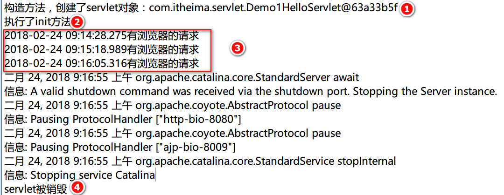  

- 问1：一个Servlet在Tomcat中生成几个对象？
  - 答：servlet在Tomcat中式单例模式，一个类只产生一个对象。无论多少个浏览器访问，一个servlet在Tomcat中只有一个对象。
- 问2：在service方法中输出request和response对象，这两个对象从哪里来的？
  - 答：service方法存在这两个对象：  
  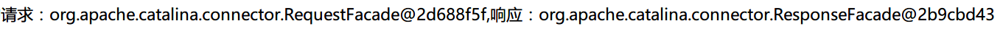   
  由tomcat创建好这两个对象，传入给service()方法，我们在service()方法中就可以直接使用请求和响应对象。每次请求和响应都是新的对象。  

## Servlet的实现类
### Servlet继承结构
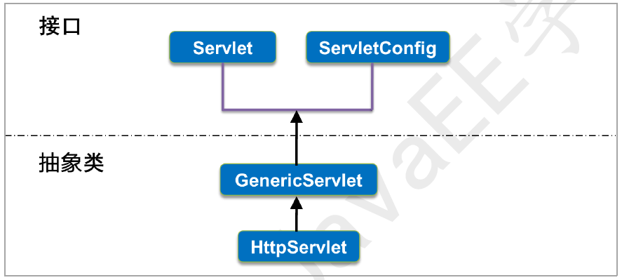  

### GenericServlet类 
起到一个中间类的作用，实现了两个接口，重写了两个接口中的方法。它又是HttpServlet抽象类的父类。一般情况下我们不直接继承于这个类，而是继承于它的子类HttpServlet  
通过servlet向导创建：  
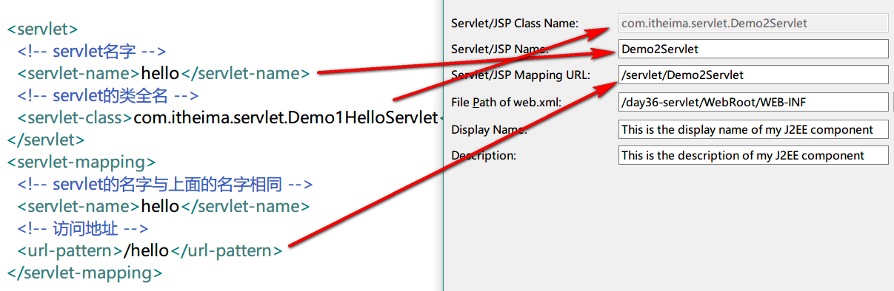  

`public abstract GenericServlet implements Servlet, ServletConfig`

### HttpServlet类
我们的类直接继承于HttpServlet，并且重写doGet或doPost方法  
```java
package com.itheima.servlet;

import java.io.IOException;
import java.io.PrintWriter;

import javax.servlet.ServletException;
import javax.servlet.http.HttpServlet;
import javax.servlet.http.HttpServletRequest;
import javax.servlet.http.HttpServletResponse;

public class Demo2Servlet extends HttpServlet {

    /**
     * 处理doGet方法
     */
    public void doGet(HttpServletRequest request, HttpServletResponse response)
            throws ServletException, IOException {
        //设置响应内容类型和字符集
        response.setContentType("text/html;charset=utf-8");
        //得到打印流
        PrintWriter out = response.getWriter();
        out.println("<h1>新年快乐，不要睡觉</h1>");
        //可以不关，因为响应结束，流就自动关闭了
        out.flush();
        out.close();
    }

    /**
     * 处理doPost方法，直接调用doGet
     */
    public void doPost(HttpServletRequest request, HttpServletResponse response)
            throws ServletException, IOException {
        this.doGet(request, response);
    }

}

```
- web.xml 中的配置
```xml
 <servlet>
    <servlet-name>Demo2Servlet</servlet-name>
    <servlet-class>com.itheima.servlet.Demo2Servlet</servlet-class>
  </servlet>
  <servlet-mapping>
    <servlet-name>Demo2Servlet</servlet-name>
    <url-pattern>/demo2</url-pattern>
  </servlet-mapping>
```
- service()方法的作用：
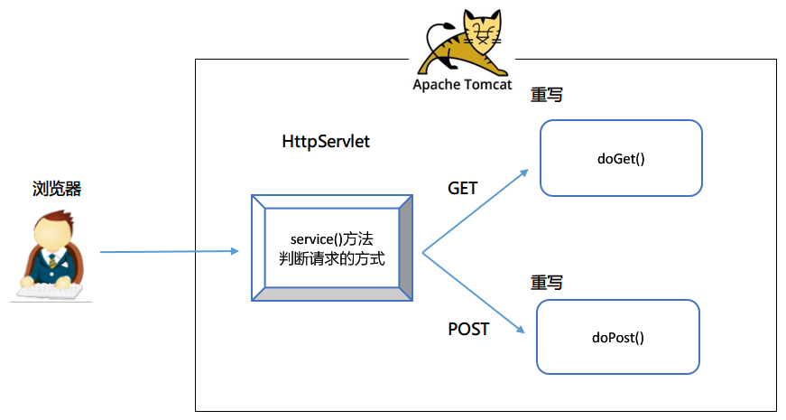  
- 使用MyEclipse向导创建Servlet  
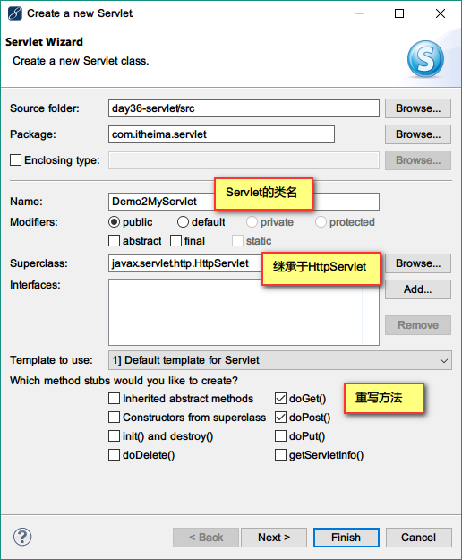  
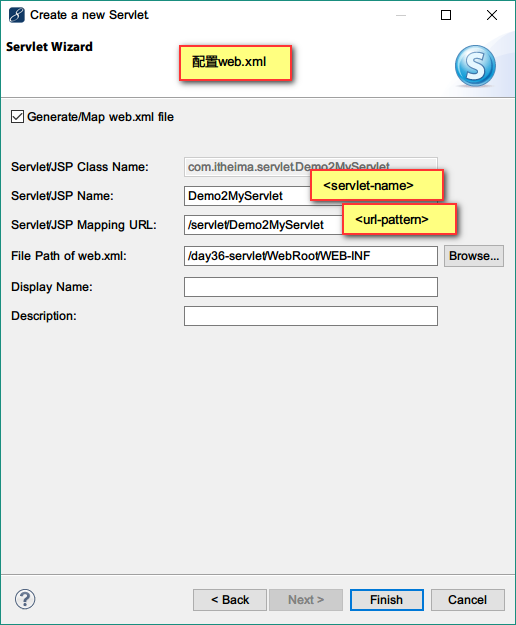  

- service()方法的源码分析：
```java
public abstract class HttpServlet extends GenericServlet {

    //定义了常量
    private static final String METHOD_GET = "GET";
    private static final String METHOD_POST = "POST";
    
    //生命周期中的service方法
    protected void service(HttpServletRequest req, HttpServletResponse resp)
        throws ServletException, IOException {
        //得到请求的方式
        String method = req.getMethod();
        //是否是get方法
        if (method.equals(METHOD_GET)) {
            //判断是否使用缓存
            long lastModified = getLastModified(req);
            if (lastModified == -1) {
              //不使用缓存，则直接调用子类中的doGet方法
                doGet(req, resp);
            } else {
                //使用缓存
            }
        //如果是POST方法，则调用子类中的doPost方法
        } else if (method.equals(METHOD_POST)) {
            doPost(req, resp);
        } else {
            // 如果上面所有的请求方式都不匹配，则发送一个错误给浏览器
            resp.sendError(HttpServletResponse.SC_NOT_IMPLEMENTED, errMsg);
        }
    }
}

```

## Servlet的访问地址
### Servlet映射多个路径
通常情况下，一个Servlet只有一个访问地址。一个Servlet可以有多个访问地址  
两种实现方式：  
- 方式一：一个servlet-mapping中包含多个url-pattern
```xml
 <servlet>
    <servlet-name>Demo2Servlet</servlet-name>
    <servlet-class>com.itheima.servlet.Demo2Servlet</servlet-class>
  </servlet>
  <!-- 一个servlet映射中包含多个url-pattern -->
  <servlet-mapping>
    <servlet-name>Demo2Servlet</servlet-name>
    <url-pattern>/demo2</url-pattern>
    <url-pattern>/demo1</url-pattern>
  </servlet-mapping>
```
- 方式二：一个servlet对应多个servlet-mapping  
```xml
<servlet>
    <servlet-name>Demo2Servlet</servlet-name>
    <servlet-class>com.itheima.servlet.Demo2Servlet</servlet-class>
  </servlet>
  <!-- 一个servlet映射中包含多个servlet-mapping -->
  <servlet-mapping>
    <servlet-name>Demo2Servlet</servlet-name>
    <url-pattern>/demo2</url-pattern>
  </servlet-mapping>
  <servlet-mapping>
    <servlet-name>Demo2Servlet</servlet-name>
    <url-pattern>/xxx</url-pattern>
  </servlet-mapping>

```

### <url-pattern>的访问方式
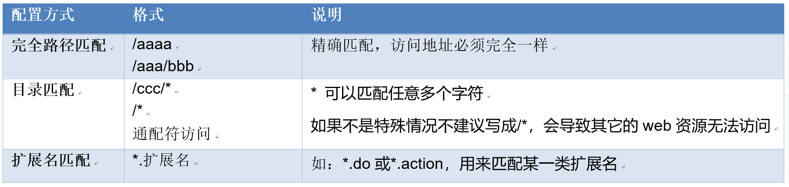  

- 从格式上分为两种方式：
1. 以/开头的方式  如： `/aaa`
2. 以扩展名结尾的方式  如：`.html`
- 面试题：
1. 请问： `/aaa/*.do ` 访问地址是什么？
`Caused by: java.lang.IllegalArgumentException: Invalid <url-pattern> /aaa/*.do in servlet mapping`  
这个配置是错误的，不允许同时出现/开头和扩展名结尾的方式。这样配置会导致整个web项目加载失败，web项目中所有的资源都无法访问。  
2. 创建2个Servlet，一个Servlet1，一个Servlet2，在下列情况下，访问的是哪个Servlet，课后自己证明。  
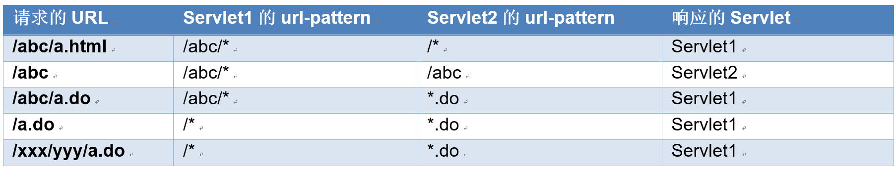  

 **结论：**  
- 优先级：以/开头的高于以扩展名结尾
- 匹配原则：哪个最接近就匹配哪个


### load-on-startup
1. 作用：
  正常清空下，浏览器第一次访问Servlet的时候实例化对象。有时，我们需要web容器一启动就实例化servlet，要怎么做呢？使用load-on-startup
2. 参数的使用说明：
  **语法：`<load-on-startup>大于0的整数</load-on-startup>`**  
  整数越小，就越先加载，负数无效
3. 案例：
  - 在Servlet中的init方法中输出一句话到控制台上，比较有没有`<load-on-startup>1</load-on-startup>`的区别  
  ```xml
   <servlet>
    <!-- servlet名字 -->
    <servlet-name>hello</servlet-name>
    <!-- servlet的类全名 -->
    <servlet-class>com.itheima.servlet.Demo1HelloServlet</servlet-class>
    <load-on-startup>1</load-on-startup>
  </servlet>
  <servlet-mapping>
    <!-- servlet的名字与上面的名字相同 -->
    <servlet-name>hello</servlet-name>
    <!-- 访问地址 -->
    <url-pattern>/hello</url-pattern>
  </servlet-mapping>

  ```
4. 运行结果：
```
信息: Deploying web application directory C:\apache-tomcat-7.0.70\webapps\day36-servlet
构造方法，创建了servlet对象：com.itheima.servlet.Demo1HelloServlet@4eed6301
执行了init方法
```

## 使用注解创建Servlet
如果要使用注解的方式配置servlet，必须是web3.0以上的版本  
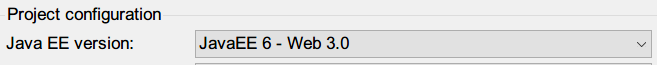  

1. 产看web.xml 文件
```xml
<web-app xmlns:xsi="http://www.w3.org/2001/XMLSchema-instance" 
xmlns="http://java.sun.com/xml/ns/javaee" 
xsi:schemaLocation="http://java.sun.com/xml/ns/javaee http://java.sun.com/xml/ns/javaee/web-app_3_0.xsd" 
id="WebApp_ID" version="3.0">
```
2. servlet 代码
```java
package com.itheima.servlet;

import java.io.IOException;
import java.io.PrintWriter;

import javax.servlet.ServletException;
import javax.servlet.annotation.WebServlet;
import javax.servlet.http.HttpServlet;
import javax.servlet.http.HttpServletRequest;
import javax.servlet.http.HttpServletResponse;

/**
 * 使用注解的方式
 * @author NewBoy
 */
@WebServlet("/demo1")    //demo1就是访问地址
public class Demo1Servlet extends HttpServlet {

    /**
     */
    public void doGet(HttpServletRequest request, HttpServletResponse response)
            throws ServletException, IOException {
        response.setContentType("text/html;charset=utf-8");
        PrintWriter out = response.getWriter();
        out.println("我们是害虫");
        out.flush();
        out.close();
    }

    public void doPost(HttpServletRequest request, HttpServletResponse response)
            throws ServletException, IOException {
        this.doGet(request, response);
    }

}

```


## request接受请求参数
### 得到参数的方法
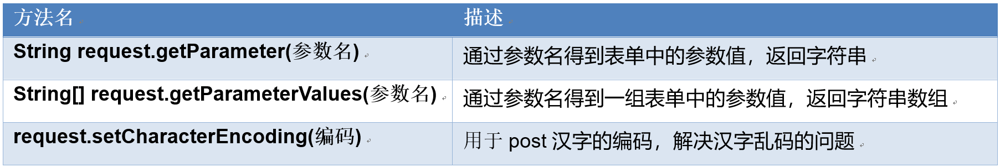  


### 接受请求参数案例
  表单上有用户名，性别，城市，爱好。使用POST方法提交数据给服务器，在Servlet中使用上面三个方法得到所有的值，并且在页面上输出提交的信息，注意汉字的乱码问题。  
```html
<!DOCTYPE html>
<html>
  <head>
    <title>register.html</title>
    <meta charset="utf-8">
  </head>
  
  <body>
  <h3>用户注册</h3>
    <!-- action提交给servlet -->
    <form action="register" method="post">
    用户名：<input type="text" name="user"/><br/>
   性别： <input type="radio" name="gender" value="男" checked="checked">男 &nbsp;<input type="radio" name="gender" value="女">女
   <br/>
   城市：
   <select name="city">
    <option value="广州">广州</option>
    <option value="深圳">深圳</option>
    <option value="上海">上海</option>
   </select>
   <br/>
   爱好：
   <input type="checkbox" name="hobby" value="上网" >上网 &nbsp;
   <input type="checkbox" name="hobby" value="游泳" >游泳 &nbsp;
   <input type="checkbox" name="hobby" value="旅游" >旅游 &nbsp;
   <hr/>
    <input type="submit"  value="注册">
    </form>
  </body>
</html>
```
servlet代码：  
```java
package com.itheima.servlet;

import java.io.IOException;
import java.io.PrintWriter;
import java.util.Arrays;

import javax.servlet.ServletException;
import javax.servlet.annotation.WebServlet;
import javax.servlet.http.HttpServlet;
import javax.servlet.http.HttpServletRequest;
import javax.servlet.http.HttpServletResponse;

/**
 * 注册的Servlet
 * @author NewBoy
 * 在Servlet中使用上面三个方法得到所有的值，并且在页面上输出提交的信息
 */
@WebServlet("/register")
public class RegisterServlet extends HttpServlet {

    public void doGet(HttpServletRequest request, HttpServletResponse response)
            throws ServletException, IOException {
        response.setContentType("text/html;charset=utf-8");
        PrintWriter out = response.getWriter();
        //在得到参数之前
        request.setCharacterEncoding("utf-8");
        // 得到表单提交的参数，名字不对返回null
        String user = request.getParameter("user");
        String gender = request.getParameter("gender");
        String city = request.getParameter("city");
        String[] values = request.getParameterValues("hobby");
        out.print("<h2>注册成功</h2>");
        out.print("<hr/>");
        out.print("用户名：" + user + "<br/>");
        out.print("性别：" + gender + "<br/>");
        out.print("城市：" + city + "<br/>");
        out.print("爱好：" + Arrays.toString(values) + "<br/>");
        out.close();
    }

    public void doPost(HttpServletRequest request, HttpServletResponse response)
            throws ServletException, IOException {
        doGet(request, response);
    }
}

```

结果：  
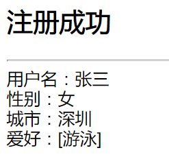  


## 案例：Servlet技术完成登录功能

### 需求分析：使用三层结构
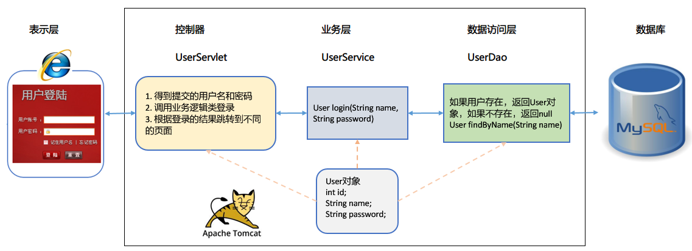  

### 项目结构
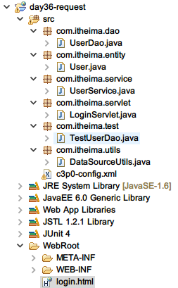  


### 创建数据库表和数据
```sql
-- 创建用户表
create table user (
    id int primary key auto_increment,
    name varchar(20) not null,
    password varchar(20) not null
    );
-- 查看表结构
desc user;
-- 插入两条记录
insert into user values(null,'jack','123'),(null,'rose','456');
-- 查询记录是否插入
select * from user;
```
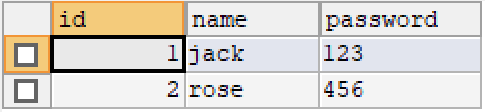  


### 登录界面
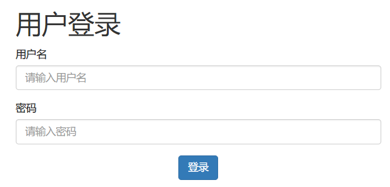  

登录界面代码：  
```html
<!DOCTYPE html>
<html lang="zh-CN">
  <head>
    <meta charset="utf-8">
    <meta http-equiv="X-UA-Compatible" content="IE=edge">
    <meta name="viewport" content="width=device-width, initial-scale=1">
    <title>登录</title>
    <link href="css/bootstrap.min.css" rel="stylesheet">
    <script src="js/jquery-3.2.1.min.js"></script>
    <script src="js/bootstrap.min.js"></script>
  </head>
  <body>
    <div class="containter" style="max-width: 500px; margin: auto;">
        <h1>用户登录</h1>
        <form action="login" method="post">
          <div class="form-group">
            <label for="user">用户名</label>
            <input type="text" class="form-control" name="name" id="user" placeholder="请输入用户名">
          </div>
          <div class="form-group">
            <label for="password">密码</label>
            <input type="password" class="form-control" name="password" id="password" placeholder="请输入密码">
          </div>
          <div style="text-align: center;">
            <button type="submit" class="btn btn-primary">登录</button>
          </div>
        </form>
    </div>
  </body>
</html>

```


### 添加包到WebRoot/WEB-INF/lib目录
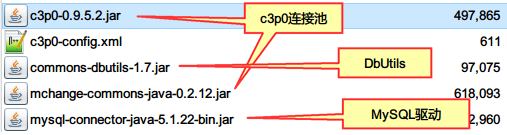  

### Servlet写出登录功能
1. 用户实体类代码：  
```java
package com.itheima.entity;
/**
 * 用户实体类
 * @author NewBoy
 */
public class User {
    private int id;  //编号
    private String name; //姓名
    private String password; //密码
    
    //getter和setter方法省略
    @Override
    public String toString() {
        return "User [id=" + id + ", name=" + name + ", password=" + password   + "]";
    }
}

```
2. 数据源工具类代码： 
```java
package com.itheima.utils;

import java.sql.Connection;
import java.sql.SQLException;

import javax.sql.DataSource;

import com.mchange.v2.c3p0.ComboPooledDataSource;

/**
 * 工具类
 * @author NewBoy
 *
 */
public class DataSourceUtils {
    
    private static ComboPooledDataSource ds = new ComboPooledDataSource();
    
    /**
     * 得到数据源
     */
    public static DataSource getDataSource() {
        return ds;
    }
    
    /**
     * 得到连接
     */
    public static Connection getConnection() {
        try {
            return ds.getConnection();
        } catch (SQLException e) {
            e.printStackTrace();
            throw new RuntimeException(e);
        }
    }

}

```
3. 数据访问层代码UserDao：
```java
package com.itheima.dao;

import java.sql.SQLException;

import org.apache.commons.dbutils.QueryRunner;
import org.apache.commons.dbutils.handlers.BeanHandler;

import com.itheima.entity.User;
import com.itheima.utils.DataSourceUtils;

/**
 * 数据访问层
 * @author NewBoy
 *
 */
public class UserDao {
    
    private QueryRunner runner = new QueryRunner(DataSourceUtils.getDataSource());
    
    /**
     * 通过名字查询是否用指定的用户
     * @param name
     * @return
     */
    public User findByName(String name) {
        try {
            return runner.query("select * from user where name=?", new BeanHandler<User>(User.class), name);
        } catch (SQLException e) {
            e.printStackTrace();
            throw new RuntimeException(e);
        }
    }


}

```
4. Dao层测试类：
```java
package com.itheima.test;

import org.junit.Test;

import com.itheima.dao.UserDao;

public class TestUserDao {
    
    private UserDao userDao = new UserDao();
    
    /**
     * 测试DAO
     */
    @Test
    public void testUserDao() {
        System.out.println(userDao.findByName("newboy"));
        System.out.println(userDao.findByName("jack"));
    }

}

```
5. 业务层：
```java
package com.itheima.service;

import com.itheima.dao.UserDao;
import com.itheima.entity.User;

/**
 * 业务层
 * @author NewBoy
 *
 */
public class UserService {
    
    //调用dao层
    private UserDao userDao = new UserDao();
    
    /**
     * 通过用户名和密码查询用户是存在
     * @param name
     * @param password
     * @return 存在返回用户，不存在返回null
     */
    public User login(String name, String password) {
        User user = userDao.findByName(name);
        //如果得到再判断密码是否相同
        if (user!=null) {
            if (user.getPassword().equals(password)) {
                //登录成功
                return user;
            }
        }
        //失败
        return null;
    }

}
```
6. UserServlet:
```java
package com.itheima.servlet;

import java.io.IOException;
import java.io.PrintWriter;

import javax.servlet.ServletException;
import javax.servlet.annotation.WebServlet;
import javax.servlet.http.HttpServlet;
import javax.servlet.http.HttpServletRequest;
import javax.servlet.http.HttpServletResponse;

import com.itheima.entity.User;
import com.itheima.service.UserService;

/**
 * 登录
 * @author NewBoy
 *
 */
@WebServlet("/login")
public class UserServlet extends HttpServlet {
    
    //调用业务层
        

    public void doGet(HttpServletRequest request, HttpServletResponse response)
            throws ServletException, IOException {
        //汉字乱码
        request.setCharacterEncoding("utf-8");
        response.setContentType("text/html;charset=utf-8");
        PrintWriter out = response.getWriter();
        //得到用户名和密码
        String name = request.getParameter("name");
        String password = request.getParameter("password");
        User user = userService.login(name, password);
        if (user == null) {
            out.print("<h2>登录失败，用户名或密码不正确</h2>");
            out.print("<a href='login.html'>重新登录</a>");
        }
        else {
            out.print("欢迎您!" + name + "<br/>");
        }
        out.close();
    }

    public void doPost(HttpServletRequest request, HttpServletResponse response)
            throws ServletException, IOException {
        doGet(request, response);
    }

}
```
- 使用三层结构开发所遇到的问题：  
<b>
    <font style="color:red;font-family:'微软雅黑';">
    如果要调用其他的层的话，用私有构造方法来创建那一层的对象，比如service层调用dao层，private Dao dao = new Dao();
</font>
</b>

## Web开发中的路径问题

### 相对路径的个编写规范
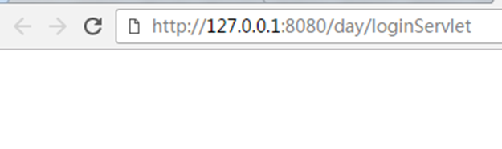  
- 面试题：表单form中action和method的写法是什么？  
  - action: 有两种写法，相对地址loginServlet，绝对地址/day/loginServlet，一定要加上工程访问地址  
  - method: 地址栏上没有参数，所以是post  
  **相对地址前面没有/**

### 什么是相对路径：以当前地址为起点的路径
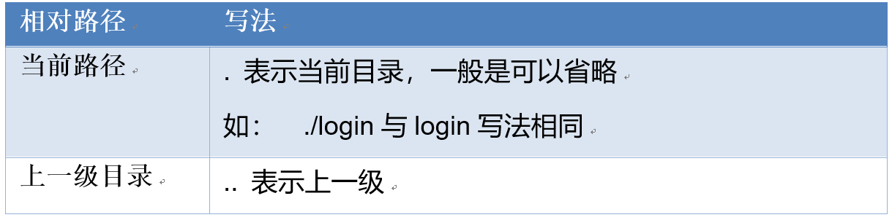  


### 什么是绝对路径：以根目录为起点路径
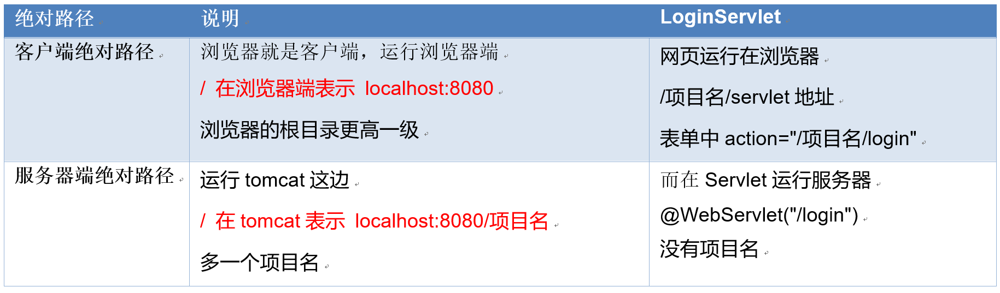  


## ServletConfig的使用

### 作用: 用来的到web.xml中servlet的配置参数

### 常用的方法
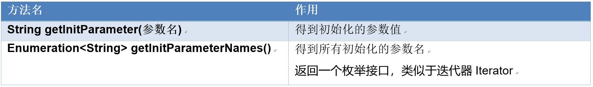  


### Enumeration中的方法
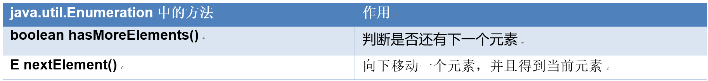  


### 硬编码的缺点
可以将一些配置信息放在web.xml中，使用ServletConfig得到配置的信息

### 案例演示
需求：在当前的Servlet中创建2个init的参数，name=Jack, age=18，读取配置文件中的多个参数，读取出来，显示到浏览器上。

### 代码

web.xml
```xml
<?xml version="1.0" encoding="UTF-8"?>
<web-app xmlns:xsi="http://www.w3.org/2001/XMLSchema-instance" xmlns="http://java.sun.com/xml/ns/javaee" xsi:schemaLocation="http://java.sun.com/xml/ns/javaee http://java.sun.com/xml/ns/javaee/web-app_3_0.xsd" id="WebApp_ID" version="3.0">
  <display-name>day36-config</display-name>
  
  <servlet>
    <servlet-name>ReadConfigServlet</servlet-name>
    <servlet-class>com.itheima.servlet.ReadConfigServlet</servlet-class>
    <!-- 配置初始的参数 -->
    <init-param>
        <!-- 参数名 -->
        <param-name>name</param-name>
        <param-value>Jack</param-value>
    </init-param>
    <init-param>
        <param-name>age</param-name>
        <param-value>20</param-value>
    </init-param>
  </servlet>

  <servlet-mapping>
    <servlet-name>ReadConfigServlet</servlet-name>
    <url-pattern>/read</url-pattern>
  </servlet-mapping>
  
</web-app>
```
2. servlet
```java
package com.itheima.servlet;

import java.io.IOException;
import java.io.PrintWriter;
import java.util.Enumeration;

import javax.servlet.ServletException;
import javax.servlet.http.HttpServlet;
import javax.servlet.http.HttpServletRequest;
import javax.servlet.http.HttpServletResponse;

/**
 * 读取配置信息
 * 需求：在当前的Servlet中创建2个init的参数，name=Jack, age=18
 * 读取配置文件中的多个参数，读取出来，显示到浏览器上
 * @author NewBoy
 *
 */
public class ReadConfigServlet extends HttpServlet {

    public void doGet(HttpServletRequest request, HttpServletResponse response)
            throws ServletException, IOException {
        response.setContentType("text/html;charset=utf-8");
        PrintWriter out = response.getWriter();
        // 读取配置参数
        String name = getInitParameter("name");
        String age = getInitParameter("age");
        out.print("配置名字：" + name + "<br/>");
        out.print("配置年龄：" + age + "<br/>");
        //得到所有配置名字
        out.print("<hr/>");
        //得到枚举接口
        Enumeration<String> names = getInitParameterNames();
        while(names.hasMoreElements()) {
            String initName = names.nextElement();
            out.print("参数名:" + initName + "<br/>");
            out.print("参数值:" + getInitParameter(initName) + "<br/>");
        }
        out.close();
    }

    public void doPost(HttpServletRequest request, HttpServletResponse response)
            throws ServletException, IOException {
        doGet(request, response);
    }

}
```
3. 结果： 
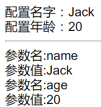  

