# cookies和session

## 1.会话概述

### 1. 什么是会话
类似于生活中的打电话。会话指浏览器第一次访问服务器，由服务器创建会话对象，浏览器与服务器之间多次发送请求和响应，这就是整个会话过程，会话可以访问多个页面。浏览器关闭或服务器上会话过期，会话就结束。   
  
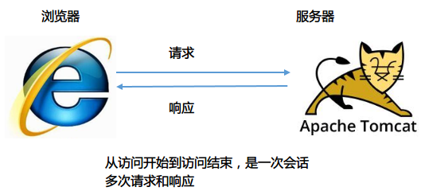  

### 2. 两种会话技术
cookies 和 session

## 2. cookies的学习

### 1. cookies的引入
1.  疑问：常见的网站登录，保存密码，下次自动登录如何实现？用户的数据应该保存到哪里？
原理：如果勾上下次自动登录，将用户名和密码保存到本地浏览器端，存在Cookie对象中，不同的浏览器保存Cookie的方式不同，如：IE是以文本文件的方式保存在本地硬盘上。下次再访问这个网站，从Cookie中读取用户名和密码的信息，发送给服务器。
保存的用户名和密码应该是加密以后   
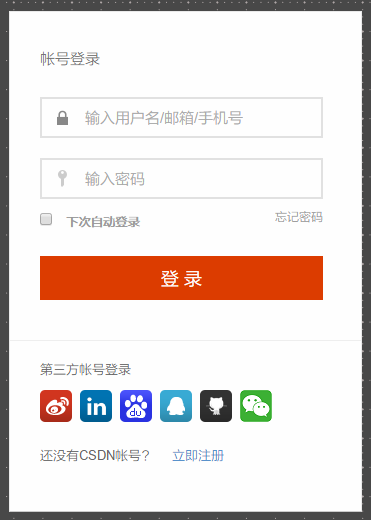  

2. 如何查看Cookie信息?
  - 如IE浏览器，文本文件的大小不能超过4K
  - 路径:c:\Users\用户名\AppData\Local\Microsoft\Windows\INetCookies\   
  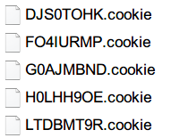  

  - Chrome 浏览器直接在浏览器什么查看就可以了。
  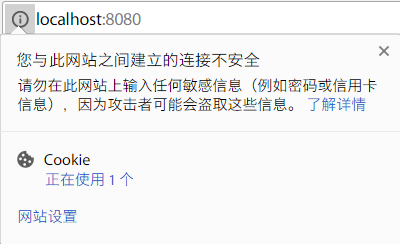  
3. 什么是Cookie？  
  是由服务器创建，发送给浏览器，由浏览器来保存到本地。每个Cookie是一个键值对，键和值都只是能字符串类型。而且不能直接使用汉字。  
4. Cookie技术运行的原理：  
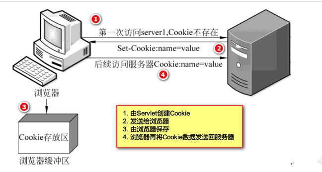  
  - 第1次浏览器访问服务器，没有Cookie信息
  - 由服务器创建Cookie的键和值，以响应头Set-Cookie的方式发送给浏览器
  - 浏览器收到Cookie的信息，把它保存到本地
  - 下次再访问服务器的时候将Cookie的信息发送给服务器

### 2. 与Cookies操作相关的方法  
- 创建cookie  

|cookie类的方法|作用|
|---|---|
|Cookie(String name, String value) | 调用有参构造，指定名字和值，创建一个cookie对象|
|String getName()|得到cookie的键|
|String getValue()|的到cookie的值|

- cookie的写入  
|需要HttpServletResponse对象|作用|
|---|---|
|response.addCookie(Cookie cookie)|将cookie信息发送给浏览器|

示例： 发送了一个cookie(name,allenlei) 给浏览器
代码：  
```java
import java.io.IOException;
import java.io.PrintWriter;

import javax.servlet.ServletException;
import javax.servlet.annotation.WebServlet;
import javax.servlet.http.Cookie;
import javax.servlet.http.HttpServlet;
import javax.servlet.http.HttpServletRequest;
import javax.servlet.http.HttpServletResponse;

/**
 * cookies demo01
 * create a cookie that name = allen
 * @author AllenLei
 *
 */
@WebServlet("/demo1")
public class Demo1CookieServlet extends HttpServlet {

    public void doGet(HttpServletRequest request, HttpServletResponse response)
            throws ServletException, IOException {
        response.setContentType("text/html;charset=utf-8");
        PrintWriter out = response.getWriter();
        // Put your code here
        out.print("send a cookie to brower");
        Cookie cookie = new Cookie("name", "allenlei");
        response.addCookie(cookie);
        
        out.close();
    }

    public void doPost(HttpServletRequest request, HttpServletResponse response)
            throws ServletException, IOException {
        doGet(request, response);
    }

}

```
- 查询响应头
- Set-Cookie:name=allenlei  
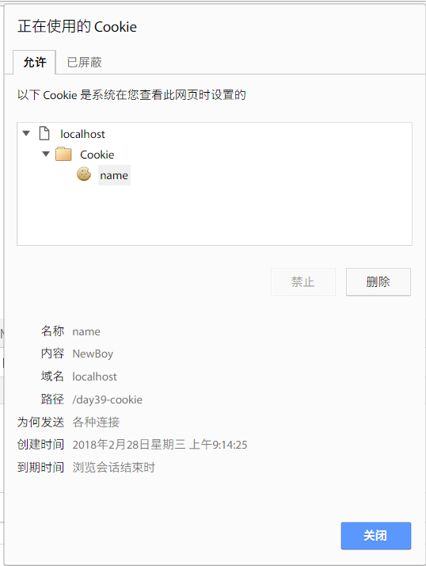  

- Cookie的过期时间
- 默认是浏览器关闭就过期
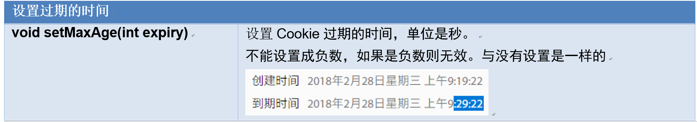  
```java
//创建Cookie对象
Cookie cookie = new Cookie("name", "allenlei");
//设置过期的时间，单位是秒
cookie.setMaxAge(60 * 10);
//将Cookie对象发送给浏览器
response.addCookie(cookie);
```

- Cookie的读取：
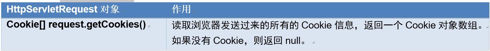  

- Cookie中使用汉字的情况  
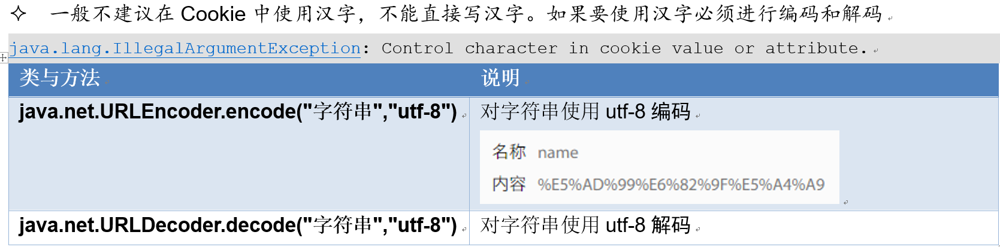  

### 3. 案例：得到用户上次访问的时间
- 需求：   
1. 如果用户是第一次访问，则输出：您好，您是第1次访问，欢迎您的加入！当前的时间是xxx   
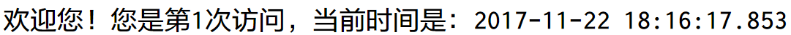  

2. 把这次访问服务器的时间写到Cookie中
3. 如果之前已经访问过，则从Cookie中得到上次访问的时间，显示：您好，欢迎您再次访问。
上次访问的时间是：xxxx，当前的时间是xxxxx。   
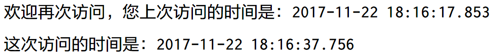  

- 流程分析：   
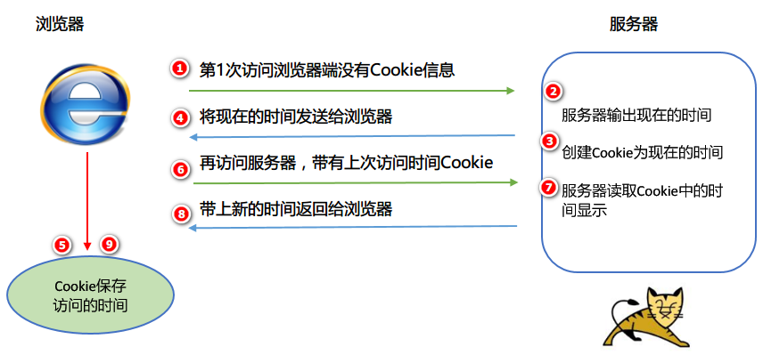  

- 实现细节：
1. 创建一个CookieUtils工具
`方法：从Cookie中取一个名字为name的值，如果有则返回值，没有则返回空。`
`public static String getCookieValue(HttpServletRequest request , String name)`  
2. 从Cookie中取一个叫visitedTime的信息，如果为null，则表示第一次访问
3. 否则读取Cookie的信息，并且显示上次访问的时间
4. 无论上次访问时间是否为空，都把这次访问的时间写入Cookie中

登录项目中有用此方法  

### 4. 设置Cookies的路径
- Cookies 设置路径的方法：`cookie.setPath(路径)`;设置浏览器向服务器发送Cookie的访问路径  
- cookies默认的路径：
- 如果没有设置访问路径，则使用项目的访问地址。只有访问地址是这个路径或它的子路径，浏览器才将cookie的信息发送给服务器。路径用于区别不同的项目的访问地址。 一般不作修改  

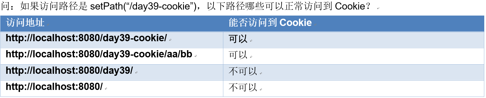  


### 5. Cookies的删除
把`setMaxAge(时间) ` 把时间设置为0就是销毁了。

## 3. HttpSession会话
### 1. Session技术的特点
- Cookie的数据保存在浏览器端，Session的数据是保存在服务器内存中。
- 每个访问服务器用户都有自己的存储空间
- 每个用户之间的数据是不能共享的
- 每个用户访问服务器都会从浏览器端带一个会话id，访问自己的会话空间。
  

### 2. Session和Cookie的主要区别在于
- Cookie的数据保存在浏览器端，Session的数据是保存在服务器内存中。
- Cookie的键和值都是字符串类型，而Session键是字符串，值是Object。

### 3. HttpSession的使用
1. 创建会话的时机   
  浏览器第一次访问服务器，并且调用下面的方法，就会创建一个会话   
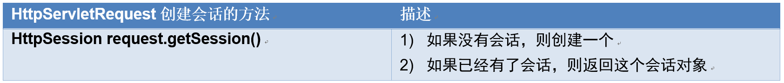  
2. HttpSession类的API：  
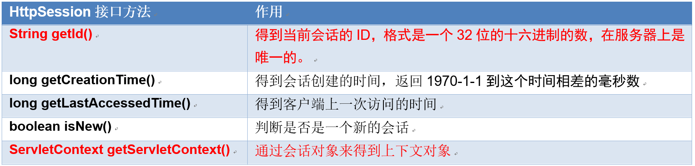  

- session作用域对象的方法
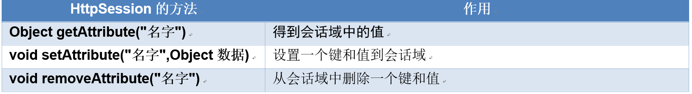  

- 示例：不同的浏览器得到不同的Session
  - 在一个SetServlet中，向Session中添加一件商品名：洗衣机，另一个GetServlet中，从Session中取出商品并输出在网页上。
  - 使用一个浏览器存，另一个浏览器取，看能不能取出来。  

- 会话原理分析：
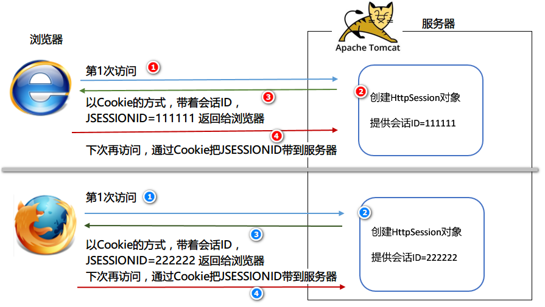  

- 浏览器第1次访问没有会话
- 由服务器调用getSession()方法创建一个会话，并且分配一个会话id给浏览器，通过Cookie发送。
- 浏览器得到会话id以后，下次访问将会话id再以cookie的方式发送给服务器
- 服务器判断会话id是否存在，如果存在，则分配上一次的空间给用户访问。


### 4. HttpSession的分析

#### 1. 问：如果浏览器关闭，服务器上的数据会清除吗？
答：服务器的会话信息是存在，要等到服务器上这个会话过期，才会消失。因为浏览器关闭，Cookie信息就过期了，会导致之前的ID无法再次得到，不能访问服务器上的空间。  

- 方案：我们可以保存会话id到Cookie中，并且指定过期的时间，下次就可以再次访问。服务器上默认保存的时间是30分钟。  
```java
//保存会话id到cookie中并设置过期的时间
Cookie id = new Cookie("JSESSIONID", session.getId());
id.setMaxAge(60 * 10);
response.addCookie(id); 
```

#### 2. 疑问：Session再服务器上默认销毁的时间
`out.print("会话销毁的时间：" + session.getMaxInactiveInterval() + "秒");`  
最大的非活动时间间隔

#### 3. 改变会话的生存时间
- 方案一：HttpSession的方法
`setMaxInactiveInterval()` : 设置会话过期的时间间隔，单位是秒  
- 方案二：通过配置web.xml文件来设置会话过期的时间
```xml
<!-- 配置会话过期的时间 -->
<session-config>
    <!-- 单位是分钟 -->
    <session-timeout>5</session-timeout>
</session-config>
```
  - 疑问：设置web.xml的会话配置，并且在代码中设置会话过期的时间，以哪个为准？
  - 代码，就近原则，或者说覆盖了
- 方案三：手动立即销毁会话
  - `invalidate()`: **让会话马上过期，一般用于退出功能**

## 5. [登录案例](https://github.com/AllenLeic/project-javalearning)  
- 需求：用户登录的时候使用验证码进行验证  
  - 登录成功后将用户信息保存到会话域中，并且跳转到WelcomeServlet
  - 然后在WeclcomeServlet中读取会话域中用户信息，显示欢迎信息。在WelcomeServlet上显示退出的链接
  - 点退出跳转到LogoutServlet，注销会话信息。

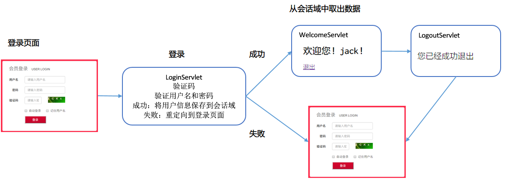  
 **步骤**：
1. 建立表
2. 实体类
3. 工具类
4. dao层
5. service层
6. LoginServlet实现步骤
  - 使用昨天的代码实现验证码的绘制
  - 将随机产生的字符串放在会话域中
  - 用户登录的时候提交验证码的字符串
  - 比较表单提交的字符串是否与会话域中的字符串相等，如果相等则验证成功
  - 登录一次以后删除会话域中的验证码字符串
  - 登录成功以后保存用户的信息到会话域中，并且跳转到WelcomeServlet
7. WelcomeServlet的实现步骤
  - 从会话域中取出用户信息并且显示
  - 判断用户是否正常登录，如果是非法用户则跳转到登录页面
  - 在页面上输出一个注销的连接，点注销跳转到LogoutServlet
8. LogoutServlet的实现步骤：  
  - 让会话立刻过期
  - 显示您已经成功退出


## 6. sevlet三个作用域总结
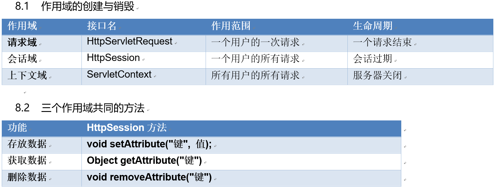  


## session钝化和激活
如果Tomcat正常退出，会把内存中的session以对象的方式存储到硬盘中叫钝化；  
下次正常启动时再读取硬盘上面的SESSION.ser 叫激活。  
强制关闭时不会出现钝化。