# request请求对象

## HttpServletRequest对象

### 什么是HttpServletRequest对象
这是一个接口，具体的实现类由Tomcat创建。用来封装浏览器发送给服务器的所有请求信息。  


### HTTP请求的组成：
请求行，请求头（键和值）请求体 

### 获取请求行的相关方法
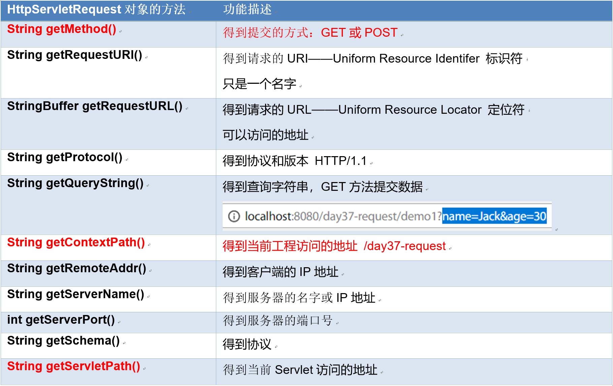  

- 示例：创建一个Demo1RequestLineServlet，用于获取请求行中相关信息的方法，并且输出到网页上。  
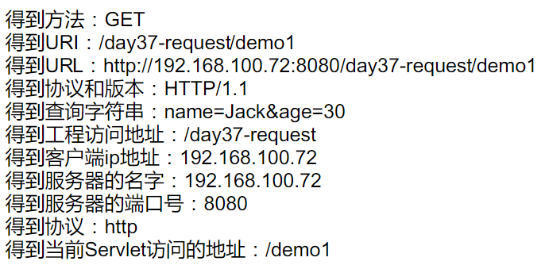  

```java
package com.itheima.servlet;

import java.io.IOException;
import java.io.PrintWriter;

import javax.servlet.ServletException;
import javax.servlet.http.HttpServlet;
import javax.servlet.http.HttpServletRequest;
import javax.servlet.http.HttpServletResponse;

/**
 * 用于获取请求行中相关信息的方法，并且输出到网页上。
 * @author NewBoy
 *
 */
public class Demo1RequestLineServlet extends HttpServlet {

    public void doGet(HttpServletRequest request, HttpServletResponse response)
            throws ServletException, IOException {
        response.setContentType("text/html;charset=utf-8");
        PrintWriter out = response.getWriter();
        out.print("得到方法：" + request.getMethod() + "<br/>");
        out.print("得到URI：" + request.getRequestURI() + "<br/>");
        out.print("得到URL：" + request.getRequestURL() + "<br/>");
        out.print("得到协议和版本：" + request.getProtocol()+ "<br/>");
        out.print("得到查询字符串：" + request.getQueryString() + "<br/>");
        out.print("得到工程访问地址：" + request.getContextPath() + "<br/>");
        out.print("得到客户端ip地址：" + request.getRemoteAddr() + "<br/>");
        out.print("得到服务器的名字：" + request.getServerName() + "<br/>");
        out.print("得到服务器的端口号：" + request.getServerPort() + "<br/>");
        out.print("得到协议：" + request.getScheme() + "<br/>");
        out.print("得到当前Servlet访问的地址：" + request.getServletPath() + "<br/>");
        out.close();
    }

    public void doPost(HttpServletRequest request, HttpServletResponse response)
            throws ServletException, IOException {
        doGet(request, response);
    }

}
```


### 获取请求头的相关方法
- 常见的请求头
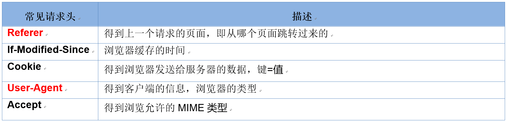    

- 获取请求头的相关方法：
- 请求头信息
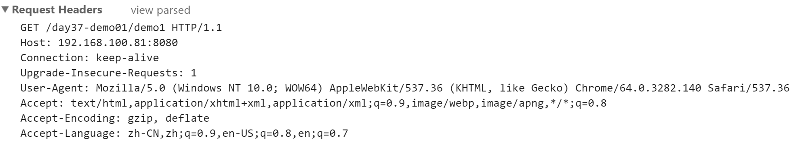  

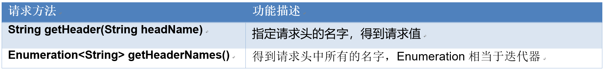  

- 示例：Demo2RequestHeaderServlet得到所有的请求头信息，并输出所有的请求值信息。  
```java
package com.itheima.servlet;

import java.io.IOException;
import java.io.PrintWriter;
import java.util.Enumeration;

import javax.servlet.ServletException;
import javax.servlet.annotation.WebServlet;
import javax.servlet.http.HttpServlet;
import javax.servlet.http.HttpServletRequest;
import javax.servlet.http.HttpServletResponse;

/**
 * 得到所有的请求头信息，并输出所有的请求值信息。
 * @author NewBoy
 *
 */
@WebServlet("/demo2")
public class Demo2RequestHeaderServlet extends HttpServlet {

    public void doGet(HttpServletRequest request, HttpServletResponse response)
            throws ServletException, IOException {
        response.setContentType("text/html;charset=utf-8");
        PrintWriter out = response.getWriter();
        // 得到一个
        String value = request.getHeader("Connection");
        out.print("Connection: " + value + "<hr/>");
        //得到所有的名字
        Enumeration<String> headerNames = request.getHeaderNames();
        while(headerNames.hasMoreElements()) {
            //得到名字
            String name = headerNames.nextElement();
            out.print("请求头名：" + name + "， 请求值：" + request.getHeader(name) + "<br/>");
        }
        out.close();
    }

    public void doPost(HttpServletRequest request, HttpServletResponse response)
            throws ServletException, IOException {
        doGet(request, response);
    }

}
```

- 应用案例： 得到浏览器的类型，判断是：Edge、Chrome、Safari、Firefox或IE浏览器
- 分析：得到user-agent请求头，判断字符串是否包含相应的浏览器的名字，如果包含则输出它的类型  
```java
package com.itheima.servlet;

import java.io.IOException;
import java.io.PrintWriter;

import javax.servlet.ServletException;
import javax.servlet.annotation.WebServlet;
import javax.servlet.http.HttpServlet;
import javax.servlet.http.HttpServletRequest;
import javax.servlet.http.HttpServletResponse;

/**
 * 得到浏览器的类型，判断是：Edge、Chrome、Safari、Firefox或IE浏览器
 * @author NewBoy
 *
 */
@WebServlet("/demo3")
public class Demo3AgentServlet extends HttpServlet {

    public void doGet(HttpServletRequest request, HttpServletResponse response)
            throws ServletException, IOException {
        response.setContentType("text/html;charset=utf-8");
        PrintWriter out = response.getWriter();
        // 得到user-agent请求头
        String userAgent= request.getHeader("user-agent");
        //out.print(userAgent);
        if (userAgent.contains("Edge")) {
            out.print("Edge浏览器");
        }
        else if (userAgent.contains("Chrome")) {
            out.print("Chrome浏览器");
        }
        else if(userAgent.contains("Safari")) {
            out.print("Safari浏览器");
        }
        else if(userAgent.contains("Firefox")) {
            out.print("Firefox浏览器");
        }
        else {
            out.print("IE或其它浏览器");
        }
        //判断
        out.close();
    }

    public void doPost(HttpServletRequest request, HttpServletResponse response)
            throws ServletException, IOException {
        doGet(request, response);
    }

}

```
- 应用案例：防盗链
  - 需求：当我们去访问某个页面的时候，首先会跳转到一个广告页面，看了广告以后才可以访问资源。
  - 原理：通过得到请求头Referer,  获取当前页面的从哪里来的。
    - 1) 如果是从广告页面过来的，则可以继续访问。
    - 2) 如果为null，表示没有上一个页面。
    - 3) 如果没有访问广告，跳转到广告页面。
  - 页面：adv.html 是广告页面
  - Demo4ResourceServlet :判断当前页面从哪里跳转过来的，如果从广告页面过来，则正常访问，否则跳转到广告页面！

```java
package com.itheima.servlet;

import java.io.IOException;
import java.io.PrintWriter;

import javax.servlet.ServletException;
import javax.servlet.annotation.WebServlet;
import javax.servlet.http.HttpServlet;
import javax.servlet.http.HttpServletRequest;
import javax.servlet.http.HttpServletResponse;

/**
 * 要访问的Web资源
 * @author NewBoy
 *
 */
@WebServlet("/demo4")
public class Demo4ResourceServlet extends HttpServlet {

    public void doGet(HttpServletRequest request, HttpServletResponse response)
            throws ServletException, IOException {
        response.setContentType("text/html;charset=utf-8");
        PrintWriter out = response.getWriter();
        //得到上一个页面的地址
        String url = request.getHeader("referer");
        System.out.println(url);
        //如果为null，没有上一个页面
        if ( url == null) {
            //重定向跳转到广告页面
            response.sendRedirect("adv.html");
            return;   //代码不再继续向后运行
        }
        //表示从其它页面跳转过来的
        else if (!url.contains("/day37-request/adv.html")) {
                //重定向跳转到广告页面
                response.sendRedirect("adv.html");
                return;   //代码不再继续向后运行
        }
        else {
            //从广告页面过来的
            out.print("<h1>我是精彩内容</h1>");
        }
        out.close();
    }

    public void doPost(HttpServletRequest request, HttpServletResponse response)
            throws ServletException, IOException {
        doGet(request, response);
    }
}
```
- 广告页面：
```html
<!DOCTYPE HTML PUBLIC "-//W3C//DTD HTML 4.01 Transitional//EN">
<html>
  <head>
    <title>MyHtml.html</title>
  </head>
  
  <body>
   <h1>我是广告</h1>
    <br/>
   <a href="/day37-request/demo4">访问资源</a>
  </body>
</html>

```

### 获取请求参数的相关方法
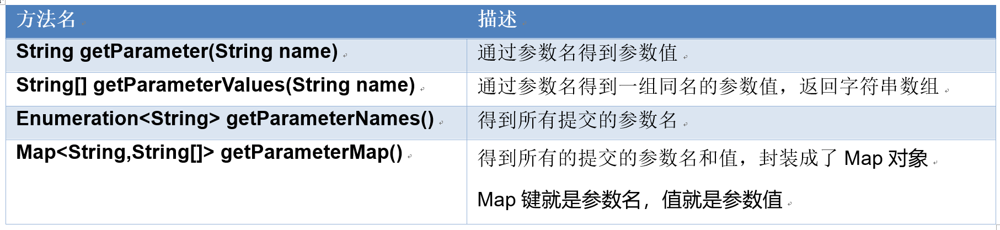  

- 用户注册得到表单提交的参数
```html
<body>
  <h2>用户注册</h2>
  <form action="demo5" method="post">
  用户名： <input type="text" name="name"><br/>
  性别: <input type="radio" name="gender" value="男" checked="checked"/>男
  <input type="radio" name="gender" value="女"/>女 <br/>
  城市： 
  <select name="city">
    <option value="广州">广州</option>
    <option value="深圳">深圳</option>
    <option value="珠海">珠海</option>
  </select>
  <br/>
  爱好：
  <input type="checkbox" name="hobby" value="上网"/>上网
  <input type="checkbox" name="hobby" value="上学"/>上学
  <input type="checkbox" name="hobby" value="上车"/>上车
  <input type="checkbox" name="hobby" value="上吊"/>上吊
  <br/>
  <input type="submit" value="注册"/>
 </form>
  </body>
</html>
```
- 得到参数的Servlet
```java
package com.itheima.servlet;

import java.io.IOException;
import java.io.PrintWriter;
import java.util.Arrays;
import java.util.Enumeration;
import java.util.Map;
import java.util.Map.Entry;
import java.util.Set;

import javax.servlet.ServletException;
import javax.servlet.annotation.WebServlet;
import javax.servlet.http.HttpServlet;
import javax.servlet.http.HttpServletRequest;
import javax.servlet.http.HttpServletResponse;

/**
 * 获取请求参数的方法
 * @author NewBoy
 *
 */
@WebServlet("/demo5")
public class Demo5ParamServlet extends HttpServlet {

    public void doGet(HttpServletRequest request, HttpServletResponse response)
            throws ServletException, IOException {
        //汉字
        request.setCharacterEncoding("utf-8");
        response.setContentType("text/html;charset=utf-8");
        PrintWriter out = response.getWriter();
        // 得到所有参数名字
        Enumeration<String> names = request.getParameterNames();
        while (names.hasMoreElements()) {
            //得到表单其中一项的名字
            String name = names.nextElement();
            //得到值
            String value = request.getParameter(name);
            out.print("表单名:" + name + "---> 表单值：" + value + "<br/>");
        }
        out.print("<hr/>");
        //得到所有的提交的参数名和值，封装成了Map对象
        Map<String, String[]> map = request.getParameterMap();
        //遍历Map
        Set<Entry<String, String[]>> entrySet = map.entrySet();
        for (Entry<String, String[]> entry : entrySet) {
            out.print("表单名：" + entry.getKey() + "--> 表单值：" + Arrays.toString(entry.getValue()) + "<br/>");
        }
        out.close();
    }

    public void doPost(HttpServletRequest request, HttpServletResponse response)
            throws ServletException, IOException {
        doGet(request, response);
    }

}

```
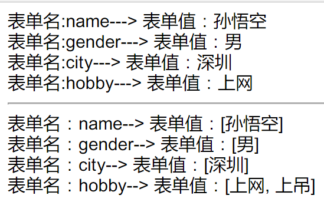  


### 参数乱码的问题
请求参数乱码的原因：   
  客户端HTML使用的是utf-8(国际码)，但服务器tomcat7.0默认是使用欧洲码iso-8859-1，不支持汉字的。客户端编码与服务端的编码要一致  
  1) Tomcat7中默认的编码：  
    

- post方式解决乱码的方案：
1） 解决方法：因为post方法是在请求体中发送数据，所以只要指定请求体的编码即可。  
  告诉服务器，请求体是utf-8编码。request.setCharacterEncoding("utf-8")
2)  代码位置：放在所有获取参数的代码之前。如：request.getParameter()   
3)  必须与页面编码相同，如果页面编码使用的是GBK，这里也要使用GBK  
- get方式乱码还原原理：
GET是以查询字符串的方式发送数据  
> 浏览器以utf-8编码--> tomcat解码使用iso-8859-1--> 产生乱码  
> 还原：使用iso-8859-1编码-->  使用utf-8解码--> 还原  

解释： 当得到请求字符串的时候已经是乱码了，还原做的是把乱码给还原成UTF-8的编码。
```java
package com.itheima.servlet;

import java.io.IOException;
import java.io.UnsupportedEncodingException;
import java.util.Arrays;

/**
 * 模板服务器产生乱码
 * @author NewBoy
 *
 */
public class Demo6Code {

    public static void main(String[] args) throws IOException {
        String s1 = "传智播客";
        //浏览器以utf-8编码
        byte[] b1 = s1.getBytes("utf-8");
        System.out.println("utf-8编码以后：" + Arrays.toString(b1));
        //tomcat解码使用iso-8859-1
        String s2 = new String(b1, "iso-8859-1");
        System.out.println("iso8859-1解码：" + s2);
        //还原：使用iso-8859-1编码
        byte[] b2= s2.getBytes("iso-8859-1");
        System.out.println("使用iso-8859-1编码:" + Arrays.toString(b2));
        //使用utf-8解码
        String s3 = new String(b2, "utf-8");
        System.out.println("使用utf-8解码:" + s3);
    }

}
3.6.4   GET方式乱码解决方案一：
使用一句话：new String("乱码".getBytes("iso-8859-1"), "utf-8")
1)  与页面编码要一致
2)  代码：
package com.itheima.servlet;

import java.io.IOException;
import java.io.PrintWriter;
import java.io.UnsupportedEncodingException;

import javax.servlet.ServletException;
import javax.servlet.annotation.WebServlet;
import javax.servlet.http.HttpServlet;
import javax.servlet.http.HttpServletRequest;
import javax.servlet.http.HttpServletResponse;

/**
 * GET方法乱码问题
 * @author NewBoy
 *
 */
@WebServlet("/demo7")
public class Demo7GetParamServlet extends HttpServlet {

    public void doGet(HttpServletRequest request, HttpServletResponse response)
            throws ServletException, IOException {
        //测试post行不行
        //request.setCharacterEncoding("utf-8");
        response.setContentType("text/html;charset=utf-8");
        PrintWriter out = response.getWriter();
        String name = request.getParameter("name");
        out.print("用户名:" + toChinese(name) + "<br/>");
        String gender = request.getParameter("gender");
        out.print("性别:" + toChinese(gender) + "<br/>");
        String city = request.getParameter("city");
        out.print("城市：" + toChinese(city) + "<br/>");
        out.close();
    }

    public void doPost(HttpServletRequest request, HttpServletResponse response)
            throws ServletException, IOException {
        doGet(request, response);
    }
    
    /**
     * 写成一个方法
     */
    private String toChinese(String code) {
        try {
            return new String(code.getBytes("iso-8859-1"), "utf-8");
        } catch (UnsupportedEncodingException e) {
            e.printStackTrace();
            throw new RuntimeException(e);
        }
    }
}
```
- 表单
```html
<h2>用户注册</h2>
<form action="demo7" method="get">
```
- GET方式乱码解决方案二
修改tomcat默认的编码为utf-8，修改conf/server.xml，在71行。并重启服务器。  
加上 <font style="color: red">URIEncoding="utf-8"</font>  
```xml
<Connector port="8080" protocol="HTTP/1.1" URIEncoding="utf-8"
           connectionTimeout="20000"
           redirectPort="8443" />

```
- 从Tomcat8开始，默认的编码是UTF-8。  

## 使用BeanUtils工具类对请求数据进行封装

### BeanUtils中的方法
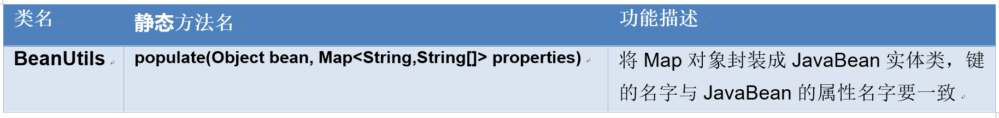  
- **注：** 表单项的名字与JavaBean的属性名要相同。  

## [案例：实现添加书籍的功能](https://github.com/AllenLeic/project-javalearning)  
1)  向数据库中添加一本新的图书，名称和作者不能为空，日期使用yyyy-MM-dd的格式，图书类别：1计算机2小说 3杂项，所属分类必须要选择。  
2)  表单项使用jQuery进行验证。所有表单数据正确的话，提交给BookServlet  
3)  BookServlet中得到所有表单项的数据，封装成Book对象  
4)  使用三层结构将表单的数据写到数据库中  

### 1.项目的三层架构
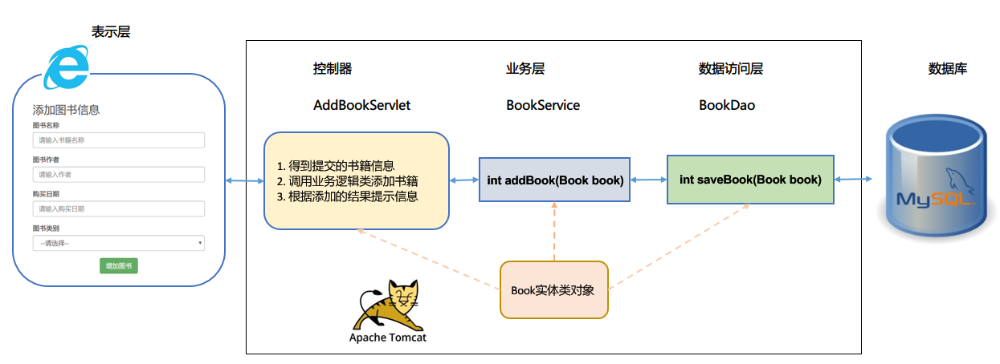  

### 2.项目的表示层
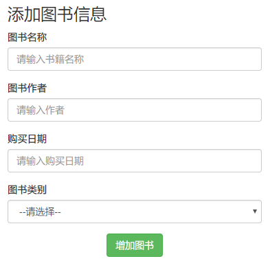  
```html
<!DOCTYPE html>
<html lang="zh-CN">

  <head>
    <meta charset="utf-8">
    <meta http-equiv="X-UA-Compatible" content="IE=edge">
    <meta name="viewport" content="width=device-width, initial-scale=1">
    <title>添加书籍</title>
    <link href="css/bootstrap.min.css" rel="stylesheet">
    <script src="js/jquery-3.2.1.min.js"></script>
    <script src="js/bootstrap.min.js"></script>
    <script src="js/myjs.js"></script>
    <script>
        $(function() {
            $("#bookForm").submit(function() {
                
                if ($("#name").val() == "") {
                    alert("书籍名称不能为空");
                    return false;
                } else if ($("#author").val() == "") {
                    alert("作者不能为空");
                    return false;
                } else if ($("#time").val() == "") {
                    alert("请选择购买日期");
                    return false;
                } else if ($("#type").val() == 0) {
                    alert("请选择类型");
                    return false;
                } 
            });
        });
    
    </script>
  </head>

  <body>
    <div class="container" style="max-width: 400px;">
      <h3>添加图书信息</h3>
      <form action="addbook" method="post" id="bookForm">
        <div class="form-group">
          <label for="name">图书名称</label>
          <input type="text" name="name" id="name" class="form-control" placeholder="请输入书籍名称"/>
        </div>
        <div class="form-group">
          <label for="name">图书作者</label>
          <input type="text" name="author" id="author" class="form-control" placeholder="请输入作者"/>
        </div>
        <div class="form-group">
          <label for="name">购买日期</label>
          <input type="date" name="time" id="time"  class="form-control" placeholder="请输入购买日期"/>
        </div>
        <div class="form-group">
          <label for="name">图书类别</label>
          <select name="type" id="type" class="form-control">
            <option value="0">--请选择--</option>
            <option value="1">计算机</option>
            <option value="2">小说</option>
            <option value="3">杂项</option>
          </select>
        </div>
        <div style="text-align: center;">
          <input type="submit" value="增加图书" class="btn btn-success"/>
        </div>
      </form>
    </div>
  </body>
</html>

```

### 3.表的设计
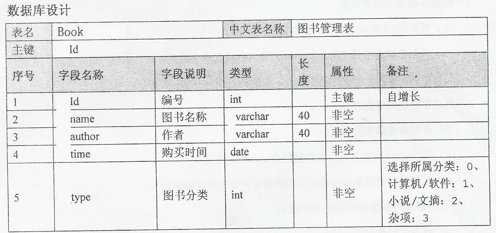  

```mysql
-- 创建数据表book
CREATE table book(
    id int primary key AUTO_INCREMENT,
    name varchar(40) not null,
    author varchar(40) not null,
    time date not null,
    type int not null
);
SELECT * from book;
```

### 4.实体类
### 数据源工具类
### BookDao类
### BookService业务类
### AddBookServlet类
## 请求域的相关方法

### 什么是作用域
什么时作用域：是服务器上的一个内存区域，用来临时存放servlet的数据，让不同的servlet之间实现数据的共享。底层是一个Map，键是字符串类型，值是Object   
作用域种类：上下文域> 会话域 > 请求域 > 页面域  
请求域的范围：只在一个请求中起作用，一个响应结束，请求域也就结束了。  

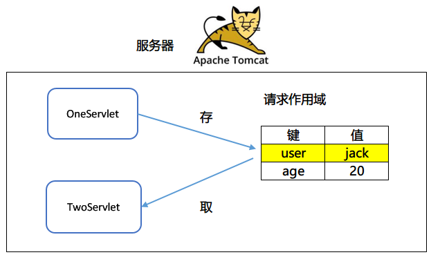   

### 作用域方法
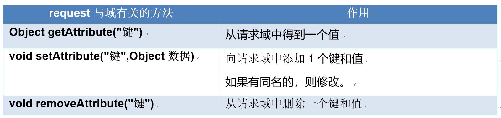   

## 转发与重定向

### 转发与重定向的作用
都可以进行页面的跳转

### 什么是转发
- 概念：在服务器端进行的页面跳转 forward
- 原理图：  
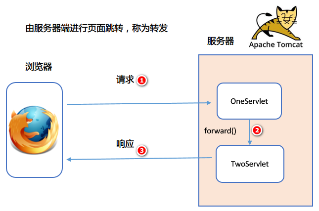  

- 转发的方法： 
`//转发：得到转发器，参数：要跳转的地址`  
`//forward的方法参数：请求，响应。请求和响应是同一个`  
`request.getRequestDispatcher("/get").forward(request, response);`  

- 转发的特点：  
  1)  地址栏显示的是上一个请求的地址  
  2)  请求次数：1次  
  3)  使用的是服务器端的根目录：http://localhost:8080/项目名/  
  4)  请求域不会丢失  

### 重定向
- 什么是重定向
  - 概念：由浏览器端进行的页面跳转，称为重定向  
  - 原理图：  
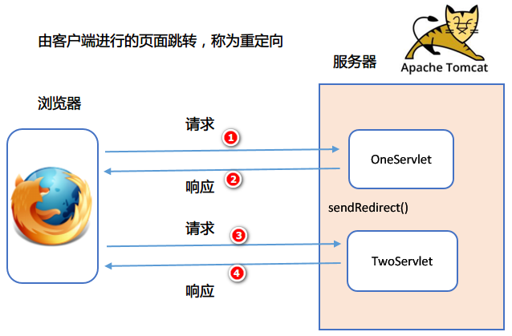  

- 重定向方法：
  - response.sedRedirect("请求的地址")  
- 修改工程的访问地址：  
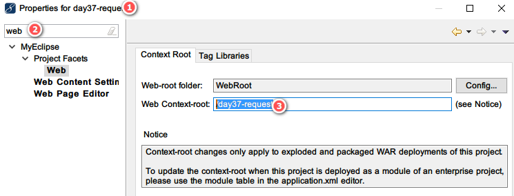  

- 重定向的特点：
  1)  地址栏显示的是新的地址  
  2)  请求次数： 2次  
  3)  根目录是浏览器的根目录：http://localhost:8080/  
  4)  请求域数据会丢失，因为不是同一次请求。   

- 什么时候使用转发，什么时候使用重定向？
如果需要保留请求中的数据，则使用转发，否则使用重定向。  
**增删改使用重定向，而且可以避免重复提交的问题。**  
**查询使用转发，可以得到请求域中的数据。**  


### 面试题：转发和重定向的区别
  

- 问：转发或重定向后续的代码是否还会运行？  
  无论重定向或是转发后面的代码都会执行
- 代码： 
```java
package com.itheima.servlet;

import java.io.IOException;
import java.io.PrintWriter;

import javax.servlet.ServletException;
import javax.servlet.annotation.WebServlet;
import javax.servlet.http.HttpServlet;
import javax.servlet.http.HttpServletRequest;
import javax.servlet.http.HttpServletResponse;

/**
 * 添加数据到请求域中
 * @author NewBoy
 *
 */
@WebServlet("/set")
public class OneServlet extends HttpServlet {

    public void doGet(HttpServletRequest request, HttpServletResponse response)
            throws ServletException, IOException {
        response.setContentType("text/html;charset=utf-8");
        PrintWriter out = response.getWriter();
        // 向请求域中添加数据
        request.setAttribute("user", "jack");
        
        //从作用域中取出
        out.print("OneServlet请求域：" + request.getAttribute("user"));
        
        //转发：得到转发器，参数：要跳转的地址
        //forward的方法参数：请求，响应。请求和响应是同一个
        request.getRequestDispatcher("/get").forward(request, response);
        
        //重定向：使用的是浏览器的根目录
        //response.sendRedirect(request.getContextPath() + "/get");
        
        System.out.println("后面的代码还会执行吗?");
        out.close();
    }

    public void doPost(HttpServletRequest request, HttpServletResponse response)
            throws ServletException, IOException {
        doGet(request, response);
    }

}
```

```java
package com.itheima.servlet;

import java.io.IOException;
import java.io.PrintWriter;

import javax.servlet.ServletException;
import javax.servlet.annotation.WebServlet;
import javax.servlet.http.HttpServlet;
import javax.servlet.http.HttpServletRequest;
import javax.servlet.http.HttpServletResponse;

@WebServlet("/get")
public class TwoServlet extends HttpServlet {

    public void doGet(HttpServletRequest request, HttpServletResponse response)
            throws ServletException, IOException {
        response.setContentType("text/html;charset=utf-8");
        PrintWriter out = response.getWriter();
        //从请求域中取出数据
        out.print("TwoServlet，得到请求域：" + request.getAttribute("user") + "<br/>");
        out.close();
    }

    public void doPost(HttpServletRequest request, HttpServletResponse response)
            throws ServletException, IOException {
        doGet(request, response);
    }

}

```
