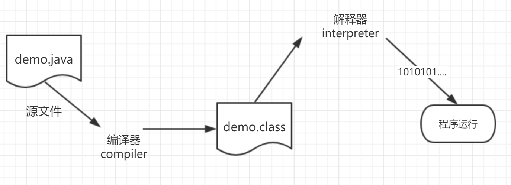
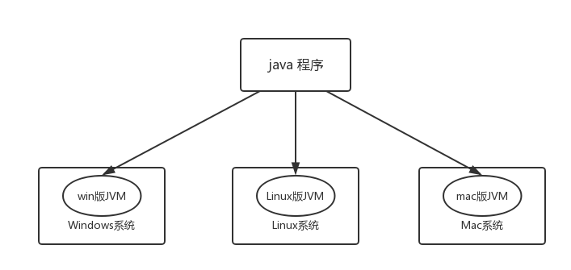
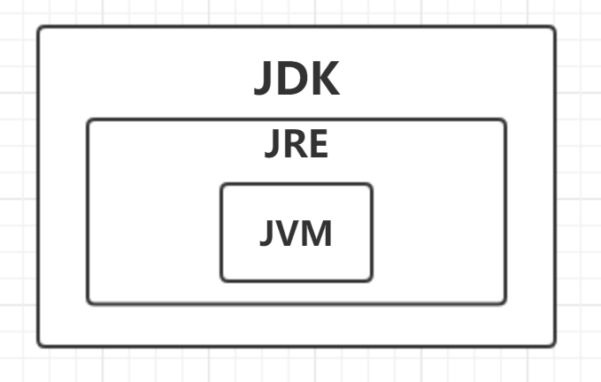

# Java编程基础和环境变量配置

<!-- MarkdownTOC -->

- [Java语言的运行机制](#java语言的运行机制)
  + [java程序执行流程](#java程序执行流程)
- [跨平台](#跨平台)
  + [JVM、JRE、JDK的关系](#jvm、jre、jdk的关系)
- [什么是Java环境变量](#什么是java环境变量)
- [如何配置Java环境变量](#如何配置java环境变量)

<!-- /MarkdownTOC -->

<a id="java语言的运行机制"></a>
## Java语言的运行机制
像目前的IT行业绝大部分人所学的语言都是第三代编程语言，有较好的可读性，但是不能直接被机器所识别，需要编译成字节码文件供机器或计算机识别然后运行。基于此语言基本上可以分为两类语言。一个是编译型语言，一个是解释型语言。  

1. 编译型语言。如 C、 C++等，特点：   
  - 编译生成的程序，只能在特定的平台上运行，先把全部的代码编译一遍再一次性执行。
  - 它可以针对特定的平台进行优化，因此性能可以得到改善。  
2. 解释型语言。如 Ruby、Python，特点：
  - 需要为不同的平台提供解释器。通常他们可以跨平台运行。
  - 由于每次运行时，都需要经过一次解释（转换为机器指令）。性能比较差   

（ps：编译型语言就是一次性编译完，然后一次执行完，解释型就是走一步看一步）   

Java语言是介于这两种之间的。 这是由于Java的机制决定的。 
- Java的虚拟机（JVM）。保证 Java语言的跨平台。
- Java的垃圾回收机制。 保证了Java程序的安全高效。

<a id="java程序执行流程"></a>
### java程序执行流程



<a id="跨平台"></a>
## 跨平台
Java中的跨平台是由 JVM(Java Virtual Machine) 来实现的


<a id="jvm、jre、jdk的关系"></a>
### JVM、JRE、JDK的关系
JDK(Java Development Kit) Java 开发工具包；  
JRE(Java Runtime Environment) Java 运行环境；  
JVM(Java Virtual Machine) Java 虚拟机。  




<a id="什么是java环境变量"></a>
## 什么是Java环境变量

Java程序的运行环境需要依赖JDK（Java Development Kit）——Java开发工具包。没有JDK的话无法编译和运行Java程序。但是我们安装的jdk如果不配置环境变量的话只能在当前的jdk的bin目录下运行和编译Java程序。所以这时候就需要配置环境变量来让我们的Java程序在系统的其他地方也能运行。    

1. PATH 环境变量。作用是指定命令的搜索路径，当执行命令是，系统除了从当前目录下找可执行程序外还会通过 PATH 路径去寻找。因为 jdk 安装目录下的bin目录包含常用的可执行文件如java、javac、javadoc。设置好 PATH 环境变量后就可以在任何路径下执行这些工具了。  

2. `JAVA_HOME` 环境变量。这里是jdk的安装目录，eclipse/netbeans/Tomcat等软件就是通过 `JAVA_HOME` 来寻找安装目录的。  

3. CLASSPATH 环境变量。这是用来告诉JDK，搜索CLASS时先查找当前目录的CLASS文件，但是从JDK 1.5 之后这个环境变量就可以不用设置了。 因为 1.5 以后JDK能够正确的自动寻找CLASSPATH了。建议继续设置以保证向下兼容的问题。  

<a id="如何配置java环境变量"></a>
## 如何配置Java环境变量
- Windows环境


```
JAVA_HOME  c:\develop\jdk1.8    //把你的安装目录复制过去

PATH   %JAVA_HOME%\bin;%PATH%   // 这一段照着复制 

CLASSPATH    .;%JAVA_HOME%\lib;%JAVA_HOME%\lib\tools.jar   
// 这里需要注意的是前面的 【.】不要丢下了。1.5之后不用再设置classpath了，
// 但建议继续设置以保证向下兼容的问题。
```


配置完成之后测试一下。 打开cmd 直接输入  `java -version`  如果能正确的现实版本号。那么就代表成功了。 不放心的话也可以再输入`java` 和 `javac` 两个命令。 如果出来了一大堆东西的话，那么代表是正确的。  
- Linux环境
1. 安装好jdk 之后。输入 `vi /etc/profile`  进入vi 编辑模式；  
2. 把下面这段复制到最后面 `#`代表注释当前行。


``` bash
# 这是你的安装的路径，只需要修改这里就行了。
JAVA_HOME=/home/gcs/user/java/jdk1.8.0_111
PATH=$JAVA_HOME/bin:$PATH
CLASSPATH=.:$JAVA_HOME/lib/dt.jar:$JAVA_HOME/lib/tools.jar
export JAVA_HOME
export PATH
export CLASSPATH
```

