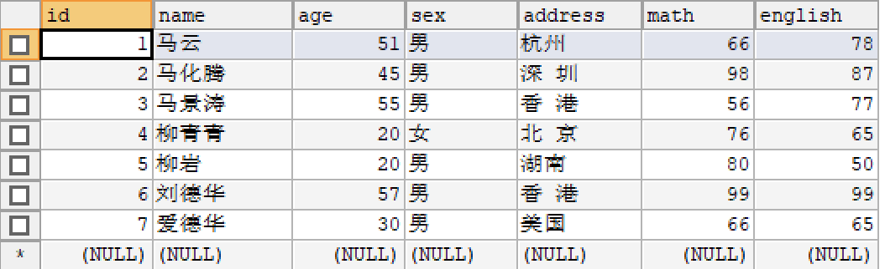

## MySQL基础第二天 day22
- 主要内容是MySQL的约束 和多表入门
知识点补充:
1. 用set names gbk; 来解决dos命令窗口不能插入中文编码的问题,不过不是永久性的;
2. 比较运算符: between... and ...  <==>  >= ... <=
  - 查询成绩在85 到90 之间的学生
    + `select * from student where math between 85 and 90;`
    
3. 逻辑运算符: not 
    - 查询姓名不为张小苍的学生信息
    `select * from student where not name = '张小苍'`
4. 包含  in(1,3) 意思为 1或者3 相当于Java的正则表达式的 [1,3] 只能2选1;
5. 使用  \`关键字\`   来转义关键字, 让关键字可以当普通的字符串来用
6. 比较运算符： between···and··· **包头包尾**
    
7. 逻辑运算符：not
   

### 常见问题回答
1. 如何解决在DOS中无法插入或查询中文字符时乱码的问题   
    方案1:修改my.ini 配置文件,将utf8修改gbk即可，不建议使用。  
    方案2:执行一条SQL语句：set names gbk;
2. 如何解决指定IP地址连接数据库无法连接问题？  
    + 打开cmd窗口，进入MySQL安装的bin目录
    + 执行命令登录数据库,之后会出现一行要你输入密码的 mysql -u root -p
    + 执行以下命令分配新用户：
  grant all privileges on *.* to 'root'@'%' identified by 'root'; 
  (%) 表示所有ip
  - 执行完上述命令后用下面的命令刷新权限
      flush privileges;
  - 之后关闭mysql服务，然后启动mysql服务，大功告成
## MySQL约束和多表操作
### 单表查询之排序查询
- order by概述
  - 作用：按指定的列排序，排序的列可以是表中的列名，也可以是select语句后指定的别名。
  - 格式： order by 列名（别名）；
    - asc ：升序，从上到下慢慢变大，**默认值**
    - desc ：降序，从上到下慢慢变小
- 注意事项 ： order by 子句应位于SELECT语句的 **结尾**
### MySQL单表查询值聚合查询
- 聚合函数概述
  - 纵向查询，将指定列的所有值做运算得到一个结果
- 常用的聚合函数：
  - sum(); 求指定列的和
  - max();求指定列的最大值
  - min();求指定列的最小值
  - avg();求指定列的平均值
  - count();求指定列的记录数
-  **注意事项：** 聚合函数都会排除是 **null**的值。
- 举例,有如下数据 
``` sql
# 1.查询学生总数
select count(*) 学生总数 from student;
# 2.查询年龄大于40的总数
select count(*) 大于40的总数 from student where age>40;
# 3. 查询学生数学成绩总分
select sum(math) 数学成绩总分 from student;
# 4. 查询学生数学成绩平均分
select avg(math) 平均分 from student;
# 5. 查询学生数学成绩最低分
select min(math) 最低分 from student;
```

###  分页查询
- 格式：
  LIMIT 起始行号，查询多少行
  行号从0开始
  比如：LIMIT 0,2 表示从1行开始进行查询，查询2行数据。
- 注意事项：
  如果分页同时使用排序， **则limit语句要放到排序语句后面**
- 例：
``` sql
-- 分页查询，共5条数据，每页显示两条数据，共三页  
select * from student limit 0,2;
select * from student limit 2,2;
select * from student limit 4,2;

-- 分页的同时排序
select * from student order by math desc limit 0,4;
```

### MySQL单表查询之分组查询
- 分组查询概述：
  - 语句： group by 列名 having 条件。  
- 注意事项： 
  - 如果分组语句和聚合函数结合使用，则聚合函数的作用就是对组的信息进行运算。   
- `having`关键字的作用
  - 根据条件对组信息进行筛选/过滤。
#### where 和having 语句的区别
1.   
  - where 语句是对行进行筛选的。
  - having 语句是对组进行筛选。
2.  
  - where 语句后面不能使用聚合函数。
  - having 语句后面可以使用聚合函数。
3. 
  - where语句必须在group by 前面
  - having 语句必须在group by 后面  
如何选择having 和where
- 只有分组后过滤数据，则使用having语句，其他使用where语句  
- 示例：
``` sql
-- 查询男女的数量个多少。
select gender 性别，count(*) as 人数 from student group by gender;
```

### 数据库的备份和还原
- 通过DOS命令行方式
1. 备份数据库
  - 语法格式：mysqldump -u用户名 -p密码 -B 数据库 > 文件的路径;  
2. 数据库还原
  - 语法格式：mysql -u用户名 -p密码 < 文件的路径;  
- 利用GUI 工具 SQLyog  
1. 备份：选中数据库，右键“备份/导出”，指定导出路径，保存成.sql文件即可
2. 还原：数据库列表区域点“从sql转存储文件导入数据库” 然后选择备份了的文件即可  

### SQL约束
1. SQL约束的作用  
  约束主要完成对数据的检验，保证数据的完整性和准确性  
2. 约束的分类  
  DEFAULT： 默认约束  
  NOT NULL：非空约束  
  UNIQUE: 唯一约束  
  PRIMARY KEY : 主键约束  
  FOREIGN KEY : 外键约束  

  **注意：约束实在创建表结构的时候指定，或修改表结构的时候指定**