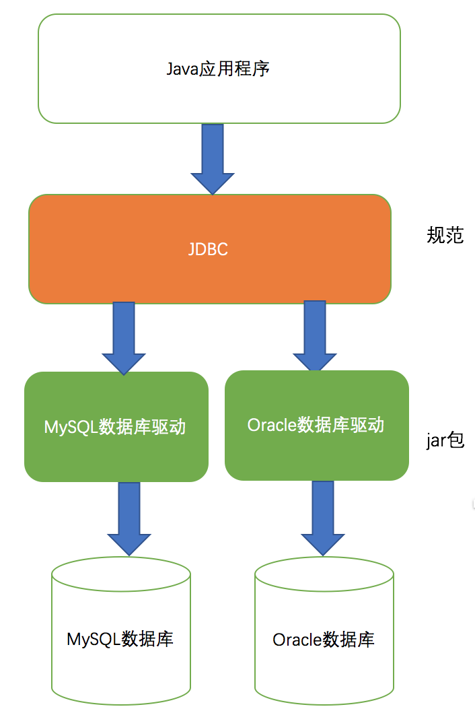
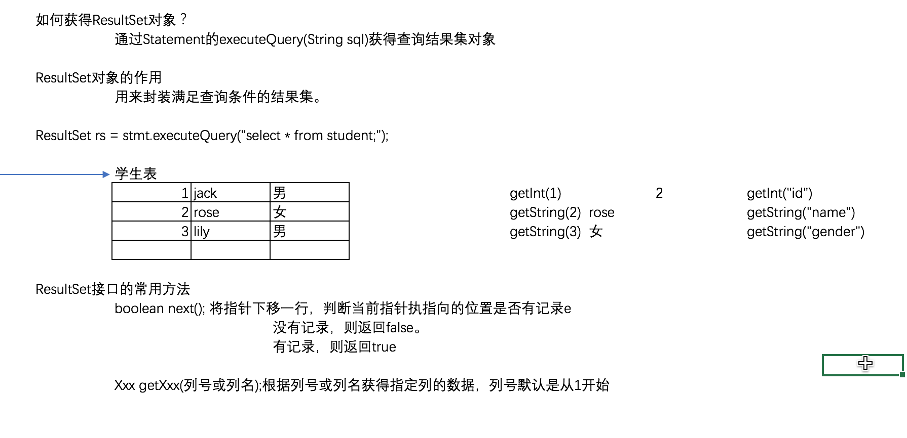

[TOC]
# JDBC基础
## 一.知识回顾
- 多表连接查询
    + 交叉连接
        * 查询记录数等于两张表的记录数之积
    + 内连接
        * 隐式内连接
        * 显示内连接
    + 外连接
        * 左外连接
            - 格式: left outer join 表 on 条件
            - 特点:左表的记录一定会全部显示出来
        * 右外连接
            - 格式: right outer join 表 on 条件
            - 特点:右表的记录一定会全部显示出来
- 子查询分类
    + 单行子查询:单行单列的结果,一般使用聚合函数,父查询一般使用比较运算符
    + 多行子查询: 多行单列的结果,父查询一般使用in 运算符
    + 多列子查询: 一张虚拟表.
- 三大范式
    + 1NF:原子性,不可再分割
    + 2NF:一张表只描述一件事情
    + 3NF:不能产生传递依赖
## 二.JDBC 基础学习目标
* 能够理解JDBC的概念
    a，  说出JDBC的概念
    b，  说出JDBC的开发步骤
    c，  编写JDBC的入门案例

* 能够使用DriverManager类
    a，  说出DriverManager类的作用
    b，  说出如何注册驱动
    c，  写出DriverManager类获取连接的方法

* 能够使用Connection接口
    a，  说出Connection接口的作用
    b，  写出获取Statement和PreparedStatement接口的方法

* 能够使用Statement接口
    a，  说出Statement接口的作用
    b，  写出Statement接口执行增删改的方法 executeUpdate(String sql)
    c，  写出Statement接口执行查询的方法  executeQuery(String sql)


* 能够使用ResultSet接口
    a，  说出ResultSet接口的作用
    b，  写出ResultSet接口遍历结果集的方法  boolean next()  getXxx()
    c，  写出ResultSet接口获取指定列的数据的方法

* 能够描述SQL注入原理和解决方案
    a，  能够描述SQL注入
    b，  说出 PreparedStatement接口的作用
    c，  写出PreparedStatement接口执行增删改的方法
    d，  写出PreparedStatement接口执行查询的方法

* 能够编写JDBC的工具类
    a，  说出JDBC工具类的分析步骤
    b，  写出JDBC工具类的代码实现

* 能够通过PreparedStatement完成CURD代码

## 三.JDBC基础知识
### 1. JDBC的概述
- 客户端操作数据库服务器的方式
    + 命令行方式操作
    + 第三方图形化软件: 比如SQLyog,Navicat,Workbench等
    + 通过Java代码操作:JDBC
- JDBC的概述
    + 概念:Java DataBase Connectivity
    + 组成:一组Java语言编写的接口组成(是一套规范).
    + 作用:为各大数据库提供统一的访问方式
    + 
- JDBC的核心API
    + Driver: 接口,数据库驱动
    + Connection: 接口,数据库连接对象
    + Statement:接口,对数据库进行增删改查的对象
    + ResultSet:接口,用来封装满足查询条件的结果集
    + DriverManger:类,用来注册和管理数据库驱动的类
### 2.JDBC之注册驱动
+ jar使用步骤
    1.在项目根目录下创建一个lib文件夹
    2.复制jar包到lib文件夹中
    3.右键→ build Path → Add to Buile Bath
+ 注册驱动
```java 
import com.mysql.jdbc.Driver;
// DriverManger
/*
Connection 对象的作用
    负责于数据库建立连接
如何获取Connection 对象;
    通过DriverManager 静态方法 
    static Connection getConnection(String url, String user, String password)
    * url,数据库连接url字符串
    * user 用户名
    *password 密码
    jdbc:mysql://localhost:3306/day24; 
    服务器是本机 端口号默认是3306的简化格式:jdbc:mysql:///数据库名;
数据库连接URL字符串格式
*JDBC协议:子协议:// 数据库服务器地址
*JDBC协议是一个固定的协议:jdbc
*自协议: 数据库厂商的名称,比如MySQL数据库自协议:mysql
* 第二种获得方式:static Connection getConnection(String url, Properites info)
*/
public class JDBCDemo01 {
    public static void main(String[] args) throws Exception {
        Class.forName("com.mysql.jdbc.Driver");
        // 问题: 代码复用性不高// 用的比较少
        // 正确方式注册2:使用properties 配置文件
        // static Connecction getConnection(String url,properites info)
        Connection conn = DriverManager.getConnection
        ("jdbc:mysql://localhost:3306/jdbc", "root", "root");
        Statement stmt = conn.createStatement();
        String sql = "create table student("
                + "id int primary key auto_increment,"
                + "name varchar(20),"
                + "gender varchar(2));";
        int row = stmt.executeUpdate(sql);
        System.out.println("row = " + row);
    }
    // 创建了一张表,再次创建的话会出错
    }   
    // 第一种注册方式.
   public static void main(String[] args) { 
  // 导包,com.mysql.jdbc.Driver 实现了接口
        Driver driver = new Driver();
        // 注册驱动
        DriverManger.registerDriver(driver);
        // 问题:以上代码 驱动会注册两次
        // com.mysql.jdbc.Driver 有静态代码块,创建对象的时候就已经注册了一次了
    }
```
### 3.JDBC核心对象之Connection对象
- Connection对象的作用: **负责与数据库建立连接。**
- 如何获得Connection对象？
    + 通过 <font color="red">DriverManager类提供的方法获得</font> DriverManager类提供的方法获得，方法如下:
    + 通过DriverManager 类提供的方法获得:
    + `static Connection getConnection(String url, String user, String password)`
    + `static Connection getConnection(String url, Properites info)`
### 4.JDBC核心对象之Statement对象
- Statement对象的作用: **用来发送SQL语句到数据库，实现对数据库的增删改查操作。**
- 如何获得Statement对象?
    + 通过连接对象提供的方法获得方法如下
    1. **`Statement createStatement()`**;
    + Statement 接口的常用方法
    1. `int executeUpdate(String sql)` 
     根据指定的sql语句对数据库进行增删改操作,返回被影响的行数
    3. `ResultSet executeQuery(String sql)` 
     根据指定的sql 语句对数据库进行查询操作,返回符合查询的 **结果集对象**
### 5.JDBC之执行DDL语句-创建数据表
<a href="#2jdbc">代码示例</a>
### 6.JDBC开发步骤总结
1. 通过Class.forName("驱动类全名")注册驱动;*JDK(1.6版本后)可以省略这一步,不过不建议省略,为了兼容之前的版本*
2. 通过DriverManager 反法 getConnection()反法连接数据库获得连接对象
3. 通过连接对象的`createStatement()`反法获得Statement instance
4. 通过Statement对象的`executeUpdate()/executeQuery()`方法执行SQL语句。
5. 获得ResultSet 对象,通过该对象的方法获得数据.
6. 关闭资源 **关闭资源的原则:先开后关**
    + 开的顺序: Connection -->Statement --> ResultSet
    + 关闭的顺序: ResultSet --> Statement --> Connection
    + **导包都是对接口操作,面向接口编程 Java.sql.\***
### 7.JDBC之DML语句
7.1 添加数据 <font color="red">只需要修改对应的sql</font> 语句就行了
7.2 更新数据 同上
7.3 删除数据 同上
### 8.JDBC核心对象之ResultSet 图解,类似 **迭代器**

### 9.JDBC之DQL语句-查询
查询结果为一个 ResultSet 结果集,遍历这个结果集获取全部数据
### 10.JDBC之数据库工具类
- 需求分析: 对数据库操作的重复代码太多,把共同代码抽取出来,写成一个工具类,简化代码.
- 创建工具类JDBCUtil包含三个方法
    + 驱动类名,用户名,密码,数据库url字符串定义成字符串常量
    + 在静态代码块中注册驱动，只需注册一次即可。
    + `public static Connection getConnection()`：得到数据库的连接对象
    + `public static void close(Connection conn,Statement stmt,ResultSet rs)`关闭所有打开的资源。
    + `public static void close(Connection conn,Statement stmt)`
