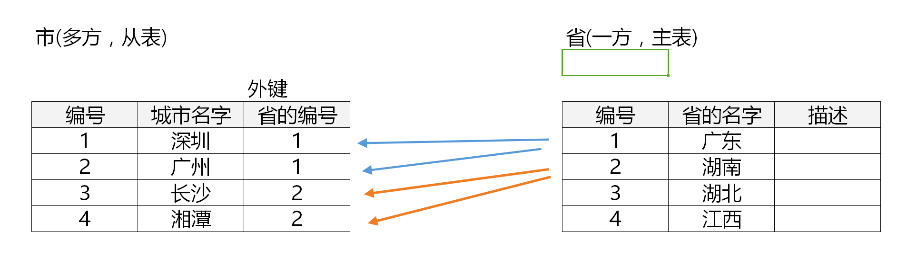

[TOC]
# MySQL基础:多表查询和数据库设计
###### 今日目标:
- 能够使用内连接进行多表查询
- 能够使用外连接进行多表查询 
- 能够使用子查询进行多表查询 

###### 1.一对多实战  
* 需求:实现省和市的一对多的关联关系表
    - __方案一: 两张表(省表和城市表), 省和市一对多.__
    - __需求分析__    
    - 需求说明:
    ```sql
        -- 创建省表和城市表
        create table province(
            id int primary key auto_increment,
            name varchar(20)
            );

        create table city(
            id int primary key auto_increment,
            name varchar(20),
            p_id int ,
            constraint foreign key(p_id) references province(id)
            );
        -- 插入内容 
        insert into province(name) values('广东省'),('湖南省'),('湖北省'),('江西省');   
        insert into city(name,p_id) values('深圳',1),('广州',1),
        ('长沙',2),('湘潭',2),('武汉',3),('赣州',4);
        select * from province;
        select * from city;
        -- 查询某个省下的城市名
        select from city where p_id = 1;
    ```
    + __方案二: 一张表,自关联一对多.__
    + 什么时候会使用一张表自关联一对多?
        - 当存在多级的上下级关系的时候,比如:
            1) 省-> 市 ->区(县)-> 镇(街道)
            2) 老板 -> 总经理 -> 部门经理->主管->主管
    + 要点
        * 表中增加一列用来记录上一级的id,该列一般称为parent id.
        * 最顶层的parent id 是null, 表示没有上一级了.
    + 设计一张表用来存储所有的区域名称
    ```sql
    -- 创建一张区域表
    create table area(
        id int primary key auto_increment,
        name varchar(20),
        parent id int, -- 上级的编号
        constraint foreign key(parent id) references area(id)
        )
    -- 插入数据
    insert into area(name,parent_id) values('湖南省',null),
    ('长沙市',1),
    ('岳麓区',2),
    ('岳麓山',3),
    ('广东省',null),
    ('广州市',5),
    ('天河区',6),
    ('番禺区',6),
    ('越秀区',6),
    ('白云区',6),
    ('珠吉路',7),
    ('津安创意员',8);
    ```

###### 2. 多表查询连接查询
* 多表连接查询的概念: **从多张表中查询数据的过程**
    - 数据准备
    ```sql
        -- 准备部门表和员工表
        create table department( -- 部门表 
        id int primary key auto_increment,
        name varchar(20)
            );
        create table employee(
            id int primary key auto_increment,
            name varchar(20),
            department_id int,
            constraint foreign key(department_id) references department(id)
            );
        -- 插入数据测试
        insert into department(name) values('开发部'),('财务部');
        insert into employee(name,department_id) 
        values('马化腾',1),('马云',2);
        select * from department;
        select * from employee;
    ```
* **多表连接类型**
    - 交叉连接
    - 内连接
    - 外连接
    - 全连接(MySQL不支持)
* 表连接查询的步骤
    - 先确定要查询哪些表
    - 然后确定要查询哪些字段(列)
    - 最后确定查询条件
###### 3. 多表连接之交叉连接
* **交叉连接概述**
    - 当查询的记录数等于两张记录数之积时,改查询就是交叉连接查询
    - 查询结果称为笛卡尔积.交叉查询又称 **笛卡儿积**.
    - 笛卡尔积的寄过在实际开发中没有任何意义,一般需要添加查询条件在笛卡儿积的基础上进行数据过滤.
* **交叉连接演示**
    ```sql
    select d.name 部门名称, e.name 员工姓名  -- 确定要查询的列  
    from department d,employee e-- 确定要查询的表
    -- 查询员工表和部门表中所有的列。
    select d.* , e.*
    from department d,employee employee;
    ```
###### 4. 多表连接查询之内连接查询
* 内连接概述
    - 连接条件必须量表同时满足,数据才查询出来,使用频率最高.
    - 利用主表(部门)中的主键与从表中的外键相等进行匹配
        如 department.id(主键) = employee.department_id(外键)  
* 内连接的类型
    - 隐式内连接: 使用where 语句过滤笛卡尔积数据.
    - 显示内连接: inner join ... on...
    - 只有满足条件的记录才能出来
 __内连接演示__
    ```sql
        # 分别使用隐式内连接和显示内连接实现以下需求
        -- 从员工表和部门表中查询员工名和部门名两列.
        -- 隐式内连接
        select e.name 员工姓名, d.name 部门名称
        from department d,employee e
        where d.id = e.department_id;
        -- 显示内连接
        select d.name,e.name
        from department d
        inner join employee e 
        on d.id = e.department_id;
        -- 查询id为1的员工姓名及其所在部门名字。
        select d.name 部门名称, e.name 员工姓名
        from department d
        inner join employee e 
        on d.id = e.department_id
        and e.id = 1;

    ```
###### 5.多表连接查询之左(外)连接
* 外连接的分类
    - 左(外)连接
    - 右(外)连接
* 左外连接概述
    - 特点: __左表的记录一定会全部显示出来，右表的记录只有满足条件的才显示。__
    - 格式：left outer join…on… (outer 可以省略)
* 准备表 
>在员工表中插入一条记录,没有部门
>`insert into employee(name) values('马蓉');`    
```sql
-- 使用内连接查询员工信息和部门信息
select e.*,d.*
from employee e
inner join department d
on d.id = e.department_id;-- 查询结果只有两个
-- 用左连接查看查询结果
select e.*,d.*
from employee e
left join department d
on e.department_id = d.id; -- 马蓉也显示出来了
```
###### 6.多表连接之右连接
___右表的记录一定会全部显示出来，左表的记录只有满足条件的才显示。(用法同左连接),把left 改为 right___   

###### 7.多表连接查询之自连接
* 自连接查询概述
    - 一张表自己连接自己
    -  **不属于多表连接的一种,因为使用的还是内连接,外连接等查询** 
* 准备表
```sql
--创建新员工表emp(id,name,parent_id)
create table emp(
    id int primary key auto_increment,
    name varchar(20),
    parent_id int,
    constraint foreign key(parent_id) references emp(id)
    );
-- 在员工表中添加新的一列BOSS_ID，并添加相应的记录。
-- 1号员工没有上司，2号员工的上司是1号员工，3号员工的上司是2号员工。
insert into emp(name, parent_id) values('如来佛',null),('唐长老',1),('孙悟空',2);
select * from emp;
-- 查询员工姓名和对应的上司姓名。
select e.name 员工姓名,b.name 上级姓名
from emp e-- 员工表
inner join emp b -- boss 表 (特别注意)
on e.parent_id = b.id;

-- 查询员工姓名和对应的上司姓名。
select e.name 员工姓名,b.name 上级姓名
from emp e -- 员工表
inner join emp b -- boss表
on e.parent_id = b.id;
-- 查询员工姓名和对应的上司姓名，没有上司的员工姓名也要显示出来。
select e.name 员工姓名, b.name boss姓名 
from emp e
left join emp b 
on e.parent_id = b.id;
```

###### 8.数据查询之子查询
* 子查询概述
    - 一条查询语句的执行结果作为另一条查询语句的一部分(条件,表)
* 子查询的分类
    - 单行子查询
    - 多行子查询
    - 多列子查询
* 子查询注意事项: 子查询的语句一定要实现 __括号__ 括起来.
* 准备数据
```sql
-- join_data 入职日期,dept_id (部门id)
create table employee(
    id int primary key auto_increment,
    name varchar(20),
    gender char(2),
    salary double,
    join_date date,
    dept_id int,
    constraint foreign key(dept_id) references department(id)--之前已经创了一张表了 
    );
    -- 插入测试数据。
insert into employee(name,gender,salary,join_date,dept_id)
values ('孙悟空','男',20000,'1999-10-20',1)
,('猪无能','男',10000,'2005-09-10',1)
,('蜘蛛精','女',2500,'2017-07-25',3)
,('白骨精','女',8000,'2001-06-20',3)
,('唐僧','男',25000,'2018-01-20',2)
,('铁扇公主','女',3500,'1998-03-30',2)
,('牛魔王','男',28000,'2015-09-20',1)
,('红孩儿','男',2000,'2010-10-20',3);
select * from employee;

```

###### 9.1 单行子查询
* 单行子查询的概述
    - 子查询的结果是一个单行单列的值
    - 付查询可以使用比较运算符,比如= < >,__返回值是多个的话可以用*in*__
    - 示例
```sql
-- 查询工资最高的员工是谁？
-- 先查询最高工资是多少
select max(salary) from employee;
-- 根据最高工资查询员工信息
select * from employee where salary =(select max(salary) from employee);

-- 查询工资小于平均工资的员工有哪些？
-- 先查询平均工资
select avg(salary) from employee;
-- 根据平均工资查询员工信息
select * from employee where salary < (select avg(salary) from employee);
-- 查询广东省有哪些城市？area表
-- 先查询广东省的id
select id from area where name='广东省';
select * from area where parent_id in (select id from area where name='广东省');
```

###### 9.2 多行子查询
* 多行子查询概述
    - 子查询的结果是多行单列的结果
    - 父查询使用in 运算符 
* 多行子查询和 单行子查询 的区别就是 执行子查询的时候返回值是 **多行,单列**
###### 9.2 多列子查询
* 多列子查询概述
    - 子查询的结果是多行多列的值
* 需求
```sql
-- 多列子查询演示
-- 查询2011年以后入职的员工信息和部门信息
-- 先查询2011 年以后入职的员工信息
-- 使用子查询
select * from employee where join_date >'2011-01-01'; -- 把这个当作虚拟表
select e.*,d.*
from (select * from employee where join_date >'2011-01-01') e
inner join department d
on d.id = e.dept_id;

-- 查询2011年以后入职的员工信息和部门信息。
-- 表连接实现,通过表连接来查询信息
select e.*,d.*
from employee e
inner join department d
on d.id = e.dept_id
and join_date>= '2011-01-01';

```

## 注意事项:
**外键约束失败 1452 主表上面要先存在对应的值才能插入**

### 数据库设计的范式
- 第一范式: 保证原子性,不能再分割
- 第二范式:满足第一范式,要有主键,其他非主键列要完全依赖主键(一张表只能描述一件事情)
- 第三范式:满足第二范式,其他非主键列要直接依赖主键,不能产生传递依赖.
<hr/>
- **数据库设计示例:**
1. 需求: 
假设某建筑公司要设计一个数据库。公司的业务规则概括说明如下：  
    公司承担多个工程项目，每一项工程有：工程号、工程名称、施工人员等    
    公司有多名职工，每一名职工有：职工号、姓名、职务    
    公司按照工时和小时工资率支付工资，小时工资率由职工的职务决定（例如，技术员的
    小时工资率与工程师不同）

2. 改进表
需求: 在 mysql 中实现上面的表，并且插入上面的数据   
- 创建表: 注意创建表的前后顺序  
1)  工程表:    工程号(主键,字符串),工程名称    
2)  职务表:    职务编号(主键)，职务,小时工资率   
3)  员工表:    职工号(主键，从 1001 开始),姓名,职务编号(外键)   
4)  工时表:    工时编号(主键)，工程号(外键),职工号(外键),工时 
```sql
#1) 创建工程表
create table project(
    id varchar(20) primary key,
    name varchar(20)
    );
#2) 创建职务表
create table job(
    id int primary key auto_increment,
    name varchar(20) not null unique,
    hour_salary double
    );
#3) 创建员工表
create table empl(
    id int primary key auto_increment,
    name varchar(20),
    job_id int,
    constraint foreign key(job_id) references job(id)
    );
-- 职工号从1001开始
alter table empl auto_increment = 1001;
#4) 创建工时表
create table work_time(
    project_id varchar(20),
    empl_id int,
    time int,
    constraint primary key(project_id,empl_id),
    constraint foreign key (project_id) references project(id),
    constraint foreign key (empl_id) references empl(id)
    );
# 插入数据
insert into project values('A1','花园大厦'),('B2','立交桥'),('C3','临江饭店');
insert into job(name,hour_salary) values('工程师',65),('技术员',60),('律师',100);
insert into empl(name,job_id) values('杨国明',1),('班建斌',2),('鞠明亮',1),('伍岳林',3);
insert into work_time(project_id,empl_id,time) values 
('A1',1001,13), 
('A1',1002,16), 
('A1',1004,19), 
('B2',1001,13), 
('B2',1003,17), 
('C3',1002,18), 
('C3',1004,14); 
select * from work_time;
- 查询需求
#1. 查询职工号是 1001 的职工职务信息，要求输出职工号，姓名及其职务，并使用别名 
select e.id as 职工号,e.name as 姓名,j.name as 职务
from empl e
inner join job j
on e.id = j.id;
#2. -- 查询职务为“技术员”的职工薪水，要求输出姓名，职务，工资。
select e.name as 姓名, j.hour_salary
from empl e
inner join job j
on j.name = '技术员'
and e.job_id = j.id;
```
-- 输出结果为 
|姓名 |工资    | 
|-----|-----: |
|班建斌| 60    |
```sql
#3. 查询所有的工程号，工程名称，职工号，工时。
select p.id as project , e.id as 职工号,w.time , e.name 姓名
from empl e
inner join project p
inner join work_time w
on w.empl_id = e.id
and w.project_id = p.id;

#4. 查询“班建斌”职工的工作情况，要求输出姓名，参与的工程名称，工时
select e.name 姓名, p.name 工程名称,w.time 工时
from empl e
inner join project p
inner join work_time w
on e.id = w.empl_id
and w.project_id = p.id
and e.name = '班建斌';

#5.查询所有信息
select p.id 工程号,p.name 工程名称, e.id 职工号, e.name 姓名, j.name 职务, j.hour_salary 小时工资率,w.time 工时
from project p
inner join empl e
inner join job j
inner join work_time w
on e.id = w.empl_id
and w.project_id = p.id
and e.job_id = j.id
order by 工程号,职工号;
```
<a href=#_3>跳转到结果图</a>


